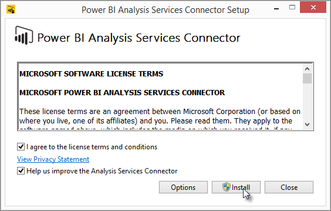

<properties 
   pageTitle="Configurar un conector de servicios de análisis de BI de energía" 
   description="Configurar un conector de servicios de análisis de BI de energía" 
   services="powerbi" 
   documentationCenter="" 
   authors="v-anpasi" 
   manager="mblythe" 
   editor=""
   tags=""/>
 
<tags
   ms.service="powerbi"
   ms.devlang="NA"
   ms.topic="article"
   ms.tgt_pltfrm="NA"
   ms.workload="powerbi"
   ms.date="06/19/2015"
   ms.author="v-anpasi"/>

# Configurar un conector de servicios de análisis de BI de energía

[Datos de gran tamaño ← y mucho más](https://support.powerbi.com/media/knowledgebase/topics/88773-big-data-and-more)

##[**Descargue ahora la versión preliminar conector de Analysis Services**](http://www.microsoft.com/en-us/download/details.aspx?id=45333)  

Antes de que los usuarios pueden conectarse a un modelo tabular de SQL Server Analysis Services, un conector de alimentación BI Analysis Services debe estar configurado para el servidor. Si tiene más de un servidor de Analysis Services, necesitará configurar un conector por servidor. Para ello, un administrador del servidor. Para obtener más información acerca de cómo funciona el conector, asegúrese de ver [Power BI Analysis Services conector detallada](http://support.powerbi.com/media/knowledgebase/articles/546004-power-bi-analysis-services-connector-in-depth).

Una vez configurado el conector, bases de datos de modelo tabular en la instancia del servidor de Analysis Services aparecerá en la página de SQL Server Analysis Services en Power BI. Crear la conexión requiere una cuenta de Windows y una contraseña con permisos de administrador del servidor para la instancia de servidor que se va a conectar. Una vez configurado, los usuarios deberán tener al menos permisos de lectura para las bases de datos de modelo tabular que va a conectar.

El conector puede ejecutarse en cualquier equipo del dominio. No tiene que ser el equipo local o el servidor de Analysis Services, tal y como sólo actúa como un proxy entre Analysis Services y Power BI. El conector realiza la conexión a Analysis Services y pasa las credenciales del usuario que tiene acceso a lo largo de Power BI a él. El equipo donde está instalado tiene permanezca encendida, conectado a la red y el servidor de Analysis Services puede acceder en todo momento.

 **Importante:**

-   Solo los modelos tabulares de servicios de análisis de SQL Server son compatibles con Power BI
-   El conector tiene que seguir ejecutándose y ha permanecido en el equipo donde está instalado.

**Requisitos previos**

-   .NET framework 4.5.1 o posterior debe estar instalado en el equipo.
-   No se admite instalar el conector de alimentación BI Analysis Services y la puerta de enlace de administración de datos en el mismo equipo. Si ya tiene instalado Data Management Gateway, desinstálela antes de instalar el conector de alimentación BI Analysis Services o instale el conector en otro equipo.
-   El servidor de Analysis Services está unido al dominio.
-   El conector de Analysis Services y el servidor de Analysis Services están instalados en equipos en el mismo dominio.
-   Si utiliza un. onmicrosoft.com dirección de correo electrónico, tendrá que sincronizar Active Directory con Azure Active Directory mediante la sincronización de Azure Active Directory \(DirSync\). Para obtener más información. consulte [Power BI Analysis Services conector detallada](http://support.powerbi.com/media/knowledgebase/articles/546004-power-bi-analysis-services-connector-in-depth).

## Para instalar y configurar un conector de servicios de análisis de BI de alimentación

1.  En Power BI, haga clic en el icono de configuración  \> **vista previa de conector de Analysis Services**.

     **Nota**: también puede [Descargar la versión preliminar conector de Analysis Services desde Microsoft Download Center](http://www.microsoft.com/en-us/download/details.aspx?id=45333).
2.  Haga clic en **ejecutar**.

    
    
3.  Revise los términos, haga clic en **instalar**. Puede hacer clic en **opciones** para cambiar la ubicación predeterminada donde se instalará el conector.

     **Nota**: para desinstalar un conector de servicios de análisis de BI de alimentación, utilice desinstalación en el Panel de Control.
4.  Después de instalar, haga clic en **iniciar** para abrir el Asistente para conector de Power BI Analysis Services. El asistente le guiará a través de la configuración de un conector a la instancia del servidor.

    
    
5.  En el asistente, haga clic en **siguiente**.

     
    
6.  Inicie sesión en su cuenta de Power BI.

     
    
7.  En la página Conectar a SQL Server Analysis Services, especifique el Nombredeservidor\\nombredeinstancia, nombre de usuario de Windows y contraseña.

    **Nota**: cuenta de Windows que especifique debe tener permisos de administrador del servidor para la instancia que se va a conectar. La cuenta también debe tener una contraseña que no caduca, de lo contrario, los usuarios podrían obtener un error de conexión.

    
8.  Escriba un nombre descriptivo, la descripción y el mensaje de error descriptivo para la conexión. Los usuarios de BI de energía identificará la conexión por este nombre y descripción.

     
9.  Compruebe la configuración de los conectores. Si todo es correcto, haga clic en **Cerrar**.

    

Cuando los asistentes se completa, las bases de datos de modelo tabular a la instancia del servidor que configuró aparecerá cuando los usuarios seleccionan **obtener datos**\> **SQL Server Analysis Services** \> **Conectar**.

Cuando un usuario selecciona la nueva conexión, todos los modelos tabulares disponibles en la instancia de SQL Server Analysis Services aparecen como orígenes de datos.

 
## Para quitar un conector de la lista de obtener datos

Desinstalar el conector con quitar programas en el Panel de Control.

## Solución de problemas

Consulte [conector de solución de problemas de servicios de análisis](http://support.powerbi.com/media/knowledgebase/articles/505324-troubleshooting-analysis-service-connector)para obtener sugerencias sobre cómo solucionar problemas es posible que tenga.

