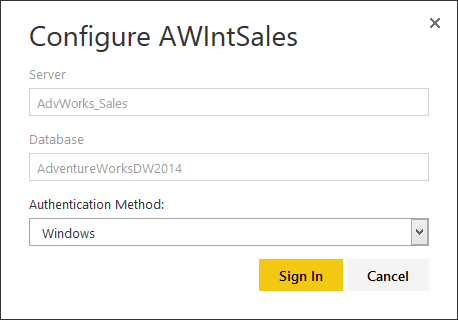
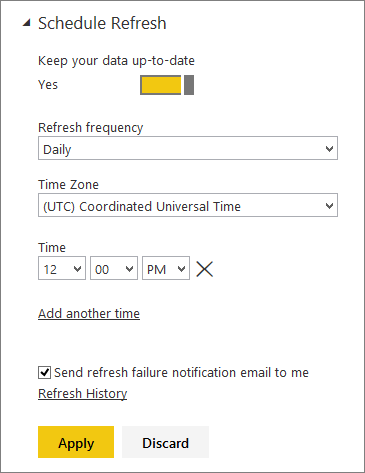

<properties 
   pageTitle="Actualizar datos en Power BI" 
   description="Actualizar datos en Power BI" 
   services="powerbi" 
   documentationCenter="" 
   authors="v-anpasi" 
   manager="mblythe" 
   editor=""
   tags=""/>
 
<tags
   ms.service="powerbi"
   ms.devlang="NA"
   ms.topic="article"
   ms.tgt_pltfrm="NA"
   ms.workload="powerbi"
   ms.date="06/19/2015"
   ms.author="v-anpasi"/>

#Actualizar datos en Power BI
[Datos de Get ←](https://support.powerbi.com/knowledgebase/topics/63369-get-data)

Siempre que los informes sobre los datos que está cambiando, es importante que los datos detrás de los informes están actualizados. Power BI admite actualización programada o manual para un número limitado de orígenes de datos. Orígenes de datos adicionales será compatible con la actualización en las próximas versiones.
##Orígenes de datos que la actualización de soporte técnico en Power BI

Programación de actualización y actualizar ahora en Power BI son ***sólo*** admite para los libros de Excel donde Power Query se utiliza para conectarse a y consultar los datos de los orígenes de datos siguientes:

|Origen de datos|Tipo de autenticación|
|---|---|
|SQL Azure \*|Básica|
|Almacén de blobs|Clave de cuenta|
|Almacenamiento de tabla|Clave de cuenta
|Perspectiva de HD|Clave de cuenta|
|Azure Marketplace|Clave de Marketplace|
|Facebook|OAuth|
|Salesforce|OAuth|
|ODATA|Anónima, básica, OAuth|
|Web|Anónima, básica|
|Consulta en blanco \(consulta que no tiene acceso a cualquier origen de datos\)|

 **Importante**

- Asegúrese de que haya descargado la versión más reciente de Power Query antes de guardar y cargar un libro en Power BI.

- Conectarse a SQL Server Analysis Services Tabular modelos mediante el conector de alimentación BI Analysis Services, crea una conexión activa con los datos del modelo, por lo que no es necesario programar la actualización. Los datos de modelo que se ven en Power BI se actualizan automáticamente cada diez minutos.

- Además del tipo de autenticación y el origen de datos, hay otras restricciones que puedan afectar o no se puede programar el libro para la actualización:

	-   Si ha especificado una instrucción SQL para ejecutar manualmente, esto no puede programarse para la actualización. La alternativa es crear la consulta mediante la selección de las tablas o vistas a través de la interfaz de usuario.
	-   Si ha creado una conexión directa a los datos a través de PowerPivot, no puede programarse para la actualización. La alternativa consiste en conectar directamente a través de Power Query.
	-   Si ha cargado los datos a una hoja de cálculo, no puede programarse para la actualización. La alternativa es cargar la consulta directamente en el modelo de datos cambiando la configuración de la carga de la consulta.

##Actualizar los datos

Hay dos maneras puede actualizar un conjunto de datos, programación de actualización y actualizar ahora. En cualquier caso, en primer lugar necesitará especificar credenciales para Power BI pueda conectarse al origen de datos. Cuando se especifica, se conservan en la configuración del conjunto de datos y no tendrá que escribir de nuevo.
### Para especificar las credenciales

1. En el Explorador de Power BI en **conjuntos de datos**, seleccione un conjunto de datos \> **menú Abrir**. 

2. Haga clic en **programar la actualización** o **Actualizar ahora**. 

3. En **Editar credenciales**, haga clic en **Editar**. 

4. Seleccione el tipo de **método de autenticación**, y escriba las credenciales de cuenta. El tipo de autenticación y las credenciales dependen del tipo de origen de datos que se está conectado. 

### Para configurar una programación de actualización

1. En el panel de navegación de Power BI en **conjuntos de datos**, seleccione un conjunto de datos \> menú Abrir \> **programación de actualización**. 

2. En **configuración for...** \> **programación de actualización**, establezca **mantener actualizados los datos** a **Sí**. 

3\. Seleccione **frecuencia de actualización**, **Actualizar entre**, y **configuración de zona horaria**, a continuación, haga clic en **aplicar**.

### Para actualizar ahora

En el Explorador de Power BI, en conjuntos de datos, seleccione un conjunto de datos \> **menú Abrir** \> **Actualizar ahora**.
  

##Más información acerca de la actualización de los datos
En Power BI, actualizar conjuntos de datos, ya que esto es donde los datos subyacentes de los informes. Quizás esté pensando "pero conectados a una hoja de cálculo de Excel y SalesForce como los orígenes de datos". Bueno, eso es true, pero cuando se conecta a los libros de Excel en Power BI, se importarán los datos o conexiones de ellos Power BI. Una vez en Power BI, los datos se almacenan en un modelo que se mantiene en memoria y en una estructura que facilita visualizaciones en los informes y paneles para cambiar y volver a calcular las métricas rápidamente.
### Cuándo actualizar datos

Desea actualizar el conjunto de datos con la frecuencia que los datos se actualizan en el origen. Para la mayoría de los orígenes de datos, los datos se actualizan diariamente, normalmente durante la noche. Si programa la actualización, seleccione días y actualización desde el origen de veces que reflejen la versión más reciente, pero también proporcionan una visión actualizada de los datos en Power BI cuando los necesite más. Por ejemplo, si el conjunto de datos se conecta a una base de datos SQLAzure y esa base de datos se actualiza cada día a medianoche, deberá programar la actualización de su conjunto de datos entre las 12:00 a.m. y 6:00 am. Este modo, cuando se obtiene de la mañana y comprobar sus paneles, reflejan los datos más actualizados de la base de datos de SQLAzure. Siempre puede comprobar la última vez que se realizó una actualización, o cuando se programa la próxima actualización haciendo clic en el **menú Abrir** icono junto a un conjunto de datos.
### Autenticación

Para Power BI actualizar el conjunto de datos, deberá proporcionar credenciales para ese origen de datos determinado. El tipo de credenciales necesarias dependen en el origen de datos que se está conectando el conjunto de datos. Se le pedirá que escriba las credenciales la primera vez que utilice programación de actualización o actualizar ahora. Una vez introducido, esas credenciales se conservan como parte de la configuración de actualización para ese conjunto de datos. Si recibe datos de otro libro que usa el mismo origen de datos en un conjunto de datos que ya configuró las credenciales de autenticación de, no necesitará configurar credenciales de nuevo para su nuevo conjunto de datos \*\* \*\*.
### Solución de problemas

Si tiene problemas para programar la actualización, ser seguro, consulte estos artículos:

- [Solución de problemas de actualización programada para bases de datos de SQL Azure en Power BI](https://support.powerbi.com/knowledgebase/articles/527228-troublehooting-scheduled-refresh-for-azure-sql-dat)
