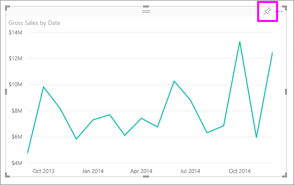
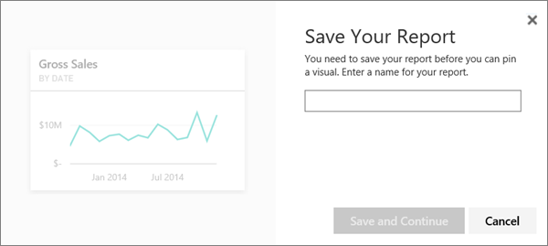
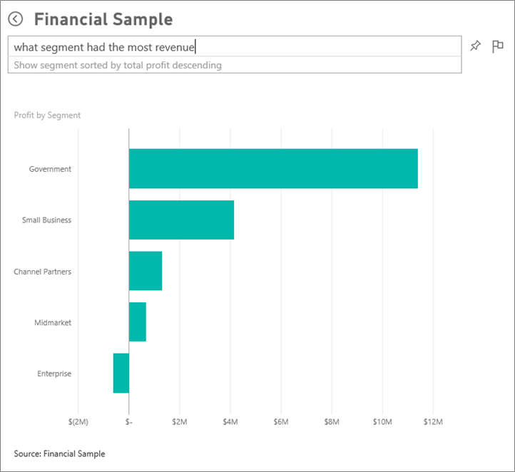

<properties 
   pageTitle="Introducción a Power BI" 
   description="Introducción a Power BI" 
   services="powerbi" 
   documentationCenter="" 
   authors="v-anpasi" 
   manager="mblythe" 
   editor=""
   tags=""/>
 
<tags
   ms.service="powerbi"
   ms.devlang="NA"
   ms.topic="article"
   ms.tgt_pltfrm="NA"
   ms.workload="powerbi"
   ms.date=""
   ms.author="v-anpasi"/>

#Introducción a Power BI
[← Introducción](https://support.powerbi.com/knowledgebase/topics/63037-getting-started)

Microsoft Power BI le ayudará a mantenerse al día con la información que es importante para usted. Con Power BI, ***paneles*** ayuda a tener un dedo en el pulso de su negocio. Los paneles muestran ***mosaicos*** que puede hacer clic para explorar más con ***informes***. Conectarse a varios ***conjuntos de datos*** para llevar todos los datos relevantes juntos en un solo lugar.

¿Necesita ayuda para comprender los bloques de creación que componen Power BI? Consulte [Bi - conceptos básicos de energía](http://support.powerbi.com/knowledgebase/articles/487029-power-bi-preview-basic-concepts).

**Nota:** este artículo trata sobre la nueva experiencia de Power BI, en lugar de la actual experiencia, Power BI para Office 365. Leer más sobre [qué experiencia de Power BI es adecuada para mí](https://support.powerbi.com/knowledgebase/articles/492388). ¿Prefiere ver en lugar de lectura? Vea nuestro vídeo de introducción al obtener:

<iframe width="500" height="281" frameborder="0" data-embed-url="https://www.youtube.com/watch?v=UE001nxTKqg" allowfullscreen="" scrolling="no" src="https://cdn.embedly.com/widgets/media.html?src=https%3A%2F%2Fwww.youtube.com%2Fembed%2FUE001nxTKqg%3Fwmode%3Dtransparent%26feature%3Doembed&amp;wmode=transparent&amp;url=https%3A%2F%2Fwww.youtube.com%2Fwatch%3Fv%3DUE001nxTKqg&amp;image=https%3A%2F%2Fi.ytimg.com%2Fvi%2FUE001nxTKqg%2Fhqdefault.jpg&amp;key=92cb8bc08566453cb1d8d02838cb7b06&amp;type=text%2Fhtml&amp;schema=youtube" class="embedly-embed"></iframe> 

##Paso 1: Obtener datos

[Iniciar sesión en Power BI](http://www.powerbi.com/). ¿No tiene una cuenta? Puede probar el [nuevo Power BI para liberar](http://www.powerbi.com/ "Pruebe gratis los nuevos Power BI").

\*\* Si tiene datos importantes en una hoja de cálculo de Excel en el equipo, puede crear un panel de Power BI para mantenerse informado en cualquier lugar y compartir con otros usuarios. ¿Es un usuario de Salesforce? Obtenga un avance [conectarse a Salesforce](http://support.powerbi.com/knowledgebase/articles/424863) para crear automáticamente un panel de datos.

1.  Haga clic en el **signo **junto a los paneles para crear un nuevo panel.  

    
2.  Asigne un nombre a su panel de información y presione ENTRAR para crearlo.
    
3.  Haga clic en el **obtener datos **icono. 

     
4.  ****La opción predeterminada es obtener los datos de una hoja de cálculo de Excel. Haga clic en **Conectar** para continuar.

5.  Haga clic en **Examinar** para buscar la hoja de cálculo de Excel que contiene los datos que desea en el panel, haga clic en Aceptar.

    *¿Desea continuar con este tutorial con datos de ejemplo? [Descargar esta hoja de cálculo de Excel de ejemplo](http://go.microsoft.com/fwlink/?LinkID=521962).*

    
    
6.  Una vez haya seleccionado la hoja de cálculo, haga clic en **Conectar**.
7.  El nuevo conjunto de datos aparece en el panel de navegación.

    
    

##Paso 2: Explorar el conjunto de datos

Ahora que ha conectado a datos, explore para buscar información. Cuando haya encontrado algo que desea supervisar, puede crear un panel de información para mantener actualizados con los cambios.

1.  Haga clic en la imagen de conjunto de datos en el panel para explorar los datos que acaba de conectarse a.
    
    
2.  Haga clic en correcto para cerrar la sugerencia acerca de cómo crear su primer gráfico.
3.  En la lista de campos en el lado derecho de la página, seleccione los campos para crear una visualización. Haga clic en la casilla situada junto a **ventas brutas**y, a continuación, **fecha**.

    
    
4.  Haga clic en el botón de tipo de cambio de visualización  para cambiar a una forma diferente de mostrar los datos. Intente cambiar a un gráfico de líneas, haga clic en la opción de gráfico de línea.

	
5.  Cuando tenga una visualización que desee en el panel, seleccione la visualización y haga clic en el **Pin** botón. Cuando se fija una visualización, se almacenarán en el panel de manera que se puede registrar el valor más reciente de un vistazo.

    
    
6.  Porque se trata de un nuevo informe, deberá guardarlo antes de que se puede anclar una visualización de él en el panel de mosaico.

    
    
7.  Asigne un nombre de informe y haga clic en **Guardar**. Power BI fija la visualización al mismo tiempo.
8.  Haga clic en el botón de Power BI  en la esquina superior izquierda de la ventana del explorador para volver al escritorio. 

9.  En el panel, puede ver la visualización nueva. Hacer que el panel aspecto aún mejor por [cambiar el nombre, el cambio de tamaño y cambiar la posición de los mosaicos](http://support.powerbi.com/knowledgebase/articles/424878).

    
    
    Puede hacer clic en el nuevo icono en el escritorio para volver al informe en cualquier momento.
    
10. Para una exploración rápida de los datos, intente formular una pregunta en el cuadro de preguntas y respuestas. Por ejemplo, pruebe a escribir "\*\* qué segmento tenía más ingresos \*\*".

    
11. Haga clic en el icono de anclaje  para mostrar esta visualización en el panel demasiado.
12. Haga clic en la flecha Atrás  para volver al escritorio.

En unos minutos, ha creado un panel interactivo.

¿Listo para probar más? A continuación presentamos algunas formas de explorar más de Power BI.

-   [Conectar con otro conjunto de datos](https://powerbi.uservoice.com/knowledgebase/articles/434354).
-   [Compartir el escritorio](http://support.powerbi.com/knowledgebase/articles/431008-share-a-dashboard) con sus compañeros de trabajo.
-   Lectura [sugerencias para diseñar paneles](http://support.powerbi.com/knowledgebase/articles/433616-tips-for-designing-a-great-dashboard).

¿Todavía no está listo para comenzar de inmediato? Comience con estos temas diseñados para ayudarle a sentirse cómodo con Power BI.

-   [Vídeos de Power BI](http://support.powerbi.com/knowledgebase/articles/475702-power-bi-preview-videos)
-   [Aprenda cómo funcionan conjuntamente los informes, conjuntos de datos, los paneles y los mosaicos](http://support.powerbi.com/knowledgebase/articles/487029-power-bi-preview-basic-concepts)
-   [Vea ejemplos de lo que tenemos disponible para su uso](http://support.powerbi.com/knowledgebase/articles/471112-sample-datasets)

### Mantente en contacto con Power BI

-   Siga [@MSPowerBI en Twitter](https://twitter.com/mspowerbi)
-   Suscríbase a la [Power BI boletín](http://www.microsoft.com/en-us/powerBI/newsletter.aspx)
-   Vea nuestra [seminarios Web de Power BI Introducción](http://www.microsoft.com/en-us/powerBI/webinars.aspx) a petición