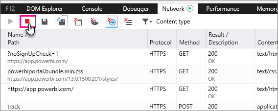

<properties 
   pageTitle="Capturing additional diagnostic information"
   description="Capturing additional diagnostic information"
   services="powerbi" 
   documentationCenter="" 
   authors="guyinacube" 
   manager="erikre" 
   backup=""
   editor=""
   tags=""
   qualityFocus="no"
   qualityDate=""/>
 
<tags
   ms.service="powerbi"
   ms.devlang="NA"
   ms.topic="article"
   ms.tgt_pltfrm="NA"
   ms.workload="powerbi"
   ms.date="06/28/2017"
   ms.author="asaxton"/>

# Capturing additional diagnostic information

## Capturing Additional Diagnostic Information for Power BI
 
These instructions provide two potential options for manually collecting additional diagnostic information from the Power BI web client.  Only one of these options needs to be followed.

## Network Capture - Edge & Internet Explorer

1.  Browse to [Power BI](https://app.powerbi.com) with Edge or Internet Explorer.

2.  Open the Edge developer tools by pressing F12.

3.  That will bring up the Developer Tools window: 

    

4.  Switch to the Network tab. It will list traffic it has already captured. 

    

5.  You can browse within the window and reproduce any problem you may be encountering. You can hide and show the developer tools window at any time during the session by pressing F12.

6.  To stop the capture, you can select the red square on the network tab of the developer tools area.

    

7.  Select on the diskette icon to **Export as HAR**

    

8. Provide a file name and save the HAR file.

    The HAR file will contain all the information about network requests between the browser window and Power BI.  This will include the activity IDs for each request, the precise timestamp for each request, and any error information returned to the client.  This trace will also contain the data used to populate the visuals shown on the screen.

9. You can provide the HAR file to support for review.

More questions? [Try asking the Power BI Community](http://community.powerbi.com/)