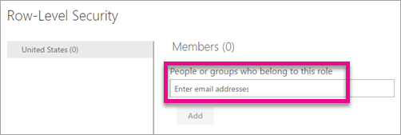

<properties
pageTitle="Row-level security (RLS) with Power BI"
description="How to configure row-level security for imported datasets, and DirectQuery, within the Power BI service."
services="powerbi"
documentationCenter=""
authors="guyinacube"
manager="mblythe"
backup=""
editor=""
tags=""
qualityFocus="no"
qualityDate=""/>

<tags
ms.service="powerbi"
ms.devlang="NA"
ms.topic="article"
ms.tgt_pltfrm="na"
ms.workload="powerbi"
ms.date="10/18/2016"
ms.author="asaxton"/>
# Row-level security (RLS) with Power BI

<iframe width="560" height="315" src="https://www.youtube.com/embed/67fK0GoVQ80?showinfo=0" frameborder="0" allowfullscreen></iframe>

Row-level security (RLS) with Power BI can be used to restrict data access for given users. Filters restrict data at the row level. You can define filters within roles.

> [AZURE.NOTE] RLS is a Pro feature. You can read more about what [Pro content](powerbi-power-bi-pro-content-what-is-it.md) is.

You can now configure RLS for data models imported into Power BI with Power BI Desktop. You can also configure RLS on datasets that are using DirectQuery, such as SQL Server. Previously, you were only able to implement RLS within on-premises Analysis Services models outside of Power BI. For Analysis Services live connections, you configure Row-level security on the on-premises model. The security option will not show up for live connection datasets.

[AZURE.INCLUDE [include-short-name](../includes/rls-desktop-define-roles.md)]

[AZURE.INCLUDE [include-short-name](../includes/rls-desktop-view-as-roles.md)]

## Manage security on your model

To manage security on your data model, you will want to do the following.

1.	Select the **ellipse (…)** for a dataset.
2.	Select **Security**.

    
 
This will take you to the RLS page for you to add members to a role you created in Power BI Desktop. Only the owners of the dataset will see Security available. If the dataset is in a Group, only Administrators of the group will see the security option. 

You can only create or modify roles within Power BI Desktop.

## Working with members

### Add members

You can add a member to the role by typing in the email address, or name, of the user, security group or distribution list you want to add. This member has to be within your organization. You cannot add Groups created within Power BI.

 
You can also see how many members are part of the role by the number in parenthesis next to the role name, or next to Members.

 
### Remove members

You can remove members by selecting the X next to their name. 
 

## Validating the role within the Power BI service

You can validate that the role you defined is working correctly by testing the role. 

1. Select the **ellipse (...)** next to the role.
2. Select **Test data as role**

You will then see reports that are available for this role. Dashboards are not presented in this view. In the blue bar above, you will see what is being applied.

You can test other roles, or combination of roles, by selecting **Now viewing as**.

You can choose to view data as a specific person, or you can select a combination of available roles to validate they are working. 

To return to normal viewing, select **Back to Row-Level Security**.

[AZURE.INCLUDE [include-short-name](../includes/rls-usernames.md)]

## Using RLS with Groups in Power BI

If you publish your Power BI Desktop report to a group within the Power BI service, the roles will be applied to read-only members. You will need to indicate that members can only view Power BI content within the group settings.

> [AZURE.WARNING] If you have configured the Group so that members have edit permissions, the RLS roles will not be applied to them. Users will be able to see all of the data.

[AZURE.INCLUDE [include-short-name](../includes/rls-limitations.md)]

[AZURE.INCLUDE [include-short-name](../includes/rls-faq.md)]

## See also

[Row-level security (RLS) with Power BI Desktop](powerbi-desktop-rls.md)  
More questions? [Try the Power BI Community](http://community.powerbi.com/)