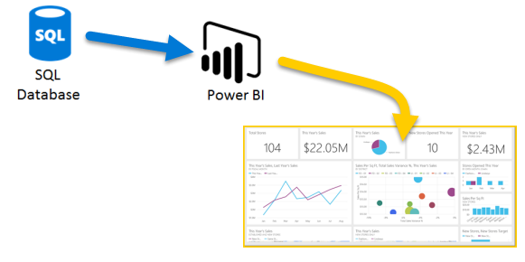
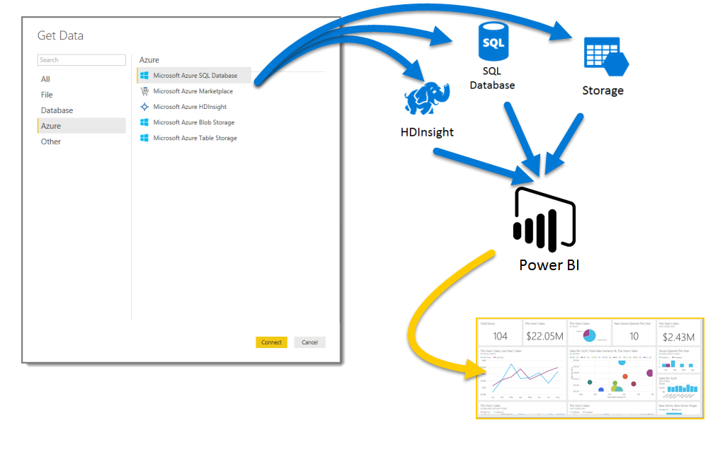
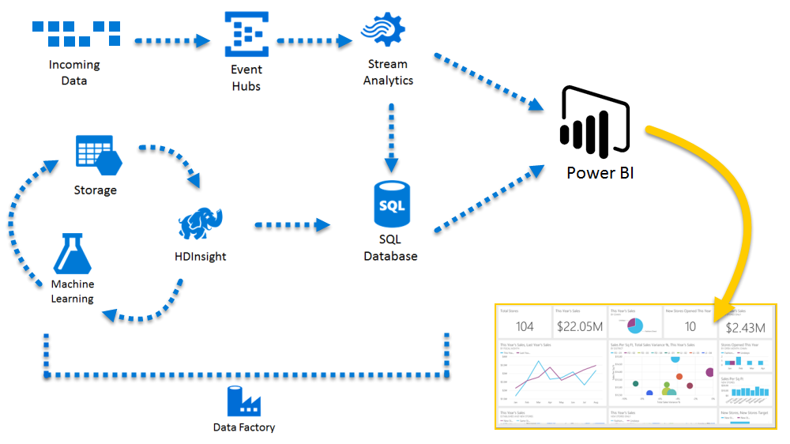

<properties 
   pageTitle="Azure and Power BI"
   description="Azure and Power BI"
   services="powerbi" 
   documentationCenter="" 
   authors="davidiseminger" 
   manager="mblythe" 
   editor=""
   tags=""/>
 
<tags
   ms.service="powerbi"
   ms.devlang="NA"
   ms.topic="article"
   ms.tgt_pltfrm="NA"
   ms.workload="powerbi"
   ms.date="09/28/2015"
   ms.author="davidi"/>
# Azure and Power BI

With **Azure** services and **Power BI**, you can turn your data processing efforts into analytics and reports that provide real-time insights into your business. Whether your data processing is cloud-based or on-premise, straightforward or complex, single-sourced or massively scaled, warehoused or real-time, Azure and Power BI have the built-in connectivity and integration to bring your business intelligence efforts to life.

Power BI has a multitude of Azure connections available, and the business intelligence solutions you can create with those services are as unique as your business. You can connect as few as one Azure data source, or a handful, then shape and refine your data to build customized reports.

### Azure SQL Database and Power BI

You can start with a straightforward connection to an Azure SQL Database, and create reports to monitor the progress of your business. Using the [Power BI Desktop](powerbi-desktop-getting-started.md), you can create reports that  identify trends and key performance indicators that move your business forward.

There's plenty more information for you to learn about [Azure SQL Database](http://azure.microsoft.com/services/sql-database/).

### Transform, shape, and merge your cloud data

Do you have more complex data, and all sorts of sources? No problem. With **Power BI Desktop **and Azure services, connections are just a tap of the **Get Data** dialog away. Within the same Query you can connect to your **Azure SQL Database**, your **Azure HDInsight** data source, and your **Azure Blob Storage** (or **Azure Table Storage**), then select only the subsets within each that you need, and refine it from there.

You can create different reports for different audiences too, using the same data connections and even the same Query. Just build a new report page, refine your visualizations for each audience, and watch it keep the business in the know.

For more information, take a look at the following resources:

-   [Azure SQL Database](http://azure.microsoft.com/services/sql-database/)

-   [Azure HDInsight](http://azure.microsoft.com/services/hdinsight/)

-   [Azure Storage](http://azure.microsoft.com/services/storage/) (Blob storage and Table storage)

### Get complex (and ahead) using Azure Services and Power BI

You can expand as much as you need with Azure and Power BI. Harness multi-source data processing, make use of massive real-time systems, use [Stream Analytics](http://azure.microsoft.com/services/stream-analytics/)and [Event Hubs](http://azure.microsoft.com/services/event-hubs/), and coalesce your varied SaaS services into business intelligence reports that give your business an edge.

### Connect your app data using Power BI APIs

You can use Power BI to gain insight on your existing apps, too. With the Power BI API, application developers can send entire data sets to Power BI programmatically. Need continuous updates? With the Power BI APIs, developers can send real-time data updates to get started quickly, and then grow into using Azure Stream Analytics when scale requirements merit doing so.

There's lots of information about Power BI APIs in the [Power BI Developer Portal](http://dev.powerbi.com). You can also learn about what others are doing programmatically with Power BI in the [Power BI developer blog](http://blogs.msdn.com/powerbidev). There's also a page dedicated to [getting you started with Power BI development](https://msdn.microsoft.com/library/dn889824.aspx).

### What could you do with Azure and Power BI?

There are all sorts of scenarios where **Azure** and **Power BI** can be combined - the possibilities and opportunities are as unique as your business. For more information about **Azure services**, check out this [overview page](http://go.microsoft.com/fwlink/?LinkId=535031&clcid=0x409), which describes **Data Analytics Scenarios using Azure**, and learn how to transform your data sources into intelligence that drives your business ahead.

