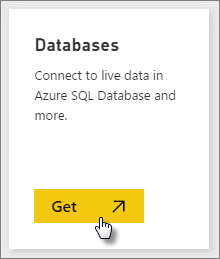
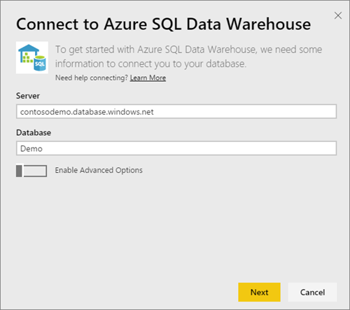
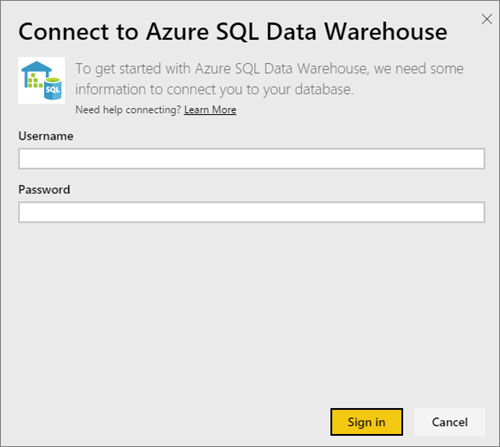
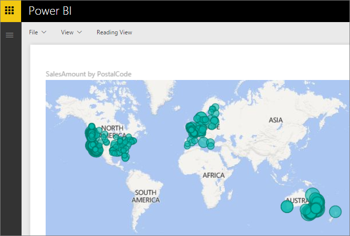

<properties 
   pageTitle="Azure SQL Data Warehouse with DirectQuery"
   description="Azure SQL Data Warehouse with DirectQuery"
   services="powerbi" 
   documentationCenter="" 
   authors="guyinacube" 
   manager="mblythe" 
   editor=""
   tags=""/>
 
<tags
   ms.service="powerbi"
   ms.devlang="NA"
   ms.topic="article"
   ms.tgt_pltfrm="NA"
   ms.workload="powerbi"
   ms.date="11/12/2015"
   ms.author="asaxton"/>

# Azure SQL Data Warehouse with DirectQuery

Azure SQL Data Warehouse with DirectQuery allows you to create dynamic reports based on data and metrics you already have in Azure SQL Data Warehouse. With DirectQuery, queries are sent back to your Azure SQL Data Warehouse in real time as you explore the data. This, combined with the scale of SQL Data Warehouse enables users to create dynamic reports in minutes against terabytes of data. In addition, the introduction of the **Open in Power BI** button allows users to directly connect Power BI to their SQL Data Warehouse without having to manually specify the information.

NOTES: When using the SQL Data Warehouse connector:

-   Specify the fully qualified server name when connecting (see below for details)

-   Ensure firewall rules for the server are configured to "Allow access to Azure services"

-   Every action such as selecting a column or adding a filter will directly query the data warehouse

-   Tiles are set to refresh approximately every 15 minutes and refresh does not need to be scheduled.  This can be adjusted in the Advanced settings when you connect.

-   Q&A is not available for DirectQuery datasets

-   schema changes are not picked up automatically

These restrictions and notes may change as we continue to improve the experiences. The step to connect are detailed below.

## Using the 'Open in Power BI' button

The easiest way to move between your SQL Data Warehouse and Power BI is with the **Open in Power BI** button within the Azure Preview Portal. This button allows you to seamlessly begin creating new dashboards in Power BI.

1. To get started, navigate to your SQL Data Warehouse instance in the Azure Preview Portal. Please note that SQL Data Warehouse only have a presence in the Azure Preview portal at this time.

2. Click the **Open in Power BI** button

    

3. If we are not able to sign you in directly or if you do not have a Power BI account, you will need to sign in.

4. You will be directed to the SQL Data Warehouse connection page, with the information from your SQL Data Warehouse pre-populated. Enter your credentials and hit connect to create a connection.

## Connecting through Power BI

SQL Data Warehouse is also listed on the Power BI Get Data page. 

1. Select **Get Data** at the bottom of the left navigation pane.  

    

2. Within **Databases**, select **Get**.

    

3. Select **SQL Data Warehouse** \> **Connect**.

    

4. Enter the necessary information to connect. The **Finding Parameters** section below shows where this data can be located in your Azure Portal.

    
   
    
   
    

5. Drill into the dataset by selecting the new tile or the newly created dataset, indicated by the asterisk. This dataset will have the same name as your database.

    

6. You can explore all of the tables and columns. Selecting a column will send a query back to the source, dynamically creating your visual. Filters will also be translated into queries back to your data warehouse. These visuals can be saved in a new report and pinned back to your dashboard.

    

## Finding Parameter Values

Your fully qualified server name and database name can be found in the Azure Preview Portal. Please note that SQL Data Warehouse only have a presence in the Azure Preview portal at this time.

## See also

[Get started with Power BI](powerbi-service-get-started.md)

[Get Data for Power BI](powerbi-service-get-data.md)

[Azure SQL Data Warehouse](https://azure.microsoft.com/en-us/documentation/services/sql-data-warehouse/)