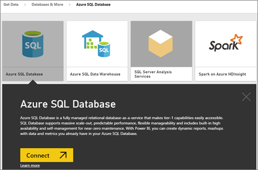
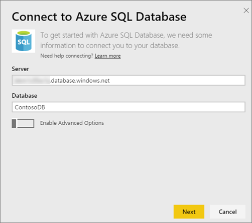
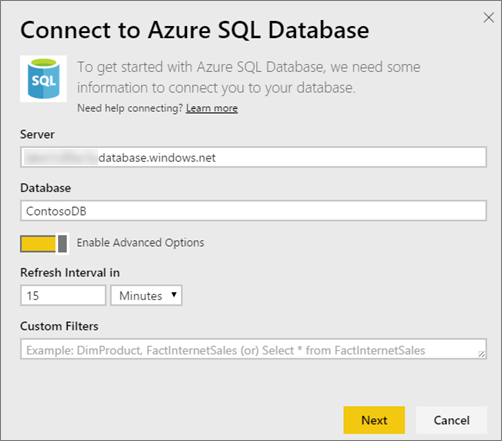
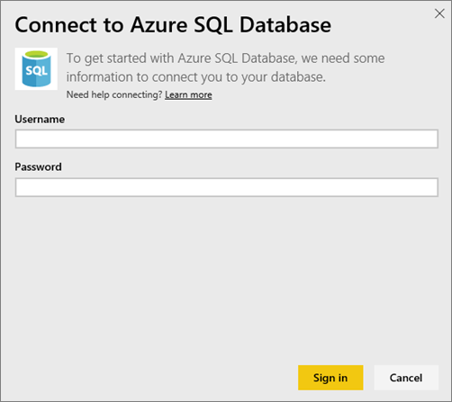
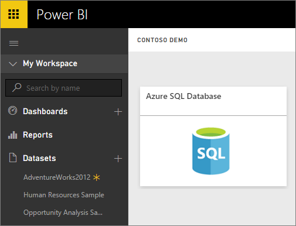
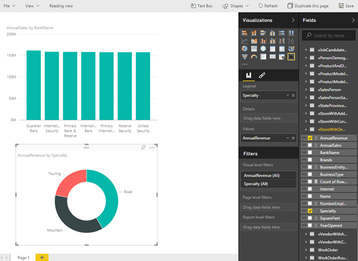

<properties 
   pageTitle="Azure SQL Database with DirectQuery"
   description="Azure SQL Database with DirectQuery"
   services="powerbi" 
   documentationCenter="" 
   authors="guyinacube" 
   manager="mblythe" 
   editor=""
   tags=""
   qualityFocus="no"
   qualityDate=""/>
 
<tags
   ms.service="powerbi"
   ms.devlang="NA"
   ms.topic="article"
   ms.tgt_pltfrm="NA"
   ms.workload="powerbi"
   ms.date="03/04/2016"
   ms.author="asaxton"/>
# Azure SQL Database with DirectQuery

Azure SQL Database with DirectQuery allows you to create dynamic reports based on data and metrics you already have in your Azure SQL Database. With DirectQuery, queries are sent back to your Azure SQL Database as you explore the data in the report view. This experience is suggested for users who are familiar with the databases and entities they connect to.

Notes:

-   Specify the fully qualified server name when connecting (see below for more details)

-   Ensure firewall rules for the database are configured to "[Allow access to Azure services](https://msdn.microsoft.com/library/azure/ee621782.aspx)".

-   Every action such as selecting a column or adding a filter will send a query back to the database

-   Tiles are refreshed approximately every 15 mins (refresh does not need to be scheduled). This can be adjusted in the Advanced settings when you connect.

-   Q&A is not available for DirectQuery datasets

-   Schema changes are not picked up automatically

These restrictions and notes may change as we continue to improve the experiences. The steps to connect are detailed below. 

## Power BI Desktop and DirectQuery

Power BI Desktop also allows the use of DirectQuery over Azure SQL Database. This approach provides additional flexability and capabilities. Reports created using Power BI Desktop can then be published to the Power BI service. [Learn More](powerbi-desktop-use-directquery.md) 

## Connecting through Power BI

Connect to the [Azure SQL Database connector](https://app.powerbi.com/getdata/bigdata/azure-sql-database-with-live-connect) for Power BI.

1.  Select Get Data at the bottom of the left navigation pane.

    

2.  Within **Databases**, select **Get**. 

    

3.  Select **Azure SQL Database** \> **Connect**.

    

4.  Enter the necessary information to connect. The **Finding Parameters** section below shows where this data can be located in your Azure Portal.

    
   
    
   
    

5.  After you've connected, you see a new dataset with the same name as the database you connected to, and a placeholder tile for the dataset, created on the dashboard.

    

6.  Selecting the placeholder tile for the dataset opens a new report, where you can explore all of the tables and columns in your database. Selecting a column will send a query back to the source, dynamically creating your visual. These visuals can be saved in a new report, and pinned back to your dashboard.

    

### Finding Parameter Values

Your fully qualified server name and database name can be found in the Azure Portal.

## See Also

[Get started with Power BI](powerbi-service-get-started.md)

[Get Data for Power BI](powerbi-service-get-data.md)

