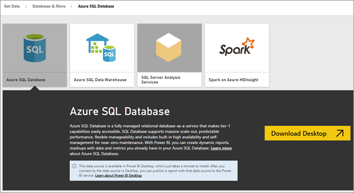
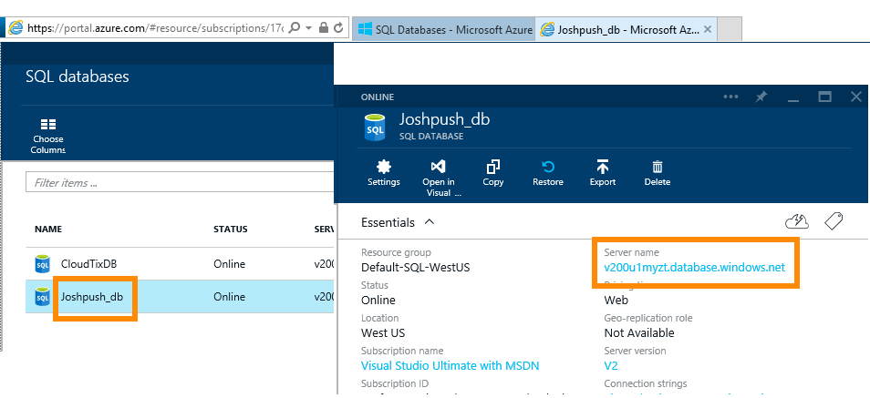

<properties 
   pageTitle="Azure SQL Database with DirectQuery"
   description="Azure SQL Database with DirectQuery"
   services="powerbi" 
   documentationCenter="" 
   authors="guyinacube" 
   manager="mblythe" 
   backup=""
   editor=""
   tags=""
   qualityFocus="no"
   qualityDate=""/>
 
<tags
   ms.service="powerbi"
   ms.devlang="NA"
   ms.topic="article"
   ms.tgt_pltfrm="NA"
   ms.workload="powerbi"
   ms.date="04/12/2017"
   ms.author="asaxton"/>
# Azure SQL Database with DirectQuery

Learn how you can connect directly to Azure SQL Database and create reports that use live data. You can keep your data at the source and not in Power BI.

With DirectQuery, queries are sent back to your Azure SQL Database as you explore the data in the report view. This experience is suggested for users who are familiar with the databases and entities they connect to.

**Notes:**

- Specify the fully qualified server name when connecting (see below for more details)

- Ensure firewall rules for the database are configured to "[Allow access to Azure services](https://msdn.microsoft.com/library/azure/ee621782.aspx)".

- Every action such as selecting a column or adding a filter will send a query back to the database

- Tiles are refreshed approximately every 15 mins (refresh does not need to be scheduled). This can be adjusted in the Advanced settings when you connect.

- Q&A is not available for DirectQuery datasets

- Schema changes are not picked up automatically

These restrictions and notes may change as we continue to improve the experiences. The steps to connect are detailed below. 

## Power BI Desktop and DirectQuery

In order to connect to Azure SQL Database using DirectQuery, you will need to use Power BI Desktop. This approach provides additional flexability and capabilities. Reports created using Power BI Desktop can then be published to the Power BI service. You can learn more about how to connect to [Azure SQL Database using DirectQuery](powerbi-desktop-use-directquery.md) within Power BI Desktop. 

## Connecting through Power BI

You can no longer connect to Azure SQL Database directly from the Power BI service. When you select the [Azure SQL Database connector](https://app.powerbi.com/getdata/bigdata/azure-sql-database-with-live-connect), you will be asked to make the connection within Power BI Desktop. You can then publish your Power BI Desktop reports to the Power BI service. 

### Finding Parameter Values

Your fully qualified server name and database name can be found in the Azure Portal.

## See Also

[Use DirectQuery in Power BI Desktop](powerbi-desktop-use-directquery.md)  
[Get started with Power BI](powerbi-service-get-started.md)  
[Get Data for Power BI](powerbi-service-get-data.md)  
More questions? [Try the Power BI Community](http://community.powerbi.com/)