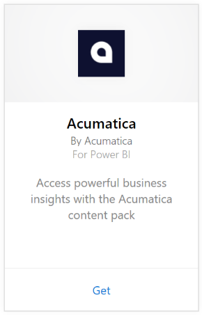
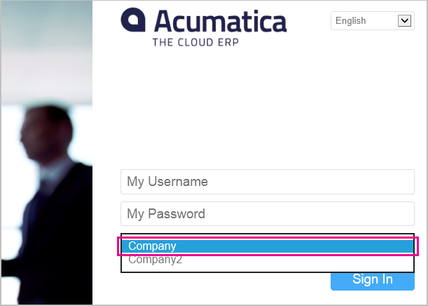

<properties 
   pageTitle="Acumatica content pack"
   description="Acumatica content pack for Power BI"
   services="powerbi" 
   documentationCenter="" 
   authors="joeshoukry" 
   manager="mblythe" 
   backup=""
   editor=""
   tags=""
   qualityFocus="no"
   qualityDate=""/>
 
<tags
   ms.service="powerbi"
   ms.devlang="NA"
   ms.topic="article"
   ms.tgt_pltfrm="NA"
   ms.workload="powerbi"
   ms.date="08/26/2016"
   ms.author="yshoukry"/>
   
# Acumatica content pack for Power&nbsp;BI

The Power BI Acumatica content pack allows to you quickly gain insights into your opportunity data. Power BI retrieves your data, including opportunities, accounts, and customers, then builds a default dashboard and related reports based on that data. 

Connect to the [Acumatica content pack](https://app.powerbi.com/getdata/services/acumatica) or read more about the [Acumatica integration](https://powerbi.microsoft.com/integrations/acumatica) with Power BI.

Note: this content pack requires Acumatica v5.2 or higher.

## How to connect
1.	Select **Get Data** at the bottom of the left navigation pane.

	

2.	In the **Services** box, select **Get**.

	

3.	Select **Acumatica** \> **Get**.

	

4.	Enter your Acumatica OData endpoint. An OData endpoint allows an external system to request data from Acumatica. Acumatica OData endpoint is formatted as follows and should us HTTPS:

		https://[sitedomain]/odata/[companyname]

	The Company Name is only required if you have a multi-company deployment. More information about finding this parameter in your Acumatica account is included below.

	

5. For Authentication Method, select **Basic**. Enter your username and password from your Acumatica account, then click **Sign In**.

	

6. After Power BI imports the data you will see a new dashboard, report, and dataset in the left navigation pane. New items are marked with a yellow asterisk \* which disappears once selected, chosing the dashboard will show a similar layout to the one below:

	
    

**What Now?**

- Try [asking a question in the Q&A box](powerbi-service-q-and-a.md) at the top of the dashboard

- [Change the tiles](powerbi-service-edit-a-tile-in-a-dashboard.md) in the dashboard.

- [Select a tile](powerbi-service-dashboard-tiles.md) to open the underlying report.

- While your dataset will be schedule to refreshed daily, you can change the refresh schedule or try refreshing it on demand using **Refresh Now**

## System requirements
This content pack requires Acumatica v5.2 or higher, please confirm the version with your Acumatica admin.

## Finding parameters

**Acumatica OData Endpoint**

The Acumatica OData endpoint is formatted as follows and should us HTTPS:

	https://[sitedomain]/odata/[companyname]

The Application Site Domain can be found in your browser’s address bar when you’re signed into Acumatica. In the example below, the site domain is “https://pbi.acumatica.com” so the OData endpoint to provide would be “https://pbi.acumatica.com/odata”.

 

The Company Name is only required if you have a multi-company deployment. You can find this information from your Acumatica sign in page.

## Troubleshooting

If you’re not able to login, verify the Acumatica OData endpoint you provided is formatted correctly. 

	https://<application site domain>/odata/<company name>

If you're having trouble connecting, please confirm with your admin your version of Acumatica. This content pack requires version 5.2 or later.

### See also

[Get started in Power BI](powerbi-service-get-started.md)

[Get data in Power BI](powerbi-service-get-data.md)

 

