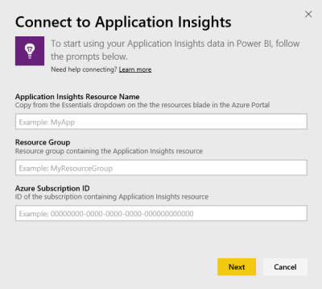
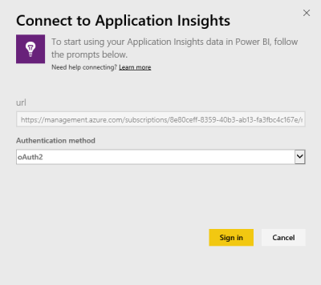
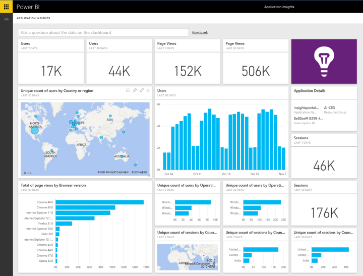
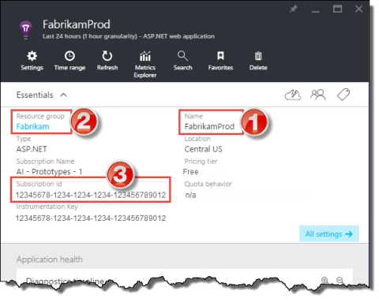
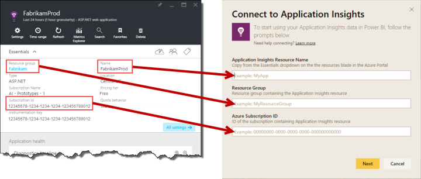

<properties
   pageTitle="Application Insights content pack for Power BI"
   description="Application Insights content pack for Power BI"
   services="powerbi"
   documentationCenter=""
   authors="maggiesMSFT"
   manager="mblythe"
   editor=""
   tags=""/>

<tags
   ms.service="powerbi"
   ms.devlang="NA"
   ms.topic="article"
   ms.tgt_pltfrm="NA"
   ms.workload="powerbi"
   ms.date="11/02/2015"
   ms.author="maggies"/>
# Application Insights content pack for Power BI

Use Power BI to create powerful custom dashboards from [Application Insights](https://azure.microsoft.com/documentation/articles/app-insights-overview/) telemetry. Envision your app telemetry in new ways. Combine metrics from multiple apps or component services onto one dashboard. This first release of the Power BI content pack for Application Insights includes widgets for common usage-related metrics such as active users, page view, sessions, browser and OS version, and geographic distribution of users in a map.

Connect to the [Application Insights content pack for Power BI](https://app.powerbi.com/getdata/services/application-insights).

Before you start, you’ll need:

-   Access the Application Insights overview blade for your application in the Azure Preview Portal

## Connect to the Application Insights content pack

1. Select **Get Data** at the bottom of the left navigation pane.

    

2. In the **Services** box, select **Get**.

     

3. Select **Application Insights** > **Connect**.

    

4. Provide the details of the application you want to connect to, including **Application Insights Resource Name**, **Resource Group**, and **Subscription ID**. See [Finding your Application Insights parameters](#FindingAppInsightsParams) below for more details.

        

5. Select **Sign In** and follow the screens to connect.

    

The import process begins automatically. When complete, a notification is shown and a new dashboard, report, and dataset  appear in the Navigation Pane marked with an asterisk. Select the dashboard to view your imported data.

You can change this dashboard to display your data the way you want. Click a tile to open the underlying report and change the tiles in the dashboard.

## Finding your Application Insights parameters

Your Resource Name, Resource Group and Subscription ID can all be found in the Azure Portal. Selecting the Name will open a detailed view and you can use the Essentials drop-down to find all the values you need.

Copy and paste these into the fields into Power BI:

### See also

[Get started in Power BI](powerbi-service-get-started.md)

[Get data in Power BI](powerbi-service-get-data.md)


