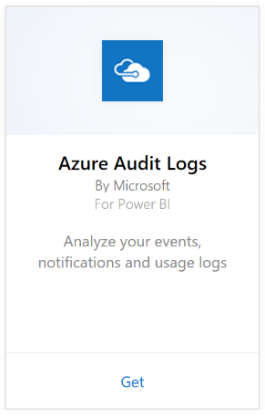
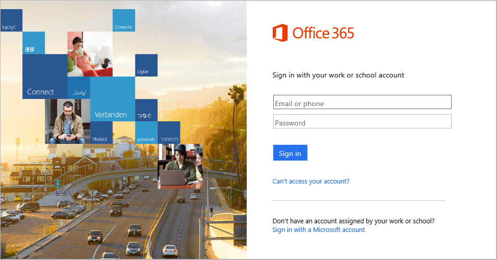
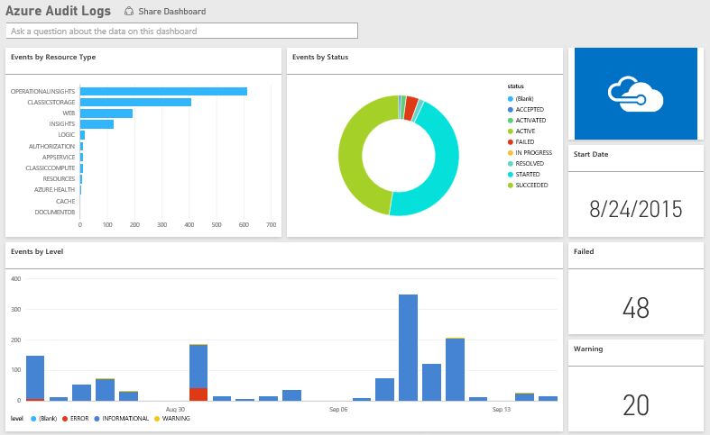

<properties
   pageTitle="Connect to Azure Audit Logs with Power BI"
   description="Azure Audit Logs for Power BI"
   services="powerbi"
   documentationCenter=""
   authors="joeshoukry"
   manager="erikre"
   backup="maggiesMSFT"
   editor=""
   tags=""
   qualityFocus="no"
   qualityDate=""/>

<tags
   ms.service="powerbi"
   ms.devlang="NA"
   ms.topic="article"
   ms.tgt_pltfrm="NA"
   ms.workload="powerbi"
   ms.date="08/28/2017"
   ms.author="yshoukry"/>

# Connect to Azure Audit Logs with Power BI

With the Azure Audit Logs content pack you can analyze and visualize the information stored in the audit logs. Power BI retrieves your data, builds an out-of-the box dashboard, and creates reports based on that data.

[Connect to the Azure Audit Logs content pack](https://app.powerbi.com/getdata/services/azure-audit-logs) or read more about the [Azure Audit Logs integration](https://powerbi.microsoft.com/integrations/azure-audit-logs) with Power BI.

## How to connect

1. Select **Get Data** at the bottom of the left navigation pane.  

	

2. In the **Services** box, select **Get**.  

	 

3.  Select **Azure Audit Logs** > **Get**.  

	

4. When prompted, enter your **Azure Subscription ID**. See details on finding your [subscription ID](#FindingParams) below.   

	

5. For **Authentication Method**, select **oAuth2** \> **Sign In**.

	

6. Enter your account credentials to finish the sign in process.

	

7. Power BI will retrieve your Azure Audit Log data and create a ready-to-use dashboard and report. 

	

**What Now?**

- Try [asking a question in the Q&A box](powerbi-service-q-and-a.md) at the top of the dashboard

- [Change the tiles](powerbi-service-edit-a-tile-in-a-dashboard.md) in the dashboard.

- [Select a tile](powerbi-service-dashboard-tiles.md) to open the underlying report.

- While your dataset will be schedule to refreshed daily, you can change the refresh schedule or try refreshing it on demand using **Refresh Now**

## System requirements
The Azure Audit logs content pack requires access to Audit Logs in the Azure Portal. More details [here](https://azure.microsoft.com/en-us/documentation/articles/insights-debugging-with-events/).

## Finding parameters  

There are two easy ways to find your Subscription Id.

1.  From https://portal.azure.com -&gt; Browse -&gt; Subscriptions -&gt; Subscription Id
2.  From https://manage.windowsazure.com -&gt; Settings  -&gt; Subscription Id

Your subscription ID will be long set of numbers and characters, similar to the example in Step \#4 above. 

## Troubleshooting
If you're seeing a credentials error or an error trying to refresh due to invalid credentials, please try deleting all instances of the Azure Audit logs content pack and reconnecting.

### See Also  
[Get started with Power BI](powerbi-service-get-started.md)  
[Power BI - Basic Concepts](powerbi-service-basic-concepts.md)  
