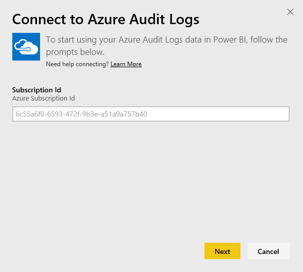
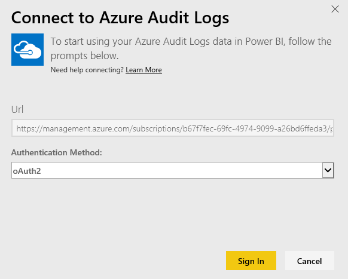

<properties 
   pageTitle="Azure Audit Logs content pack for Power BI"
   description="Azure Audit Logs content pack for Power BI"
   services="powerbi" 
   documentationCenter="" 
   authors="jastru" 
   manager="mblythe" 
   editor=""
   tags=""/>
 
<tags
   ms.service="powerbi"
   ms.devlang="NA"
   ms.topic="article"
   ms.tgt_pltfrm="NA"
   ms.workload="powerbi"
   ms.date="10/16/2015"
   ms.author="jastru"/>

# Azure Audit Logs content pack for Power BI  

With the Azure Audit Logs content pack you can analyze and visualize the information stored in the audit logs. Power BI retrieves your data, builds an out-of-the box dashboard, and creates reports based on that data.

[Connect to the Azure Audit Logs content pack for Power BI](https://app.powerbi.com/getdata/services/azure-audit-logs)

1. Select Get Data at the bottom of the left navigation pane.  
	

2. In the Services box, select Get.  
	 

3. Select Azure Audit Logs, then select Connect.  
	

4. When prompted, enter your Azure Subscription ID. See details on finding your subscription ID below.   
	

5. Select Authentication Method: oAuth2, click Sign In.   
	

6. Enter your account credentials to finish the sign in process.  
	

7. Power BI will retrieve your Azure Audit Log data and create a ready-to-use dashboard and report.   
	

###  Finding you Azure Subscription ID  
There are two easy ways to find your Subscription Id.

1.  From https://portal.azure.com -&gt; Browse -&gt; Subscriptions -&gt; Subscription Id
2.  From https://manage.windowsazure.com -&gt; Settings  -&gt; Subscription Id

Your subscription ID will be long set of numbers and characters, similar to the example in Step \#4 above. 

## See Also  
[Get started with Power BI](powerbi-service-get-started.md)  
[Power BI - Basic Concepts](powerbi-service-basic-concepts.md)  