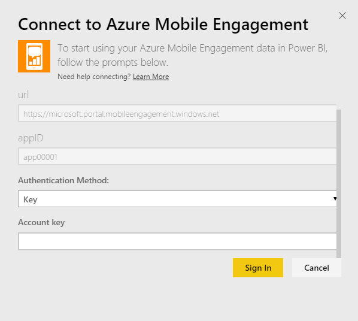

<properties 
   pageTitle="Azure Mobile Engagement content pack for Power BI"
   description="Azure Mobile Engagement content pack for Power BI"
   services="powerbi" 
   documentationCenter="" 
   authors="maggiesMSFT" 
   manager="mblythe" 
   editor=""
   tags=""/>
 
<tags
   ms.service="powerbi"
   ms.devlang="NA"
   ms.topic="article"
   ms.tgt_pltfrm="NA"
   ms.workload="powerbi"
   ms.date="09/28/2015"
   ms.author="maggies"/>
# Azure Mobile Engagement content pack for Power BI

The Power BI Azure Mobile Engagement content pack allows to you quickly gain insights into your app data.

Connect to the [Azure Mobile Engagement content pack](https://app.powerbi.com/groups/me/getdata/services/azme)for Power BI.

After you have created the connection, you can explore your data and customize the dashboard to meet your needs. Data is automatically refreshed every day.

1. Select Get Data at the bottom of the left navigation pane.

	

2. In the Services box, select Get.

	

3. Select Azure Mobile Engagement \> Connect.

	 

4. Specify your App Collection and App Name. This information can be found in your Azure Mobile Engagement account.

	 

5. For Authentication Method, provide your Key then click Sign In.

	

6. After Power BI imports the data you will see a new dashboard, report, and dataset in the left navigation pane. New items are marked with a yellow asterisk \* which disappears once selected:

7. Select the Azure Mobile Engagement dashboard. This is the default dashboard that Power BI creates to display your data. You can modify this dashboard to display your data in any way you want.

	

 

