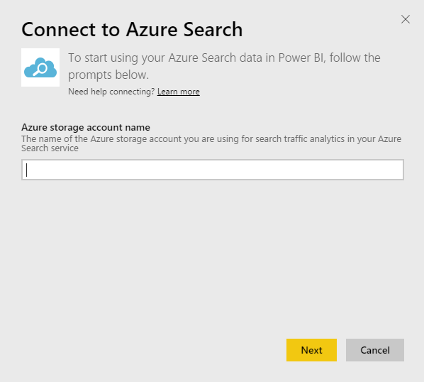
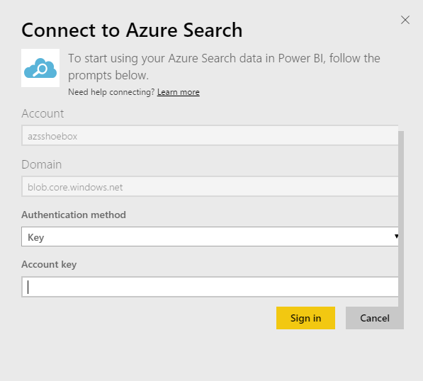

<properties
   pageTitle="Azure Search content pack for Power BI"
   description="Azure Search content pack for Power BI"
   services="powerbi"
   documentationCenter=""
   authors="theresapalmer"
   manager="mblythe"
   editor=""
   tags=""/>

<tags
   ms.service="powerbi"
   ms.devlang="NA"
   ms.topic="article"
   ms.tgt_pltfrm="NA"
   ms.workload="powerbi"
   ms.date="01/15/2016"
   ms.author="tpalmer"/>

# Azure Search content pack for Power&nbsp;BI

Azure Search Traffic Analytics allows you to monitor and understand the traffic to your Azure Search service. The Azure Search content pack for Power BI provides detailed insights on your Search data, including Search, Indexing, Service Stats and Latency from the last 30 days. More details can be found in the [Azure blog post](https://azure.microsoft.com/en-us/blog/analyzing-your-azure-search-traffic/).

Connect to the [Azure Search content pack](https://app.powerbi.com/getdata/services/azure-search) for Power BI.

## How to connect
1.  Select **Get Data** at the bottom of the left navigation pane.

     

2.  In the **Services** box, select **Get**.

     

3.  Select **Azure Search** \> **Connect**.

    
    
4.  Provide the name of the table storage account your Azure Search analysis is stored. 

    

5.  Select **Key** as the Authentication Mechanism and provide your storage account key. Click **Sign In** and to begin the loading process.

    

6.  Once the loading is complete, a new dashboard, report and model will appear in the Navigation Pane. Select the dashboard to view your imported data.

     

**What Now?**

- Try [asking a question in the Q&A box](powerbi-service-q-and-a.md) at the top of the dashboard

- [Change the tiles](powerbi-service-edit-a-tile-in-a-dashboard.md) in the dashboard.

- [Select a tile](powerbi-service-dashboard-tiles.md) to open the underlying report.

- While your dataset will be schedule to refreshed daily, you can change the refresh schedule or try refreshing it on demand using **Refresh Now**

## System requirements

The Azure Search content pack requires Azure Search Traffic Analytics to be enabled on the account. 

## Troubleshooting

Ensure the storage account name is correctly provided along with the full access key. The storage account name should correspond to the account configured with Azure Search Traffic Analytics.

### See also

[Get started with Power BI](powerbi-service-get-started.md)

[Power BI - Basic Concepts](powerbi-service-basic-concepts.md)
