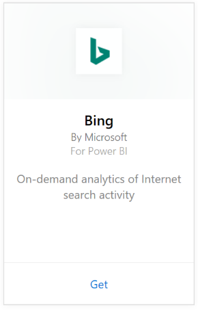
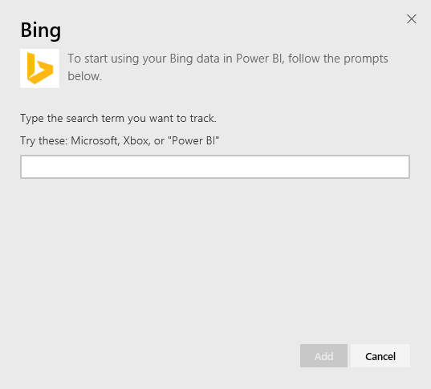
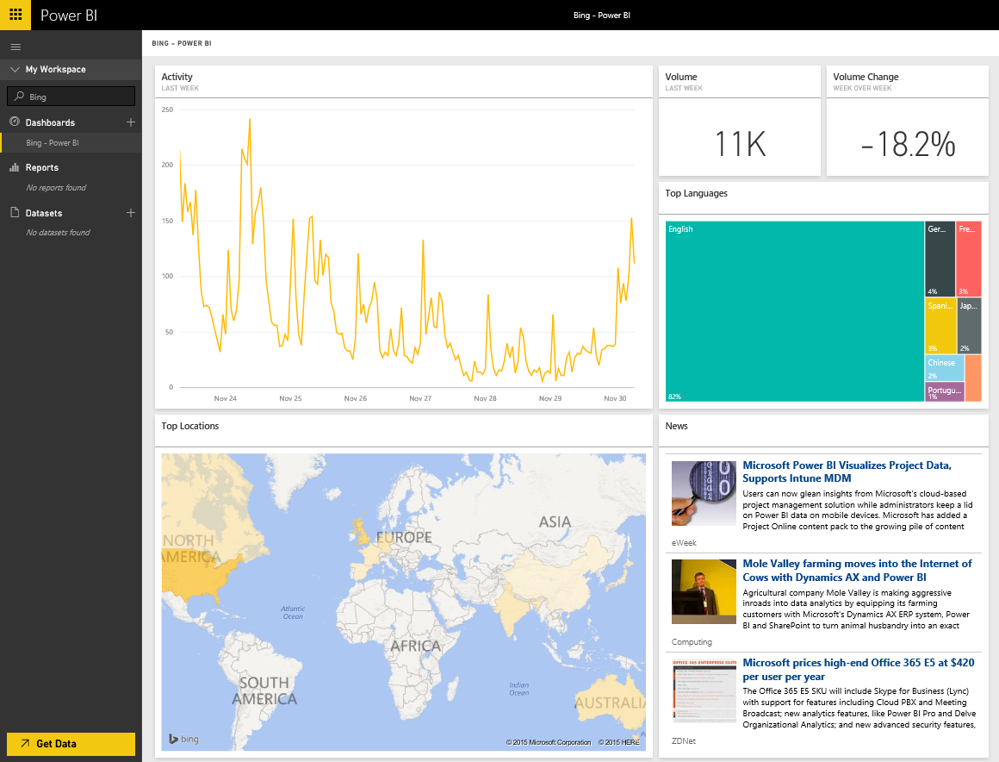

<properties
   pageTitle="Connect to Bing with Power BI"
   description="Bing for Power BI"
   services="powerbi"
   documentationCenter=""
   authors="joeshoukry"
   manager="erikre"
   backup="maggiesMSFT"
   editor=""
   tags=""
   qualityFocus="no"
   qualityDate=""/>

<tags
   ms.service="powerbi"
   ms.devlang="NA"
   ms.topic="article"
   ms.tgt_pltfrm="NA"
   ms.workload="powerbi"
   ms.date="08/28/2017"
   ms.author="yshoukry"/>

# Connect to Bing with Power BI

The Bing content pack will allow you to view analytics around Internet search activity for a term of your choice.

Connect to the [Bing content pack](https://app.powerbi.com/groups/me/getdata/services/bing) for Power BI.

Notes: Bing tiles will automatically update approximately every ~5 minutes and the only tile that can be selected is the News tile, which will take you to the corresponding news article. Tiles from the Bing content pack do not render in the mobile applications, we’re working to resolve this issue.

1. Select **Get Data** at the bottom of the left navigation pane.

    

2. In the **Services** box, select **Get**.

    

3. Select **Bing** > **Get**.

    

4. In the parameters dialog, enter the search term you want to track and hit Add.

        

5. On the left you’ll see a new entry in your list of dashboards, named with Bing and the search term you provided. Note there is no dataset or report associated with this dashboard. The tiles may take some time to load but once completed you’ll see a layout similar to the below.

	

Once the loading has completed, you can start exploring your data, including pinning tiles from this dashboard to other dashboards in your account.
