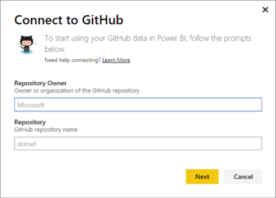
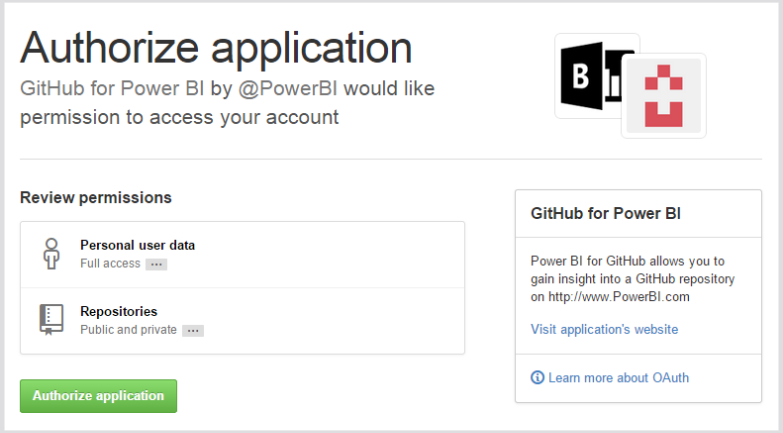
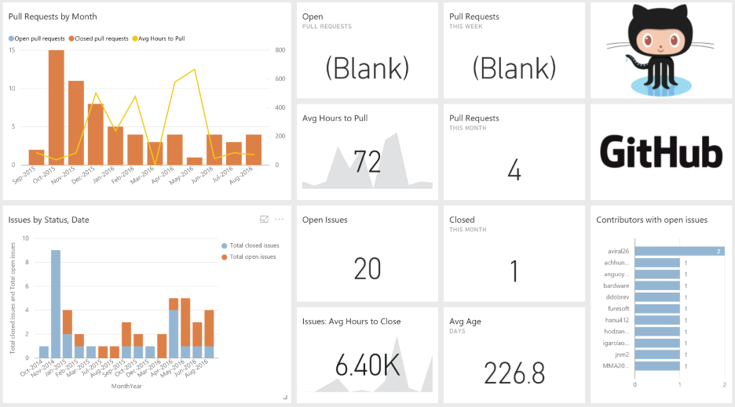

<properties 
   pageTitle="GitHub content pack for Power BI"
   description="GitHub content pack for Power BI"
   services="powerbi" 
   documentationCenter="" 
   authors="mgblythe" 
   manager="mblythe" 
   editor=""
   tags=""/>
 
<tags
   ms.service="powerbi"
   ms.devlang="NA"
   ms.topic="article"
   ms.tgt_pltfrm="NA"
   ms.workload="powerbi"
   ms.date="09/28/2015"
   ms.author="lukaszp"/>
# GitHub content pack for Power BI

The GitHub content pack for Power BI allows you to gain insights into a GitHub repository (also known as repo) with data around contributions, issues, pull requests and active users.

Connect to the [GitHub content pack](https://app.powerbi.com/getdata/services/github)for Power BI.

Creating this connection retrieves your data and automatically provides a dashboard and related reports based on the data.

**Requirements:**

-   The GitHub account that has access to the repo

-   Permission granted to the Power BI for GitHub app during first login

-    Sufficient API calls available to pull and refresh the data
 

1.  Select **Get Data** at the bottom of the left navigation pane.

	 

2.  In the **Services** box, select **Get**.

     

3.  Select GitHub \> **Connect**. 

    

4.  Enter the repository name and repository owner of the repo.

    

    You can determine the owner and repository by looking at the repository in GitHub itself:

    

    The first part "Azure" is the owner and the second part "azure-sdk-for-php" is the repository itself.  You see these same two items in the URL of the repository:

    <https://github.com/Azure/azure-sdk-for-php> .

5.  Enter your GitHub credentials (this step might be skipped if you are already signed in with your browser). 

6.  For **Authentication Method**, select **oAuth2** \> **Sign In**. 

7.  Follow the Github authentication screens. Grant the GitHub for Power BI content pack permission to the GitHub data.

    

    This connects Power BI with GitHub and allows Power BI to connect to the data.  The data is refreshed once a day.

8.  After you connect to your GitHub repo, Power BI imports the data. You see a new dashboard, report, and dataset in the left navigation pane. New items are marked with a yellow asterisk \*.

    
	
	You can change this dashboard to display your data the way you want it. Plus you can ask a [question in Q&A](powerbi-service-q-and-a.md) or click a tile to [open the underlying report](powerbi-service-dashboard-tiles.md) and [change the tiles](powerbi-service-edit-a-tile-in-a-dashboard.md) in the dashboard. 
	 
	The following data is available from GitHub in Power BI:     
	
	|Table name|Description|
	|---|---|
	|Contributions|The contributions table gives the total additions, deletions and commits authored by the contributor aggregated per week.|
	|Issues|List all issues for the selected repo and it contains calculations like total and average time to close an issue, Total open issues,  Total closed issues. This table will be empty when there are no issues in the repo.|
	|Pull requests|This table contains all the Pull Requests for the repo and who pulled the request. It also contains calculations around how many open, closed and total pull requests, how long it took to pull the requests and how long the average pull request took. This table will be empty when there are no issues in the repo.|
	|Users|This table provides a list of GitHub users or contributors who have made contributions, filed issues or solved Pull requests for the repo selected.|
	|Milestones|It has all the Milestones for the selected repo.|
	|DateTable|This tables contains dates from today and for years in the past that allow you to analyze your GitHub data by date.|
	|ContributionPunchCard|This table can be used as a contribution punch card for the selected repo. It shows commits by day of week and hour of day. This table is not connected to other tables in the model.|
	|RepoDetails|This table provides details for the repo selected.|

## De-authorize Power BI
To de-authorize Power BI from being connected to your GitHub repo you can Revoke access in GitHub. For more details see this [GitHub help](https://help.github.com/articles/keeping-your-ssh-keys-and-application-access-tokens-safe/#reviewing-your-authorized-applications-oauth) topic.

## Troubleshooting
If necessary, you can verify your GitHub credentials.
1. In another browser window, go to the GitHub web site and log in to GitHub. You can see you’re logged in, in the upper-right corner of the GitHub site.  
2. In GitHub, navigate to the URL of the repo you plan to access in Power BI. For example: https://github.com/dotnet/corefx.
3. Back in Power BI, try connecting to GitHub. In the Configure GitHub dialog box, use the names of the repo and repo owner for that same repo.

## See also
- [Get started with Power BI](powerbi-service-get-started.md)
- [Get data](http://support.powerbi.com/knowledgebase/topics/63369-get-data)
