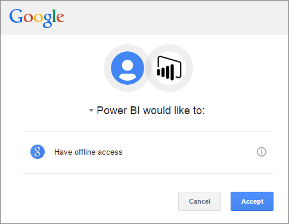
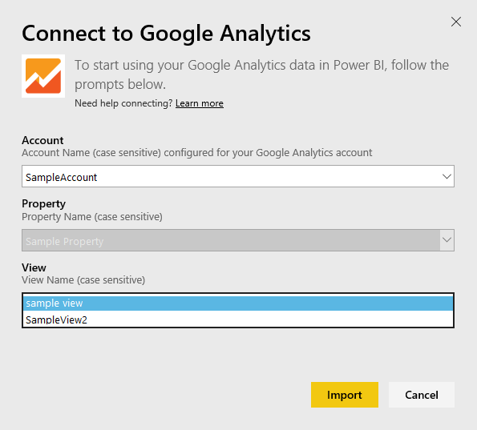
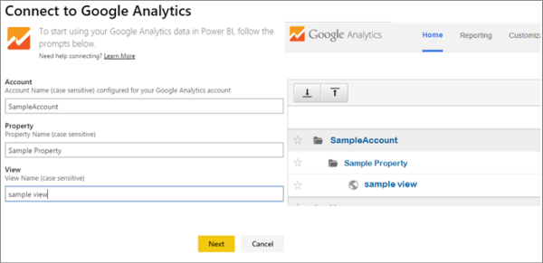

<properties
   pageTitle="Google Analytics content pack for Power BI"
   description="Google Analytics content pack for Power BI"
   services="powerbi"
   documentationCenter=""
   authors="theresapalmer"
   manager="mblythe"
   editor=""
   tags=""
   qualityFocus="no"
   qualityDate=""/>

<tags
   ms.service="powerbi"
   ms.devlang="NA"
   ms.topic="article"
   ms.tgt_pltfrm="NA"
   ms.workload="powerbi"
   ms.date="03/28/2016"
   ms.author="tpalmer"/>
   
# Google Analytics content pack for Power&nbsp;BI

Connecting to Google Analytics through Power BI starts by connecting to your Google Analytics account. You will get a Power BI dashboard and a set of Power BI reports that provide insights about your site traffic and user dimensions. You can use the dashboard and reports provided, or customize them to highlight the information you care most about. The data will be refreshed automatically once per day.

Connect to the [Google Analytics content pack](https://app.powerbi.com/getdata/services/google-analytics) for Power BI or read more about the [Google Analytics integration](https://powerbi.microsoft.com/integrations/google_analytics) with Power BI.

In addition to this content pack, customized dashboards and reports can also be created starting from the [Google Analytics connector](powerbi-service-google-analytics-connector.md) in Power BI Desktop. Just connect with your Google Analytics account and create your custom reports which can also be published to the Power BI service.

## How to connect

1.  Select **Get Data** at the bottom of the left navigation pane.

     

2.  In the **Services** box, select **Get**.

     

3.  Select **Google Analytics** \> **Connect**.

    

4.  When prompted, enter your Google Analytics credentials. Select **oAuth 2** as the Authentication Mechanism and click **Sign In**. Follow the Google authentication flow, which may include 2-factor authentication if you have it configured.

    

5.  Click **Accept** to allow Power BI to access your Google Analytics data.

    

6.  The content pack connects to a specific Google Analytics View. Select the account name, property name and view name you’d like to connect to.  This information can be found in your Google Analytics account, either in the top left or on the **Home** tab. See details below. 

    

7.  Click **Connect** to begin the import process. When complete, a new dashboard, report and model will appear in the Navigation Pane. Select the dashboard to view your imported data.

     
    
**What Now?**

- Try [asking a question in the Q&A box](powerbi-service-q-and-a.md) at the top of the dashboard

- [Change the tiles](powerbi-service-edit-a-tile-in-a-dashboard.md) in the dashboard.

- [Select a tile](powerbi-service-dashboard-tiles.md) to open the underlying report.

- While your dataset will be schedule to refreshed daily, you can change the refresh schedule or try refreshing it on demand using **Refresh Now**

## System requirements

This content pack requires you to have a [Google Analytics](https://www.google.com/analytics/) account. Other Google accounts that do not have a Google Analytics account connected to it will see an authentication error.

## Troubleshooting 

**Credentials**
If you have multiple Google accounts, please use an incognito or an in-private broswer window during connection to ensure the correct account is used.

If you're getting an error indicating your credentials are invalid however you were able to sign into Google, please confirm you have a [Google Analytics](https://www.google.com/analytics/) account.

**Parameters**
Unique names are currently required for the parameters. If you see an error indicating the value you selected is duplicated, please select another value or change the names in Google Analytics to make them unique. We're actively working to improve this. 

Note: Parameters are case-sensitive. Enter them exactly as they appear in your Google Analytics account.

Still having issues? Open a support ticket to reach the Power BI team:

-   While in the Power BI app, select the question mark \> **Contact Support.**

-   From the Power BI Support site (where you're reading this article), select **Contact Support** on the right side of the page.

### See also

[Get started with Power BI](powerbi-service-get-started.md)

[Power BI - Basic Concepts](powerbi-service-basic-concepts.md)

[Google Analytics Power BI Desktop connector](powerbi-service-google-analytics-connector.md)
