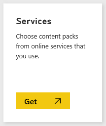

<properties 
   pageTitle="Mandrill content pack for Power BI"
   description="Mandrill content pack for Power BI"
   services="powerbi" 
   documentationCenter="" 
   authors="v-anpasi" 
   manager="mblythe" 
   editor=""
   tags=""/>
 
<tags
   ms.service="powerbi"
   ms.devlang="NA"
   ms.topic="article"
   ms.tgt_pltfrm="NA"
   ms.workload="powerbi"
   ms.date="09/28/2015"
   ms.author="v-anpasi"/>
# Mandrill content pack for Power BI

**Update 8/17**: The Mandrill content pack has been restored in Power BI, we apologize for any inconvenience. We are always interested in your feedback, please contact us at http://support.powerbi.com.

The Power BI content pack pulls data from your Mandrill account and generates a dashboard, a set of reports and a dataset to allow you to explore your data. Use Mandrill's analytics to quickly gain insights into your newsletter or marketing campaign. The data is set to refresh daily ensuring the data you're monitoring is up to date.

[Connect to the Mandrill content pack for Power BI.](http://app.powerbi.com/getdata/services/mandrill)

1. Select Get Data at the bottom of the left navigation pane.

	

2. In the Services box, select Get.

	

3. Select Mandrill \> Connect.

	

4. For Authentication Method, select Key and provide your API key. The key can be located under the settings tab from Mandrill's dashboard. Select Sign In to begin the import process, which can take a few minutes depending on the volume of data in your account.

	

5. After Power BI imports the data you will see a new dashboard, report, and dataset in the left navigation pane. This is the default dashboard that Power BI created to display your data. You can modify this dashboard to display your data in any way you want.

	

You can change this dashboard to display your data the way you want it. Plus you can:

- [Change the tiles](https://support.powerbi.com/knowledgebase/articles/424878) in the dashboard.

- [Select a tile](https://support.powerbi.com/knowledgebase/articles/425669) to open the underlying report.

### See Also

****[Get started in Power BI](https://support.powerbi.com/knowledgebase/articles/430814-get-started-with-power-bi)

[Get data in Power BI](https://support.powerbi.com/knowledgebase/topics/63369)

[Services in Power BI](https://support.powerbi.com/knowledgebase/topics/88770)



