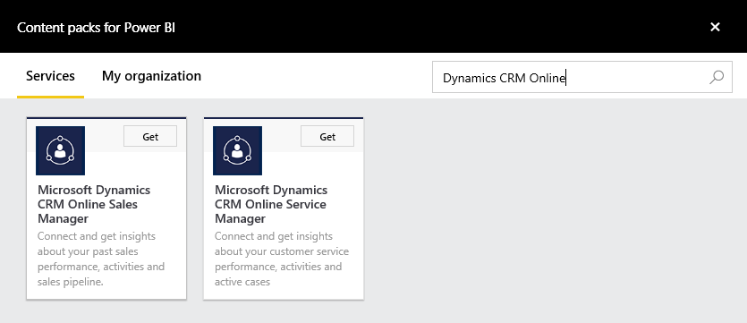
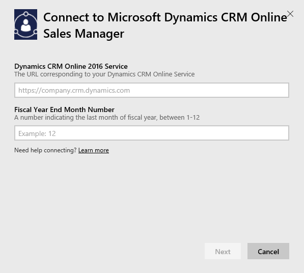

<properties 
   pageTitle="Microsoft Dynamics CRM content pack for Power BI"
   description="Microsoft Dynamics CRM content pack for Power BI"
   services="powerbi" 
   documentationCenter="" 
   authors="theresapalmer" 
   manager="mblythe" 
   backup=""
   editor=""
   tags=""
   qualityFocus="no"
   qualityDate=""/>
 
<tags
   ms.service="powerbi"
   ms.devlang="NA"
   ms.topic="article"
   ms.tgt_pltfrm="NA"
   ms.workload="powerbi"
   ms.date="05/09/2016"
   ms.author="tpalmer"/>
   
# Microsoft Dynamics CRM content pack for Power&nbsp;BI

The Microsoft Dynamics CRM Online content pack for Power BI allows you to easily access and analyze your data. The content pack uses the OData feed to create a descriptive model, with all the entities and measures needed such as Accounts, Activities, Opportunities, Product, Leads, Users and more. The data is filtered down to opportunities that were created or closed in the last 365 days and will be refreshed daily.

Connect to the Dynamics CRM Online [Sales Manager](https://msit.powerbi.com/groups/me/getdata/services/dynamics-crm-sales-manager) or [Service Manager](https://msit.powerbi.com/groups/me/getdata/services/dynamics-crm-customer-service) content packs,or read more about the [Dynamics CRM Online integration](https://powerbi.microsoft.com/integrations/microsoft_dynamicscrm) with Power BI.

Note: this content pack requires Microsoft Dynamics CRM Online 2016. More details on [requirements](#Requirements) below.

## How to connect

1.  Select Get Data at the bottom of the left navigation pane.

     

2.  In the Services box, select Get.

     

3.  Select **Microsoft Dynamics CRM Sales Manager** or **Microsoft Dynamics CRM Service Manager** and click **Connect**.

    

4.  Provide the Service URL associated with your account.  This will be in the form `https://mytenant.crm.dynamics.com`, see more details [below](#FindingParams).

	

5.  When prompted, provide your credentials (this step might be skipped if you are already signed in with your browser). For Authentication Method, enter **oAuth2** and click **Sign In**:

    

6.  After connecting, you'll see a dashboard customized for a Sales Manager or Service Manager, populated with your own data:

    

**What Now?**

- Try [asking a question in the Q&A box](powerbi-service-q-and-a.md) at the top of the dashboard

- [Change the tiles](powerbi-service-edit-a-tile-in-a-dashboard.md) in the dashboard.

- [Select a tile](powerbi-service-dashboard-tiles.md) to open the underlying report.

- While your dataset will be schedule to refreshed daily, you can change the refresh schedule or try refreshing it on demand using **Refresh Now**

## System requirements

-   A valid Dynamics CRM Online 2016 instance (the content pack will not work with an on-premises CRM version).

-   An administrator must enable the OData endpoint in the site settings. 

-   An account with less than 100k records in any of the tables. Note if the account has access to more than 100k records the import will fail. 

## Finding parameters

The address of the instance can be found in the URL bar of your browser. It typically has the format: `https://[instance_name].crm.dynamics.com`

Note: only Dynamics CRM 2016 endpoints are supported in the content pack.

## Troubleshooting

If you're having trouble connecting, please confirm you're providing the correct instance URL and the instance is CRM Online 2016. Also ask your admin to confirm the correct service URL and that the OData endpoint is enabled.

If you see an error "Data refresh failed as query exceeded the maximum limit of 100000 records.", please consider connecting directly from the Power BI Desktop or leveraging the CRM solution template. 

If you're still having issues, open a support ticket to reach the Power BI team:

-   While in the Power BI app, select the question mark \> Contact Support.

-   From the Power BI Support site (where you're reading this article), select Support on the right side of the page.

### See also

[Get started with Power BI](powerbi-service-get-started.md)

[Power BI - Basic Concepts](powerbi-service-basic-concepts.md)

