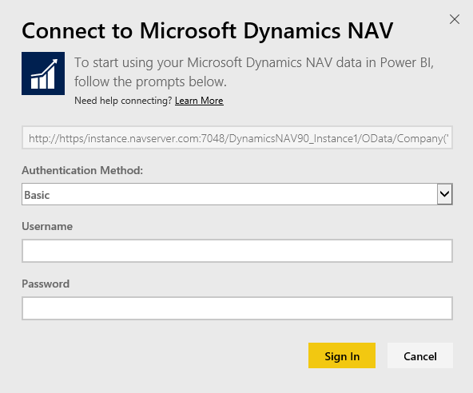
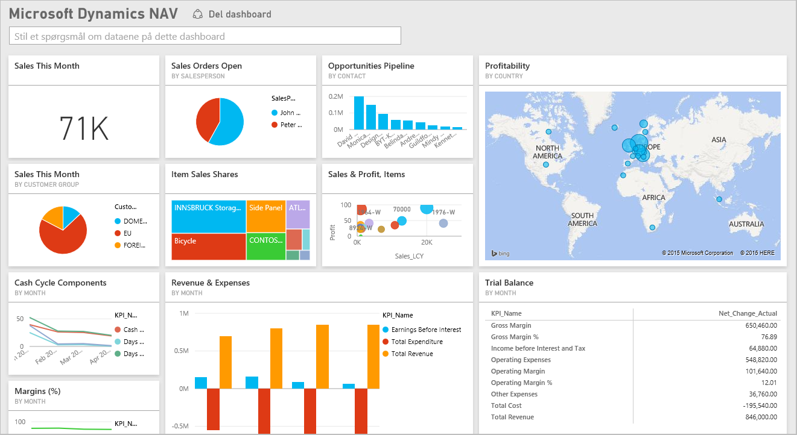

<properties 
   pageTitle="Microsoft Dynamics NAV content pack for Power BI"
   description="Microsoft Dynamics NAV content pack for Power BI"
   services="powerbi" 
   documentationCenter="" 
   authors="maggiesMSFT" 
   manager="mblythe" 
   editor=""
   tags=""/>
 
<tags
   ms.service="powerbi"
   ms.devlang="NA"
   ms.topic="article"
   ms.tgt_pltfrm="NA"
   ms.workload="powerbi"
   ms.date="10/16/2015"
   ms.author="maggies"/>

# Microsoft Dynamics NAV content pack for Power BI  

Getting insights into your Microsoft Dynamics NAV data is easy with Power BI and the Microsoft Dynamics NAV content pack. Power BI retrieves your data, both Sales and Financial data then builds an out-of-box dashboard and reports based on that data.

[Connect to the Microsoft Dynamics NAV for Power BI.](https://app.powerbi.com/getdata/services/microsoft-dynamics-nav)

>**Important:**  
>
>- To import your Microsoft Dynamics NAV data into Power BI, you need to have permissions to the tables where data is retrieved from, in this case sales and finance data. You sign in your account credentials.
>
>- The Power BI Microsoft Dynamics NAV content pack uses Microsoft Dynamics NAV's web services to retrieve your data. If you have a lot of data in your Microsoft Dynamics NAV instance, a suggestion to minimize the impact on your web service usage is to change the refresh frequency depending on your needs. Another suggestion is to have one admin create the content pack and share it instead of having every admin create their own.

1. Select Get Data at the bottom of the left navigation pane.  

2. In the Services box, select Get.  

3. Select Microsoft Dynamics NAV, then select Connect.  

4. When prompted, enter your Microsoft Dynamics NAV credentials and follow the Microsoft Dynamics NAV authentication process. If you are already signed in to Microsoft Dynamics NAV in your browser, you may not be prompted for credentials.

    	https//instance.navserver.com:7048/DynamicsNAV90_Instance1/OData/Company('CRONUS%20International%20Ltd.')
	- "instance.navserver.com" with your NAV Server name
	- "DynamicsNAV90\_Instance1" with your NAV Server Instance name
    - "Company('CRONUS%20International%20Ltd.')" with your NAV Company name

	An easy way to obtain this URL is in Dynamics NAV to go to Web Services, find the powerbifinance web service and copy the OData URL, but leaving out the “/powerbifinance” from the URL string.  
	

5. When prompted, enter your Microsoft Dynamics NAV credentials and follow the Microsoft Dynamics NAV authentication process. If you are already signed in to Microsoft Dynamics NAV in your browser, you may not be prompted for credentials.

	>**Note:**  
	>You need admin credentials (or at least permissions to sales and finance data for your Microsoft Dynamics NAV account.  
	
	

6. Power BI will retrieve your Microsoft Dynamics NAV data and create a ready-to-use dashboard and report for you.   

### Troubleshooting  
**"Parameter validation failed, please make sure all parameters are valid"**  
If you see this error after typing your Microsoft Dynamics NAV URL. Make sure the following requirements are satisfied:

  - The URL follows exactly this pattern 
    	https//instance.navserver.com:7048/DynamicsNAV90_Instance1/OData/Company('CRONUS%20International%20Ltd.')
	Replacing:
    - "instance.navserver.com" with your NAV Server name
	- "DynamicsNAV90\_Instance1" with your NAV Server Instance name
    - "Company('CRONUS%20International%20Ltd.')" with your NAV Company name
  - Make sure all the letters are lower case.  
  - Make sure the URL is in 'https'.  
  - Make sure there are no trailing forward slash at the end of the URL.

**"Login failed"**  
If you get a "login failed" error after using your Microsoft Dynamics NAV credentials to login, then you may be hitting one of the following issues:
- The account you are using doesn't have permissions to retrieve the Microsoft Dynamics NAV data from your account. Verify it is an admin account and try again.  
- The Dynamics NAV instance you're trying to connect to doesn't have a valid SSL certificate. In this case you'll see a more detailed error message ("unable to establish trusted SSL relationship"). Note that self-signed certs are not supported.

**"Oops"**  
If you see an "Oops" error dialog after you pass the authentication dialog, we're hitting an issue while loading the data for the content pack. 

- Verify the URL follows the pattern specified above. A common mistake is to specify 

    `https//instance.navserver.com:7048/DynamicsNAV90\_Instance1/OData` 
    
    however the 'Company('CRONUS%20International%20Ltd.')' section with your NAV Company name needs to be included:
    
    `https//instance.navserver.com:7048/DynamicsNAV90\_Instance1/OData/Company('CRONUS%20International%20Ltd.')`
    
- Ensure your account has all the tables (case sensitive) required for the content pack. These include:
    - ItemSalesAndProfit
    - ItemSalesByCustomer
    - powerbifinance
    - SalesDashboard
    - SalesOpportunities
    - SalesOrdersBySalesPerson
    - TopCustomerOverview
