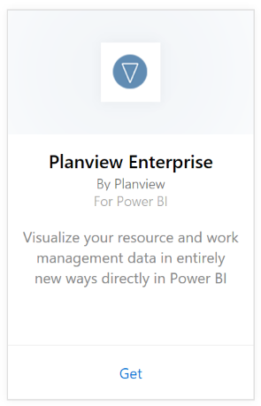
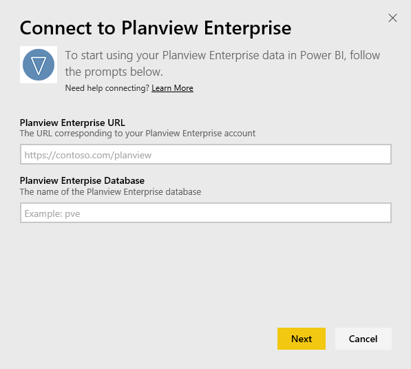

<properties 
   pageTitle="Planview Enterprise content pack"
   description="Planview Enterprise content pack for Power BI"
   services="powerbi" 
   documentationCenter="" 
   authors=”joeshoukry” 
   manager="mblythe" 
   backup=""
   editor=""
   tags=""
   qualityFocus="no"
   qualityDate=""/>
 
<tags
   ms.service="powerbi"
   ms.devlang="NA"
   ms.topic="article"
   ms.tgt_pltfrm="NA"
   ms.workload="powerbi"
   ms.date="08/29/2016"
   ms.author=”yshoukry”/>

# Planview Enterprise content pack for Power&nbsp;BI

With the Planview Enterprise content pack, you can visualize your resource and work management data in entirely new ways directly in Power BI. Use your Planview Enterprise sign-in credentials to interactively see your portfolio investment spend, understand where you are over and under budget, and know how well your projects align with your corporate strategic priorities. You can also extend the out-of-the box dashboard and reports to get the insights that are most important to you.

Connect to the [Planview Enterprise content pack in Power BI](https://app.powerbi.com/getdata/services/planview-enterprise)

Note: To import your Planview Enterprise data into Power BI, you must be a Planview Enterprise user with the Reporting Portal Viewer feature enabled on your role. See additional requirements below. 

## How to connect

1. Select **Get Data** at the bottom of the left navigation pane.

    

2. In the **Services** box, select **Get**.

    

3. On the Power BI page, select **Planview Enterprise**, then select **Get**:  
	

4. In the Planview Enterprise URL text box, enter the URL for the Planview Enterprise server you want to use. In the Planview Enterprise Database text box, enter the name of the Planview Enterprise database, then click Next.  
	

5.  On the Authentication Method list, select **Basic** if it is not already selected. Enter the **Username** and **Password** for your account and select **Sign In**.  
	

6. On the left pane, select Planview Enterprise from the list of dashboards.  
 	Power BI imports Planview Enterprise data into the dashboard. Note that the data may take some time to load.  
	

**What Now?**

- Try [asking a question in the Q&A box](powerbi-service-q-and-a.md) at the top of the dashboard

- [Change the tiles](powerbi-service-edit-a-tile-in-a-dashboard.md) in the dashboard.

- [Select a tile](powerbi-service-dashboard-tiles.md) to open the underlying report.

- While your dataset will be schedule to refreshed daily, you can change the refresh schedule or try refreshing it on demand using **Refresh Now**

## System requirements

To import your Planview Enterprise data into Power BI, you must be a Planview Enterprise user with the Reporting Portal Viewer feature enabled on your role. See additional requirements below. 

This procedure assumes you have already signed in to the Microsoft Power BI home page with a Power BI account. If you do not have a Power BI account, create a new free Power BI account on the Power BI home page, and then click Get Data.

### See Also:

[Get started with Power BI](powerbi-service-get-started.md)

[Get Data for Power BI](powerbi-service-get-data.md)