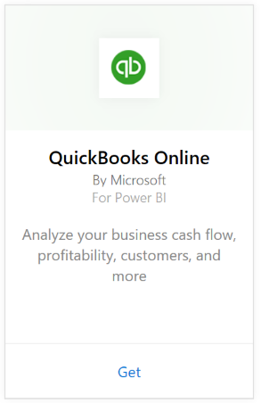
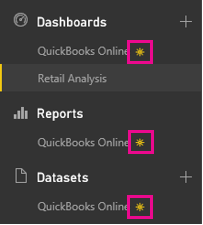
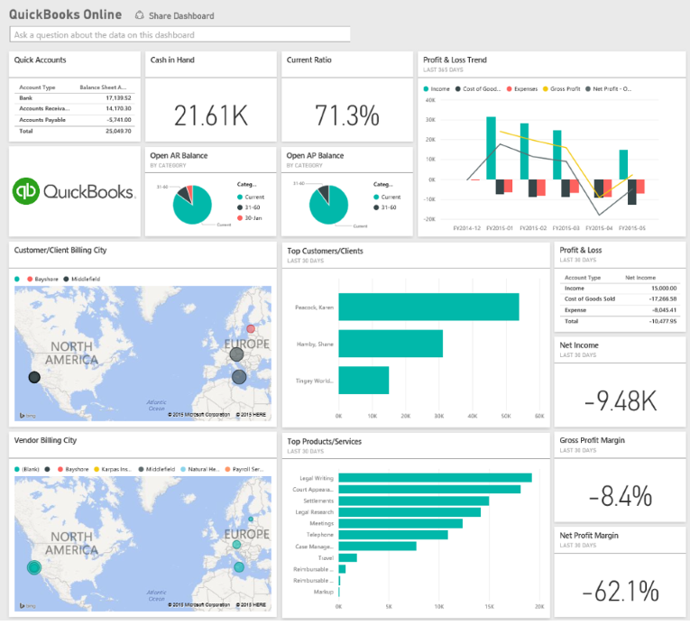

<properties 
   pageTitle="QuickBooks Online content pack for Power BI"
   description="QuickBooks Online content pack for Power BI"
   services="powerbi" 
   documentationCenter="" 
   authors="theresapalmer" 
   manager="mblythe" 
   backup=""
   editor=""
   tags=""
   qualityFocus="no"
   qualityDate=""/>
 
<tags
   ms.service="powerbi"
   ms.devlang="NA"
   ms.topic="article"
   ms.tgt_pltfrm="NA"
   ms.workload="powerbi"
   ms.date="05/17/2016"
   ms.author="tpalmer"/>

# QuickBooks Online content pack for Power&nbsp;BI

When you connect to your QuickBooks Online data from Power BI you immediately get a Power BI dashboard and Power BI reports that provide insights about your business cash flow, profitability, customers, and more. Use the dashboard and reports as they are, or customize them to highlight the information you care most about. The data is refreshed automatically once a day.

Connect to the [QuickBooks Online content pack](https://dxt.powerbi.com/getdata/services/quickbooks-online) for Power BI.

Note: To import your QuickBooks Online data into Power BI, you need to be an admin on your QuickBooks Online account and sign in with your admin account credentials.

## How to connect 

1.  Select **Get Data** at the bottom of the left navigation pane.

     

2.  In the **Services** box, select **Get**.

     

3.  Select **QuickBooks Online**, then select **Get**.

    

4.  Select **oAuth2** for Authentication Method and select **Sign In**. 

5.  When prompted, enter your QuickBooks Online credentials and follow the QuickBooks Online authentication process. If you are already signed in to QuickBooks Online in your browser, you may not be prompted for credentials.

    **Note:** You need admin credentials for your QuickBooks Online account.

6.  Select the company you would like to connect to Power BI in the next screen.

    

7.  Select **Authorize** in the next screen to begin the import process. This can take a few minutes depending on the size of your company data. 

    

    After Power BI imports the data, you see a new dashboard, report, and dataset in the left navigation pane. New items are marked with a yellow asterisk \*.

    

8.  Select the QuickBooks Online dashboard. This is the dashboard Power BI created automatically to display your imported data. You can modify this dashboard to display your data any way you want. 

    

**What Now?**

- Try [asking a question in the Q&A box](powerbi-service-q-and-a.md) at the top of the dashboard

- [Change the tiles](powerbi-service-edit-a-tile-in-a-dashboard.md) in the dashboard.

- [Select a tile](powerbi-service-dashboard-tiles.md) to open the underlying report.

- While your dataset will be schedule to refreshed daily, you can change the refresh schedule or try refreshing it on demand using **Refresh Now**

## Troubleshooting 

**“Oops! An error has occurred"**

If you get this message after selecting **Authorize**:

“Oops! An error has occurred." Please close this window and try again.

The application has already been subscribed to by another user for this company. Please contact [admin email] to make changes to this subscription.”

... this means another admin in your company has already connected to your company data with Power BI. Ask that admin to share the dashboard with you. Currently, only one admin user can connect a particular QuickBooks Online company dataset to Power BI. After Power BI creates the dashboard, the admin can shared it with multiple colleagues on the same Power BI tenants.

**"This app is not set up to allow connections from your country"**

Currently Power BI only supports US editions of QuickBooks Online. 

### See also

[Get started with Power BI](powerbi-service-get-started.md)

[Power BI - Basic Concepts](powerbi-service-basic-concepts.md)

