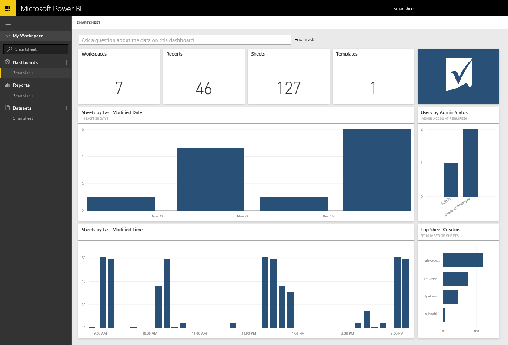

<properties 
   pageTitle="Smartsheet content pack for Power BI"
   description="Smartsheet content pack for Power BI"
   services="powerbi" 
   documentationCenter="" 
   authors="tpalmer" 
   manager="mblythe" 
   editor=""
   tags=""/>
 
<tags
   ms.service="powerbi"
   ms.devlang="NA"
   ms.topic="article"
   ms.tgt_pltfrm="NA"
   ms.workload="powerbi"
   ms.date="09/28/2015"
   ms.author="maggies"/>
# Smartsheet content pack for Power BI

Smartsheet offers an easy platform for collaboration and file sharing., the Power BI content pack offers an overview of your Smartsheet account.

**Important:**

-   Smartsheet admin account is preferred to connect and load the Power BI content pack as it has additional access
-   Smartsheet content pack doesn't currently allow you to access individual sheet, stay tuned for more updates

Connect to the [Smartsheet content pack](https://app.powerbi.com/groups/me/getdata/services/smartsheet) for Power BI.

1.  Select **Get Data** at the bottom of the left navigation pane.

	

2.  In the **Services** box, select **Get**.

	 

3.  Select **Smartsheet \> Connect**.

	

4.  For Authentication Method, select oAuth2 \> Sign In.

	When prompted, enter your Smartsheet credentials and follow the authentication process.

	
    
    

6.  After Power BI imports the data you will see a new dashboard, report, and dataset in the left navigation pane. New items are marked with a yellow asterisk \*, select the Office365Mon entry.

	

What can you do now?

-   Try asking a question in the Q&A box at the top of the dashboard, such as "count of sheets"

-   Change the tiles in the dashboard.

-   Select a tile to open the underlying report.

-   Rename the dashboard: Select the ellipsis (…) next to the dashboard \> Rename.

See Also:

[Get started with Power BI](powerbi-service-get-started.md)

[Get Data for Power BI](powerbi-service-get-data.md)

