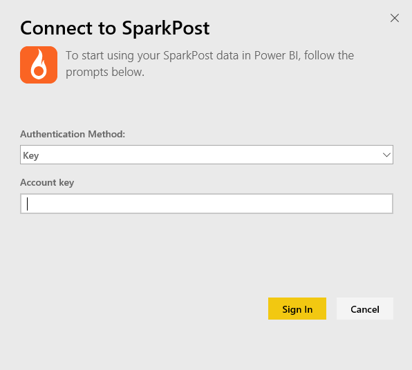

<properties
   pageTitle="SparkPost content pack for Power BI"
   description="SparkPost content pack for Power BI"
   services="powerbi"
   documentationCenter=""
   authors="theresapalmer"
   manager="mblythe"
   editor=""
   tags=""/>

<tags
   ms.service="powerbi"
   ms.devlang="NA"
   ms.topic="article"
   ms.tgt_pltfrm="NA"
   ms.workload="powerbi"
   ms.date="02/08/2016"
   ms.author="tpalmer"/>

# SparkPost content pack for Power&nbsp;BI

The Power BI content pack for SparkPost allows you to extract valuable datasets from your SparkPost account all into one insightful dashboard. Using the SparkPost content pack you can visualize your overall email statistics, including domains, campaigns, and engagement by ISP.

Connect to the [SparkPost content pack for Power BI](https://app.powerbi.com/getdata/services/spark-post).

1.  Select **Get Data** at the bottom of the left navigation pane.

	

2.  In the **Services** box, select **Get**.

	

3.  Select the **SparkPost** content pack and click **Connect**. 

	

4.  When prompted, provide your SparkPost API key and select Sign In. For more details, please see the **Finding your SparkPost API key** below.

	

5.  Your data will start to load, depending on the size of you account this may take some time. After Power BI imports the data, you’ll see the default dashboard, report, and dataset in the left navigation pane, populated with your email statistics for the past 90 days. New items are marked with a yellow asterisk \*.

	

You have the freedom to change the dashboard to display your data anyway you see fit. In addition, you can ask a question in Q&A or click a tile to open the underlying report and change the tiles in the dashboard. The SparkPost content pack is configured by default to refresh once a day.

## Finding your SparkPost API key

The content pack uses an API key to connect your SparkPost account to Power BI. You can find your API key in your account under Account \> API & SMTP. We suggest using an API key with permissions for `Message Events: Read-only `and `Metrics: Read-only`

