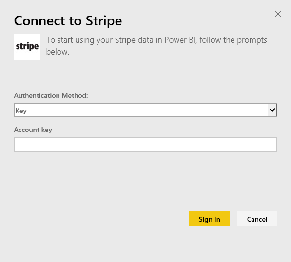
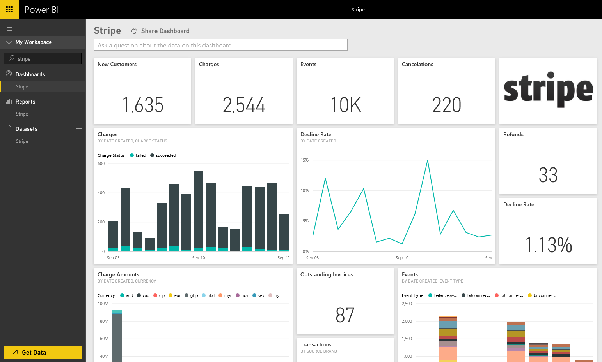

<properties 
   pageTitle="Stripe content pack for Power BI"
   description="Stripe content pack for Power BI"
   services="powerbi" 
   documentationCenter="" 
   authors="v-aljenk" 
   manager="mblythe" 
   editor=""
   tags=""/>
 
<tags
   ms.service="powerbi"
   ms.devlang="NA"
   ms.topic="article"
   ms.tgt_pltfrm="NA"
   ms.workload="powerbi"
   ms.date="10/16/2015"
   ms.author="v-aljenk"/>

# Stripe content pack for Power BI

[← Services in Power BI](https://support.powerbi.com/knowledgebase/topics/88770-services-in-power-bi)

Visual and explore your Stripe data in Power BI with the Power BI
content pack. The Power BI Stripe content pack pulls in data about your
Customers, Charges, Events and Invoices. The data includes the most
recent ten thousand events and five thousand charges over the last 30
days. The content will be refreshed automatically once per day at a
schedule you control. 

[Connect to the Power BI Stripe content pack.](https://app.powerbi.com/getdata/services/stripe)

1. Select Get Data at the bottom of the left navigation pane.

   

2. In the Services box, select Get.
 
     

3. Select Stripe &gt; Connect.

     

4. Provide your Stripe [API key](https://dashboard.stripe.com/account/apikeys) to connect. 
 
   

5. The import process will begin automatically. When complete, a new
dashboard, report and model will appear in the Navigation Pane, marked
with an asterisk. Select the dashboard to view your imported data.

   
 
You can change this dashboard to display your data the way you want.
Click a tile to open the underlying report and change the tiles in the
dashboard.
