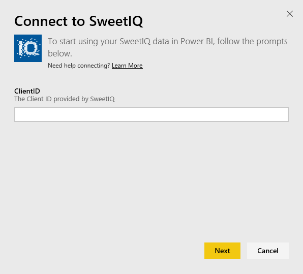
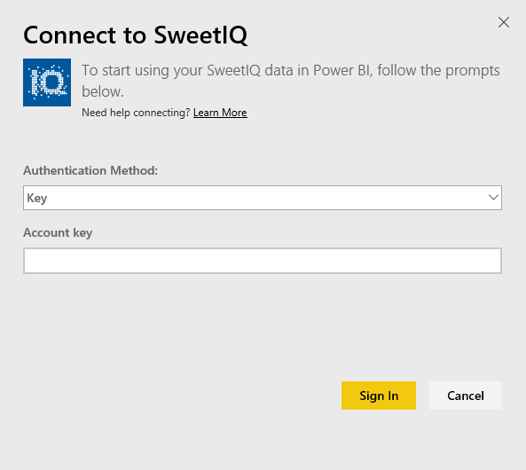
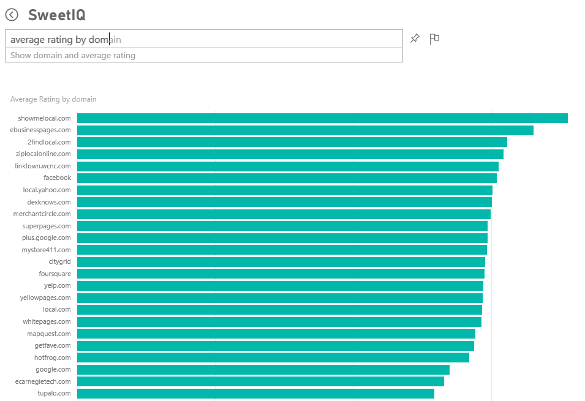

<properties 
   pageTitle="SweetIQ content pack for Power BI"
   description="SweetIQ content pack for Power BI"
   services="powerbi" 
   documentationCenter="" 
   authors="v-anpasi" 
   manager="mblythe" 
   editor=""
   tags=""/>
 
<tags
   ms.service="powerbi"
   ms.devlang="NA"
   ms.topic="article"
   ms.tgt_pltfrm="NA"
   ms.workload="powerbi"
   ms.date="09/28/2015"
   ms.author="v-anpasi"/>
# SweetIQ content pack for Power BI

The Power BI content pack pulls data from your SweetIQ account and generates set of out of box content allowing you to easily explore your data. Use the SweetIQ content pack to analyze data about your locations, listings, ratings and reviews. The data is set to refresh daily ensuring the data you're monitoring is up to date.

1. In the navigation pane on the left, click **Get Data.**

	

2. Select **SweetIQ** and click **Connect.**

	

3. Provide your SweetIQ Client ID. This is typically an alpha-numeric value. For more details on finding this value, see below.

	

4. Select **Key** authentication type and provide your Sweet IQ API Key. This is typically an alpha-numeric value. For more details on finding this value, see below.

	

5. Power BI will start loading your data, which may take some time depending on the size of data in your account. Once the load has completed, you'll see a new dashboard, report and dataset in the left navigation pane.

	

Once the loading has completed, you can start exploring your data.

- Try [asking a question in the Q&A box](powerbi-service-q-and-a.md) , such as "average rating by domain"

- [Change the tiles](powerbi-service-edit-a-tile-in-a-dashboard.md) in the dashboard.

- [Select a tile](powerbi-service-dashboard-tiles.md) to open the underlying report.

### Finding your SweetIQ Client ID and API Key

The Client ID and API key for this content pack is not the same as your SweetIQ username and password.

Select a Client ID for one of the clients your account has access to. You can find the list of clients under "Client Management" in your SweetIQ account.

Talk to your administrator for your API key, to access the data for specific client.

