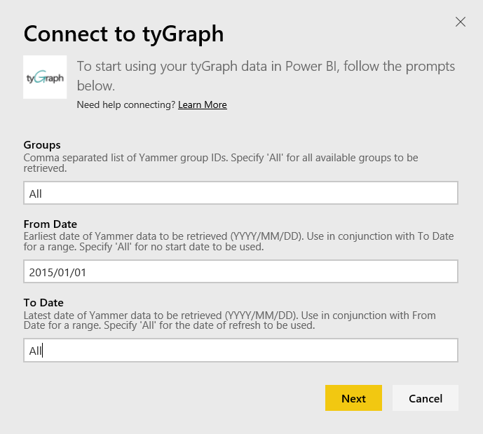
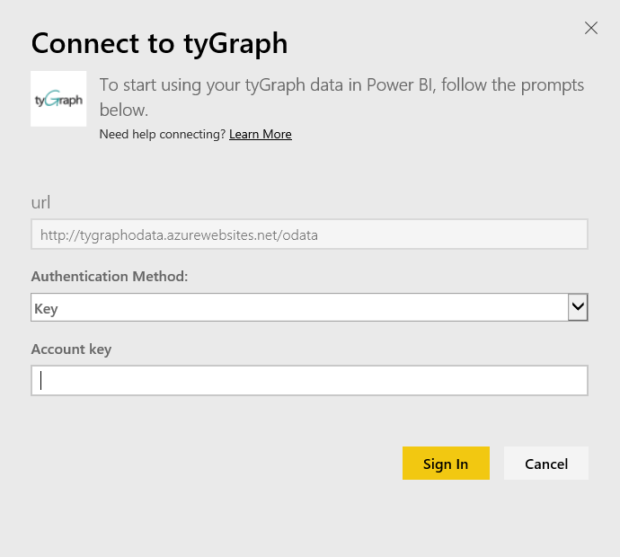
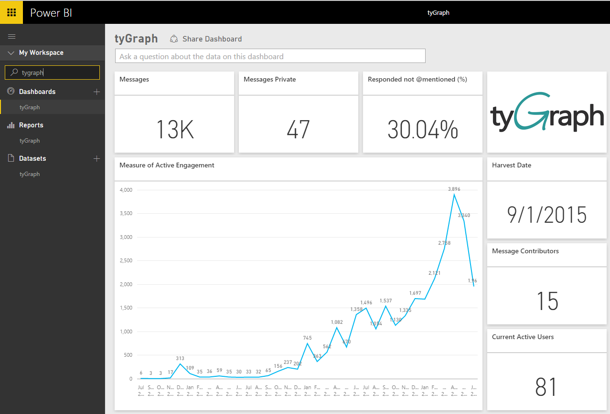

<properties 
   pageTitle="tyGraph content pack for Power BI"
   description="tyGraph content pack for Power BI"
   services="powerbi" 
   documentationCenter="" 
   authors="maggiesMSFT" 
   manager="mblythe" 
   editor=""
   tags=""/>
 
<tags
   ms.service="powerbi"
   ms.devlang="NA"
   ms.topic="article"
   ms.tgt_pltfrm="NA"
   ms.workload="powerbi"
   ms.date="11/06/2015"
   ms.author="maggies"/>
# tyGraph content pack for Power BI

Visualize and explore your tyGraph data in Power BI with the Power BI content pack. Start by connecting to your tyGraph account and loading the dashboard, reports and dataset. The out of box content includes insights such as the Measure of Active Engagement (MAE score) and Top Contributors. Customize it further to highlight the information you care most about.  The data will be refreshed automatically according to a schedule that you set.

[Connect to the tyGraph content pack for Power BI.](https://app.powerbi.com/getdata/services/tygraph)

1.  Select Get Data at the bottom of the left navigation pane.

	
2.  In the Services box, select Get.

	

3.  Select tyGraph \> Connect.

	

4.  Specify the groups and time range you'd like to connect to, otherwise specify "All" to bring in all the data. Note the date format that's expected (YYYY/MM/DD). See details on finding the parameter below.

	

5. Provide your tyGraph key to connect. See details on finding this value below.

	**If you are a Yammer Verified Admin**  
	Your API key is sent to you in an email when your tyGraph account is successfully created. If you can no longer find your key, you can request a new one by sending an email to support@unlimitedviz.com. If you do not yet have a tyGraph account, you can start a trial at [http://www.tygraph.com/SignUp.aspx](http://www.tygraph.com/SignUp.aspx). 

	**If you are not a Yammer Verified Admin**

	The tyGraph content pack requires a tyGraph account created by a Yammer verified administrator. Once created, supplemental keys can be issued to users within the same organization. If your verified admin has not yet created a tyGraph account, contact them to have them do so. If they have, you can request a key by sending an email to <support@unlimitedviz.com>.

	

6. After successful authentication, the import process will begin automatically. When complete, a new dashboard, report and model will appear in the Navigation Pane. Select the dashboard to view your imported data.

	

You can change this dashboard to display your data the way you want. Click a tile to open the underlying report and change the tiles in the dashboard.

## Finding tyGraph Parameters and Credentials

You can bring in data on all the groups you have access to, or you can choose to specify a subset. You can also create a subset of data by date. You can create multiple tyGraph dashboards to monitor specific sets of groups and/or dates. Details on these parameters are below.

### Groups

The tyGraph API can filter data by specific group ID. These are provided to the content pack in a comma separated list. 

	Example: 2427647,946595,1154464

You can Identify the group ID for a particular group in Yammer by navigating to the feed for the group, and examining the URL.

In the above example, the Yammer Group ID is 4054844

### From Date

The From Date allows you to restrict the earliest value for the data returned. Only data created on or after this date will be loaded into the content pack. The format of the From Date is YYYY/MM/DD. 

	Example: 2013/10/29

In the above example, all data from on or after October 29, 2013 will be loaded into the content pack. 

### To Date

The To Date allows you to restrict the latest value for the data returned. It can be used in conjunction with the From Date to load data from a range of dates. Only data created on or before this date will be loaded into the content pack. The format of the To Date is YYYY/MM/DD. 

	Example: 2014/10/20

In the above example, all data from on or prior to October 20, 2014 will be loaded into the content pack. 

