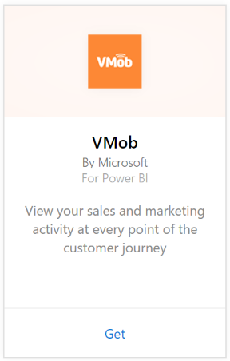
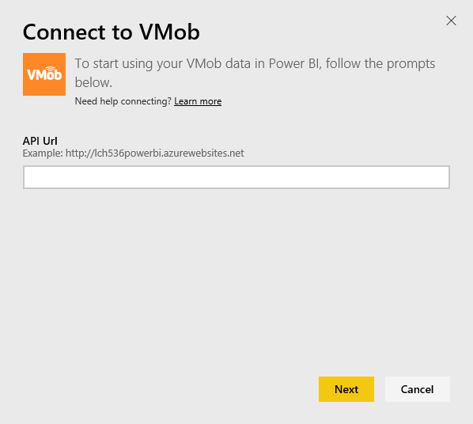
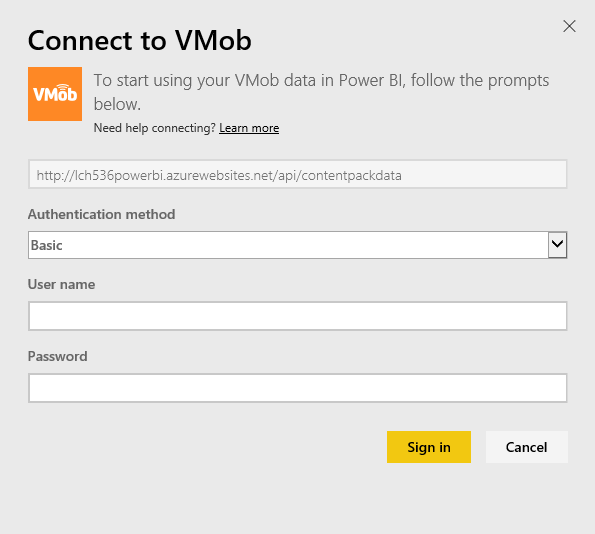
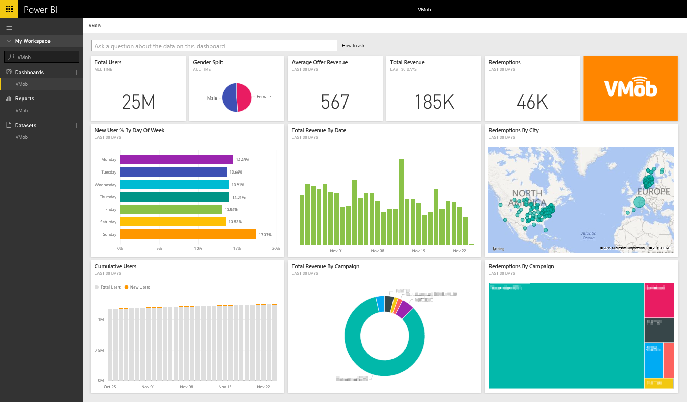

<properties
   pageTitle="VMob content pack for Power BI"
   description="VMob content pack for Power BI"
   services="powerbi"
   documentationCenter=""
   authors="theresapalmer"
   manager="mblythe"
   backup=""
   editor=""
   tags=""
   qualityFocus="no"
   qualityDate=""/>

<tags
   ms.service="powerbi"
   ms.devlang="NA"
   ms.topic="article"
   ms.tgt_pltfrm="NA"
   ms.workload="powerbi"
   ms.date="05/17/2016"
   ms.author="tpalmer"/>
   
# Microsoft VMob content pack for Power&nbsp;BI

Tracking and exploring your VMob data is easy with Power BI and the VMob content pack. Power BI will retrieve the following data: User Statistics for all time and in the last 30 days, Retail KPI for the last 30 days and Campaign Performance for the last 30 days.

Connect to the [VMob content pack](https://app.powerbi.com/getdata/services/vmob) for Power BI.

## How to connect

1. Select **Get Data** at the bottom of the left navigation pane.

	

2.  In the **Services** box, select **Get**.

	

3.  Select **VMob** \> **Get**.

	

4. When prompted, enter your VMob URL and click on the Next button. This URL is provided by VMob separately.

    

5. Choose **Basic** option in the Authentication method dropdown, enter your VMob username and password and click on **Sign In** button.

	

6.  The import process will begin automatically and Power BI will retrieve your VMob data to create a ready-to-use dashboard and report for you.

	

**What Now?**

- Try [asking a question in the Q&A box](powerbi-service-q-and-a.md) at the top of the dashboard

- [Change the tiles](powerbi-service-edit-a-tile-in-a-dashboard.md) in the dashboard.

- [Select a tile](powerbi-service-dashboard-tiles.md) to open the underlying report.

- While your dataset will be schedule to refreshed daily, you can change the refresh schedule or try refreshing it on demand using **Refresh Now**

### See also

[Get started in Power BI](powerbi-service-get-started.md)

[Get data in Power BI](powerbi-service-get-data.md)
