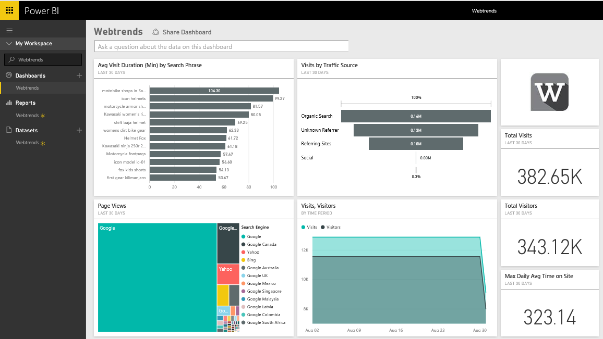

<properties 
   pageTitle="Webtrends content pack for Power BI"
   description="Webtrends content pack for Power BI"
   services="powerbi" 
   documentationCenter="" 
   authors="maggiesMSFT" 
   manager="mblythe" 
   editor=""
   tags=""/>
 
<tags
   ms.service="powerbi"
   ms.devlang="NA"
   ms.topic="article"
   ms.tgt_pltfrm="NA"
   ms.workload="powerbi"
   ms.date="09/28/2015"
   ms.author="maggies"/>
# Webtrends content pack for Power BI

The Webtrends content pack for Power BI includes a variety of out of box metrics such total page views and visits by traffic source. Visualizing your Webtrends data in Power BI starts by connecting to your Webtrends account. You can use the dashboard and reports provided, or customize them to highlight the information you care most about.  The data will be refreshed automatically once per day.

[Connect to the Webtrends content pack for Power BI.](https://app.powerbi.com/getdata/services/webtrends)

1.  Select Get Data at the bottom of the left navigation pane.

	

2.  In the Services box, select Get.

	

3.  Select Webtrends \> Connect.

	

4.  The content pack connects to a specific Webtrends profile ID. See details on finding the parameter below.

	

5.  Provide your Webtrends credentials to connect. Note that the username field expects your account and username. See details on finding these valuesbelow.

	

6.  After approving, the import process will begin automatically. When complete, a new dashboard, report and model will appear in the Navigation Pane. Select the dashboard to view your imported data.

	

 
You can change this dashboard to display your data the way you want. Click a tile to open the underlying report and change the tiles in the dashboard.

### Troubleshooting
You may hit an issue while the content pack is loading, after you've provided your credentials. If you see the "Oops" message during the loading, please review the troubleshooting suggestions below. If you're still having issues please file a support ticket at https://support.powerbi.com

1. The correct Profile ID is being used (see the Finding Webtrends Parameters section below).
2. The user has access to the following reports:
    - On-Site Searches - 34awBVEP0P6
    - Exit Pages - 7FshY8eP0P6
    - Next Pages - CTd5rpeP0P6
    - Previous Pages - aSdOeaUgnP6
    - Site Pages - oOEWQj3sUo6
    - Onsite Ads Clickthroughs - 41df19b6d9f
    - Cities  - aUuHskcP0P6
    - Countries - JHWXJNcP0P6
    - Visitors - xPcmTDDP0P6
    - Visit Duration - U5KAyqdP0P6
    - Search Phrases - IKYEDxIP0P6
    - Traffic Sources - JmttAoIP0P6
    - Search Engines - yGz3gAGP0P6
    - Entry Pages - i6LrkNVRUo6
    - Key Metrics 

### Finding Webtrends Parameters and Credentials

Your Webtrends Profile ID can be found in the URL after you've selected a profile:

Your credentials are the same as what you enter when you sign into Webtrends, however we expect your account and username in the same line, separated by a backslash:

