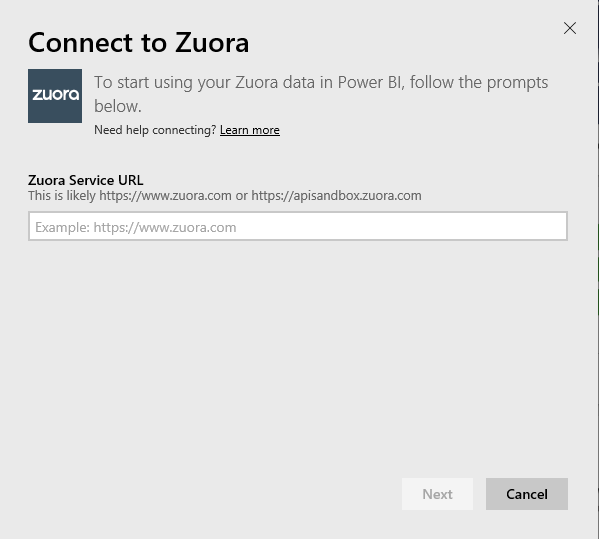
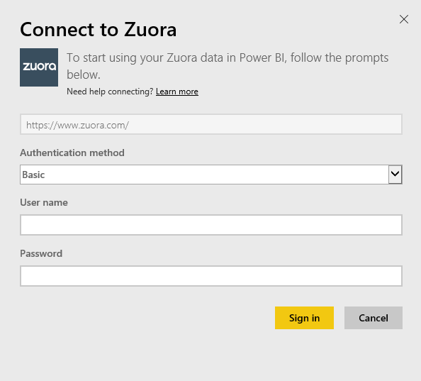
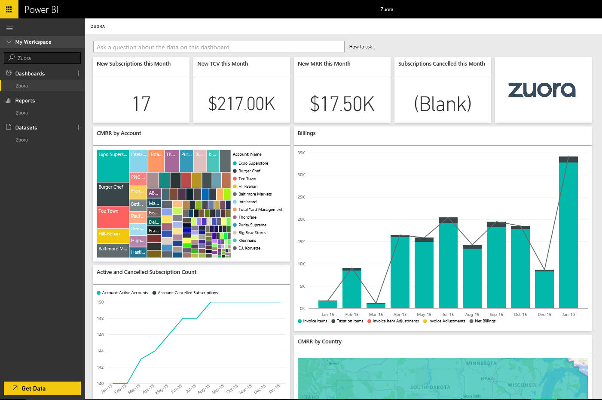

<properties 
   pageTitle="Zuora content pack"
   description="Zuora content pack for Power BI"
   services="powerbi" 
   documentationCenter="" 
   authors="theresapalmer" 
   manager="mblythe" 
   editor=""
   tags=""/>
 
<tags
   ms.service="powerbi"
   ms.devlang="NA"
   ms.topic="article"
   ms.tgt_pltfrm="NA"
   ms.workload="powerbi"
   ms.date="02/01/2016"
   ms.author="tpalmer"/>
# Zuora content pack for Power&nbsp;BI

The Zuora content pack for Power BI allows you to visualize important revenue, billing, and subscription data. Use the default dashboard and reports to analyze usage trends, track billings and payments, and monitor recurring revenue, or customize them to meet your own unique dashboard and reporting needs. 

Connect to the [Zuora content pack](https://app.powerbi.com/getdata/services/Zuora) for Power BI.

## How to connect

1.  Select **Get Data** at the bottom of the left navigation pane.

	

2.  In the **Services** box, select **Get**.

	

3.  Select **Zuora** \>  **Connect**.

	

4.  Specify your Zuora URL. This is typically "https://www.zuora.com", see details on [finding those parameters](#FindingParams) below.

	

5. For **Authentication Method**, select **Basic** and provide your username and password (case sensitive), then select **Sign In**.

	

6. After approving, the import process will begin automatically. When complete, a new dashboard, report and model will appear in the Navigation Pane. Select the dashboard to view your imported data.

	 

**What Now?**

- Try [asking a question in the Q&A box](powerbi-service-q-and-a.md) at the top of the dashboard

- [Change the tiles](powerbi-service-edit-a-tile-in-a-dashboard.md) in the dashboard.

- [Select a tile](powerbi-service-dashboard-tiles.md) to open the underlying report.

- While your dataset will be schedule to refreshed daily, you can change the refresh schedule or try refreshing it on demand using **Refresh Now**

## What's included

The content pack uses the Zuora AQUA API to pull in the following tables:
- Account
- AccountingCode
- AccountingPeriod
- BillTo
- DateDim
- Invoice
- InvoiceAdjustment
- InvoiceItem
- InvoiceItemAdjustment
- Payment
- PaymentMethod
- Product
- ProductRatePlan
- ProductRatePlanCharge
- RatePlan
- RatePlanCharge
- Refund
- RevenueSchedule
- RevenueScheduleItem
- Subscription
- TaxationItem
- Usage

## System requirements

Access to the Zuora API is required.

## Finding parameters

Provide the URL you typically sign into to access your Zuora data. The valid options are:
- https://www.zuora.com
- https://www.apisandbox.zuora.com
- The URL corresponding to your serivce instance

## Troubleshooting

The Zuora content pack pulls in many different aspects of your Zuora account. If you don't use certain features you may see correpesonding tiles/reports empty. If you have any issues loading, please contact Power BI Support.

### See also

[Get started in Power BI](powerbi-service-get-started.md)

[Get data in Power BI](powerbi-service-get-data.md)
