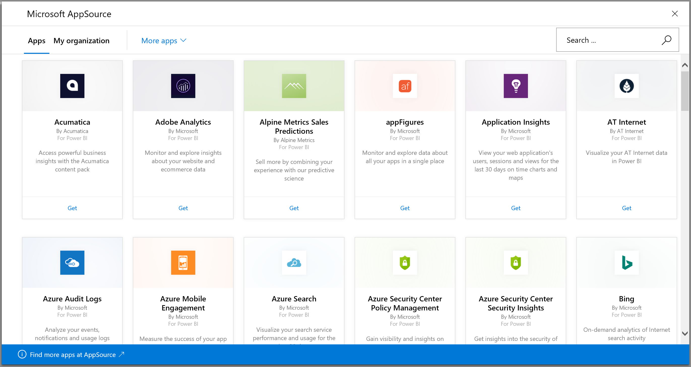

<properties 
   pageTitle="Connect to services with content packs"
   description="Connect to services with content packs for Power BI"
   services="powerbi" 
   documentationCenter="" 
   authors="theresapalmer" 
   manager="mblythe" 
   backup=""
   editor=""
   tags=""
   qualityFocus="no"
   qualityDate=""/>
 
<tags
   ms.service="powerbi"
   ms.devlang="NA"
   ms.topic="article"
   ms.tgt_pltfrm="NA"
   ms.workload="powerbi"
   ms.date="05/17/2016"
   ms.author="tpalmer"/>

# Connect to services with content packs for Power&nbsp;BI

You can connect to content packs for a number of services you use to run your business, such as Salesforce, Microsoft Dynamics, and Google Analytics. Power BI starts by using your credentials to connect to the service, and then creates a Power BI dashboard and a set of Power BI reports that automatically show your data and provide visual insights about your business. 

View all of the [content packs for services](https://app.powerbi.com/getdata/services) by logging into Power BI. The Power BI team is working with other services to add new content packs every week. 

## What's included

After connecting to a content pack, you'll see a newly created dashboard, report and dataset. The content packs include content from the service focused on a specific scenario and do not include all the information from the service. Once imported, you can customize them to highlight the information you care most about. The data is schedule to refresh automatically once per day, you can control the schedule by selecting the dataset. 

You can also use [Power BI Desktop](powerbi-desktop-get-the-desktop.md) to connect to some services, such as Google Analytics, and create your own customized dashboards and reports.  

For more details on a specific content pack, please reference their individual help pages.

## Get started

1.  Select **Get Data** at the bottom of the left navigation pane.

     

2.  In the **Services** box, select **Get**.

     

3.  Browse the content packs, or tap in the search box and type keywords:  

    

After you connect to a content pack, you see the dashboard created with your own data. You can change this dashboard to display your data the way you want. You can ask a question by typing in the Q&A box, or click a tile to open the underlying report and pin other tiles to the dashboard.

For more details on a specific content pack, please reference their individual help pages.

## Troubleshooting

**Empty Tiles**  
While the content pack is loading, you will see an empty set of tiles on your dashboard. If you still see an empty dashboard after 2hrs, it's likely the import failed - if you didn't see an actionable error message please file a support ticket with the information in the "About Power BI" dialog in the top right.

**Missing Information**  
The content packs include content from the service focused on a specific scenario and do not include all the information from the service. If there's a specific metric that you're not seeing in the content pack, please add an idea on the [Power BI Support](https://support.powerbi.com/forums/265200-power-bi) page.

## Content pack suggestions

Do you use a service you'd like to suggest for a Power BI content pack? Go to the [Power BI Support](https://support.powerbi.com/forums/265200-power-bi) page and let us know.

Do you use have a service you'd like to build a content pack for? [Submit your nomination](https://azure.microsoft.com/marketplace/programs/certified/apply/) and select "Publish a Power BI Content Pack" to get started.

### See also

[Get started with Power BI](powerbi-service-get-started.md)

[Power BI - Basic Concepts](powerbi-service-basic-concepts.md)

