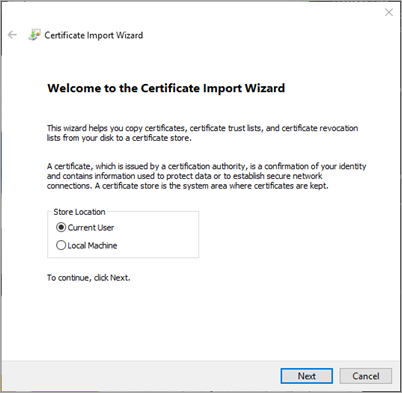
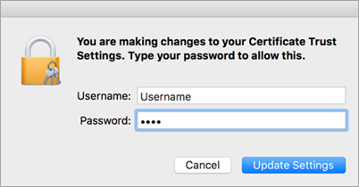
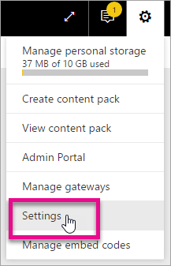
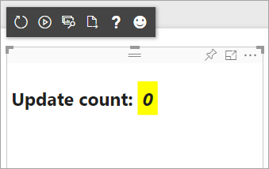

<properties
   pageTitle="Create a custom visual with the custom visual developer tools"
   description="Custom visuals allow you to meet your users' needs and match your app's design. Learn how to create a custom visual for Power BI using the developer tools."
   services="powerbi"
   documentationCenter=""
   authors="guyinacube"
   manager="mblythe"
   backup=""
   editor=""
   tags=""
   qualityFocus="no"
   qualityDate=""/>

<tags
   ms.service="powerbi"
   ms.devlang="NA"
   ms.topic="article"
   ms.tgt_pltfrm="NA"
   ms.workload="powerbi"
   ms.date="01/18/2017"
   ms.author="asaxton"/>

# Create a custom visual with the custom visual developer tools

Custom visuals allow you to meet your users' needs and match your app's design. Learn how to create a custom visual for Power BI using the developer tools.

> [AZURE.NOTE] You can use this document to get up and running. For more in-depth information, see the reference information within the [Power BI Visuals git repo](https://github.com/Microsoft/PowerBI-visuals).

## Requirements

- NodeJS 4.0+ Required (5.0 or later recommended) [Download NodeJS](https://nodejs.org)

## Install NodeJS and the Power BI tools

In order to create a custom visual, you will need to install NodeJS. NodeJS is required to run the command line tools.

1. Download and install [NodeJS](https://nodejs.org). Version 4.0 or later is required but it is recommended to have 5.0 or later.

2. Install the command line tools. Run the following command from a command prompt.

        npm install -g powerbi-visuals-tools

3. You can confirm that the tools are installed by running the following command without any parameters.

        pbiviz

    You should see the help output.

    <pre><code>
         +syyso+/
    oms/+osyhdhyso/
    ym/       /+oshddhys+/
    ym/              /+oyhddhyo+/
    ym/                     /osyhdho
    ym/                           sm+
    ym/               yddy        om+
    ym/         shho /mmmm/       om+
     /    oys/ +mmmm /mmmm/       om+
    oso  ommmh +mmmm /mmmm/       om+
   ymmmy smmmh +mmmm /mmmm/       om+
   ymmmy smmmh +mmmm /mmmm/       om+
   ymmmy smmmh +mmmm /mmmm/       om+
   +dmd+ smmmh +mmmm /mmmm/       om+
         /hmdo +mmmm /mmmm/ /so+//ym/
               /dmmh /mmmm/ /osyhhy/
                 //   dmmd
                       ++

       PowerBI Custom Visual Tool

    Usage: pbiviz [options] [command]

    Commands:

    new [name]        Create a new visual
    info              Display info about the current visual
    start             Start the current visual
    package           Package the current visual into a pbiviz file
    update [version]  Updates the api definitions and schemas in the current visual. Changes the version if specified
    help [cmd]        display help for [cmd]

    Options:

    -h, --help      output usage information
    -V, --version   output the version number
    --install-cert  Install localhost certificate
    </code></pre>

<a name"ssl-setup"></a>
### Server Certificate setup

To enable a live preview of your visual, a trusted https server is needed. Before you can start, you will need to install an SSL certificate which will allow visual assets to load in your web browser. 

> [AZURE.NOTE] This is a one-time setup for your developer workstation.

To *add* a certificate, run the following command.

    pbiviz --install-cert

**Windows OS**

1. Select **Install Certificate...***.

    

2. Select **Current User** and then select **Next**.

    

3. Select **Place all certificate in the following store** and select **Browse...**.

4. Select **Trusted Root Certification Authorities** and then select **OK**. Select **Next**.

    

5. Select **Finish**.

    

6. Select **Yes** on the security warning dialog.

    

7. Close any browsers that you have open.

> [AZURE.NOTE] If the certificate is not recognized, you may need to restart your computer.

**OSX**

1. If the lock in the upper left is locked, select it to unlock. Search for *localhost* and double click on the certificate.

    


2. Select **Always Trust** and close the window.

    

3. Enter your username and password. Select **Update Settings**.

    

4. Close any browsers that you have open.

> [AZURE.NOTE] If the certificate is not recognized, you may need to restart your computer.

## Enable live preview of developer visual

To enable a live preview of your custom visual, follow these steps. This allows the visual to be used within the Power BI service when editing reports.

1. Browse and sign into [app.powerbi.com](https://app.powerbi.com).

2. Select the **gear icon** and then select **Settings**.

    

3. Select **Developer** and then select **Enable developer visual for testing**.

    

4. Select the **Developer Visual** in the **Visualization** pane.

    

    > [AZURE.NOTE] This requires that you have run `pbiviz start` from the visual folder on your development machine. For more information on creating your visual, see [Create a new visual](#create-a-new-visual) in this article.

5. Select the visual in the report canvas. You can bind data in the same way you do other visuals.

You can now begin developing your visual.

## Create a new visual

You can create a new visual project by running the following command.

```
pbiviz new My Visual name
```

You can replace *My Visual Name* with the name you want to give the visual. This can be changed later by modifying the `name` and `displayName` fields within the generated `pbiviz.json` file.

This command will create a new folder in the direct where the command was run. It will generate a basic starter template for your visual. Once the command completes, you can open the directory and use your favorite editor to start working on your new visual.

## Testing your visual in Power BI

You can test your visual within the Power BI service within reports and dashboards.

<a name="running-your-visual"></a>
### Running your visual

You can run your visual by doing the following.

1. Open a prompt.

2. Change your directory to be your visual folder. This is the folder that contains the `pbiviz.json` file.

3. Run the following command.

    ```
    pbiviz start
    ```

    

If you are in the wrong location, you will see an error similar to the following.

```
    error  LOAD ERROR Error: pbiviz.json not found. You must be in the root of a visual project to run this command.
        at e (C:\Users\[user]\AppData\Roaming\npm\node_modules\powerbi-visuals-tools\lib\VisualPackage.js:67:35)
        at Function.loadVisualPackage (C:\Users\[user]\AppData\Roaming\npm\node_modules\powerbi-visuals-tools\lib\VisualPackage.js:62:16)
        at Object.<anonymous> (C:\Users\[user]\AppData\Roaming\npm\node_modules\powerbi-visuals-tools\bin\pbiviz-start.js:43:15)
        at Module._compile (module.js:556:32)
        at Object.Module._extensions..js (module.js:565:10)
        at Module.load (module.js:473:32)
        at tryModuleLoad (module.js:432:12)
        at Function.Module._load (module.js:424:3)
        at Module.runMain (module.js:590:10)
        at run (bootstrap_node.js:394:7)
```

### Viewing your visual in Power BI

To view your visual in a report, go to that report and select the visual within the **Visualizations** pane.

> [AZURE.NOTE] You must run the `pbiviz start` command before doing this as discribed in the [Running your visual](#running-your-visual) section.


You will then see the starter template for the visual.



|Toolbar item|Description|
|---|---|
|Refresh visual|Manually refresh the visual if auto reload is disabled.|
|Toggle auto reload|When turned on, the visual will automatically update every time you save your visual file.|
|Show dataview|Shows the visual's underlying data view for debugging|
|Get help|Documentation within GitHub|
|Send feedback|Let us know if there is anyway we can improve the experience! (Requires GitHub account)|

## Package your visual for use in Power BI Desktop and distribution

Before you can load your visual into [Power BI Desktop](https://powerbi.microsoft.com/desktop/), or share it with the community in the [Power BI Visual gallery](https://visuals.powerbi.com), you'll need to generate a `pbiviz` file.

You can package your visual by doing the following.

1. Open a prompt.

2. Change your directory to be your visual folder. This is the folder that contains the `pbiviz.json` file.

3. Run the following command.

    ```
    pbiviz package
    ```

This command will create a `pbiviz` in the `dist/` directory of your visual project. If there is already a `pbiviz` file present, it will be overwritten.

## Updating the visuals API version

When you create a visual using `pbiviz new`, a copy of the appropriate API type definitions and json schemas are copied into your visual's directory. You can use the `pbiviz update` command to update these files if needed. This can be useful if we release a fix for a past API version or if you want to update to the latest API version.

### Updating your existing API version

If we release an update to an existing API, you can get the latest version by doing the following.

```
#Update your version of pbiviz
npm install -g powerbi-visuals-tools

#Run update from the root of your visual project, where pbiviz.json is located
pbiviz update
```

This will download the latest tools from npm which include the updated type definitions and schemas. Using `pbiviz update` will overwrite the `apiVersion` property in your *pbiviz.json* fiel with the latest version.

### Upgrading to a different API version

You can update to a different API version by using the same steps as mentioned above. You can explicitly specify the API version you want to use.

```
#Update your version of pbiviz
npm install -g powerbi-visuals-tools

#Run update from the root of your visual project, where pbiviz.json is located
pbiviz update 1.2.0
```

This would update yoru visual to API version 1.2.0. You can replace `1.2.0` with whatever version your wanting to use.

> [AZURE.WARNING] The default API version used by the tools will always be the stable version of the API. Any versions later than the default API version are unstable and subject to change. They may have unexpected behaviors and behave differently between the Power BI service and Power BI Desktop. For the current stable API version, see the [change log](https://github.com/Microsoft/PowerBI-visuals/blob/master/ChangeLog.md). For more information about pre-release versions, see the [roadmap](https://github.com/Microsoft/PowerBI-visuals/blob/master/Roadmap/README.md).

## Inside the visual project

Your visual project is the folder that gets created when you run the `pbiviz new` command. 

### File structure

|Item|Description|
|---|---|
|assets/|Used to store visual assets (icon, screenshots, etc).|
|dist/|When you run `pbiviz package`, the pbiviz file will be generated here.|
|src/|Typescript code for your visual.|
|style/|Less styles for your visual.|
|.gitignore|Tells git to ignore files that shouldn't be tracked in the repository.|
|capabilities.json|Used to define the [capabilities](https://github.com/Microsoft/PowerBI-visuals/blob/master/Capabilities/Capabilities.md) of your visual.|
|package.json|Used by [npm](https://www.npmjs.com/) to manage modules.|
|pbiviz.json|Main configuration file.|
|tsconfig.json|Typescript compiler settings. Learn more about [tsconfig.json](https://www.typescriptlang.org/docs/handbook/tsconfig-json.html).|

### pbiviz.json

This file is the main configuration file for your visual. It contains metadata, as well as information about your files, needed to build your visual.

```
{
    "visual": {
        "name": "myVisual", // internal visual name (should not contain spaces)
        "displayName": "My Visual!", // visual name displayed to user (used in gallery)
        "guid": "PBI_CV_xxxxxxx", // a unique id for this visual MUST BE UNIQUE
        "visualClassName": "Visual" // the entry class for your visual
        "version": "1.0.0", // visual version. Should be semantic version (increment if you update the visual)
        "description": "", // description used in gallery
        "supportUrl": "", // url to where users can get support for this visual
        "gitHubUrl": "" // url to the source in github (if applicable)
    },
    "apiVersion": "1.0.0", //API version this visual was created with
    "author": {
        "name": "", // your name
        "email": "" // your e-mail
    },
    "assets": {
        "icon": "assets/icon.png" // relative path to your icon file (20x20 png)
    },
    "style": "style/visual.less", // relative path to your less file
    "capabilities": "capabilities.json" // relative path to your capabilities definition 
}
```

### Visual source (TypeScript)

Visual code should be written in TypeScript, which is a superset of JavaScript that support more advanced features and early access to ES6/ES7 functionality.

All TypeScript files should be stored in the `src/` directory and added to the `files` array in `tsconfig.json`. This allows the TypeScript compiler to load them and in what order.

When your visual is built, all of the TypeScript will be compiled into a single JavaScript file. This allows you to reference exported elements from other files without needing to manually `require` them as long as both files are listed in the tsconfig.

You can create as many files and classes as you need to create your visual.

Learn more about [TypeScript](http://www.typescriptlang.org/).

### Visual style (Less)

Visual styling is handled using cascading style sheets (CSS). For your convience, we use the Less pre-compiler which supports some advanced features such as nesting, variables, mixins, conditions, loops, etc. If you don't want to use any of these features, you can just write plain CSS in the Less file.

All Less files should be stored in the `style/` directory. The file specified under the `style` field within your `pbiviz.json` file will be loaded. Any additional files should be loaded using `@import`.

Learn more about [Less](http://lesscss.org/).

## Debugging

For tips about debugging your custom visual, see the [debugging guide](https://github.com/Microsoft/PowerBI-visuals/blob/master/tools/debugging.md).

## Submit your visual to the Power BI custom visual gallery

You can [submit your visual](https://app.powerbi.com/visuals/info#submit) to be included in the Power BI visuals gallery. This involves sending an email with your pbiviz file attached.

## Troubleshooting

**Pbiviz command not found (or similar errors)**

If you run `pbiviz` in your terminal / command line, you should see the help screen. If not, it is not installed correctly. Make sure you have at least the 4.0 version of NodeJS installed.

For more information, see [Install NodeJS and the Power BI tools](#install-nodejs-and-the-power-bi-tools)...

**Cannot find the debug visual in the Visualizations tab**

The debug visual looks like a prompt icon within the **Visualizations** tab.


If you don't see it, make sure you have enabled it within the Power BI settings. 

> [AZURE.NOTE] The debug visual is currently only available in the Power BI service and not in Power BI Desktop or the mobile app. The packaged visual will still work everywhere.

For more information, see [Enable live preview of developer visual](#enable-live-preview-of-developer-visual)...

**Can't contact visual server**

Run the visual server with the command `pbiviz start` in your terminal / command line from the root of your visual project. If the server is running, it is likely that your SSL vertificates weren't installed correctly.

For more information, see [Running your visual](#running-your-visual) or [Server certificate setup](#ssl-setup).


## See also

[Visualizations in Power BI](powerbi-service-visualizations-for-reports.md)  
[Custom Visualizations in Power BI](powerbi-custom-visuals.md)  
[The Power BI custom visuals gallery](https://app.powerbi.com/visuals)  
[TypeScript](http://www.typescriptlang.org/)  
[Less CSS](http://lesscss.org/)  
More questions? [Try the Power BI Community](http://community.powerbi.com/)
