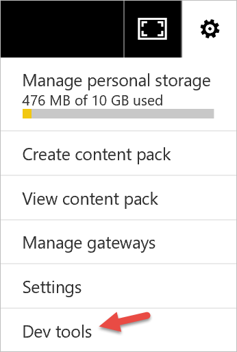
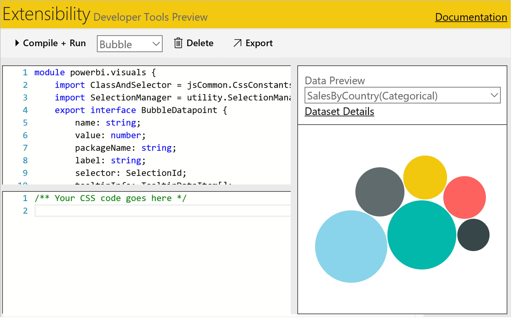
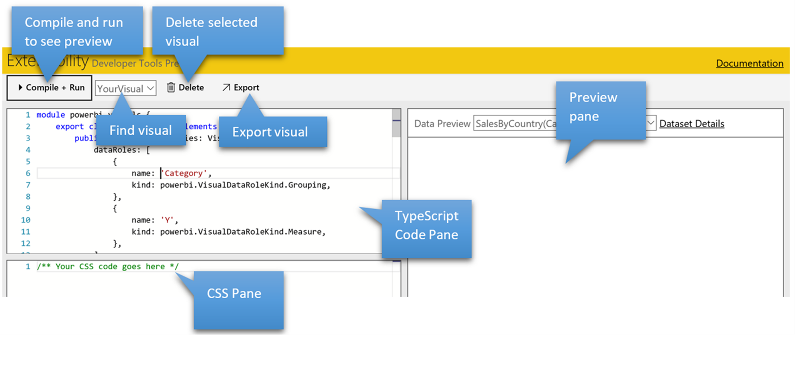
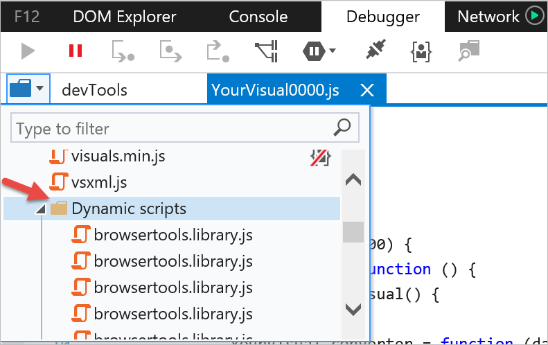
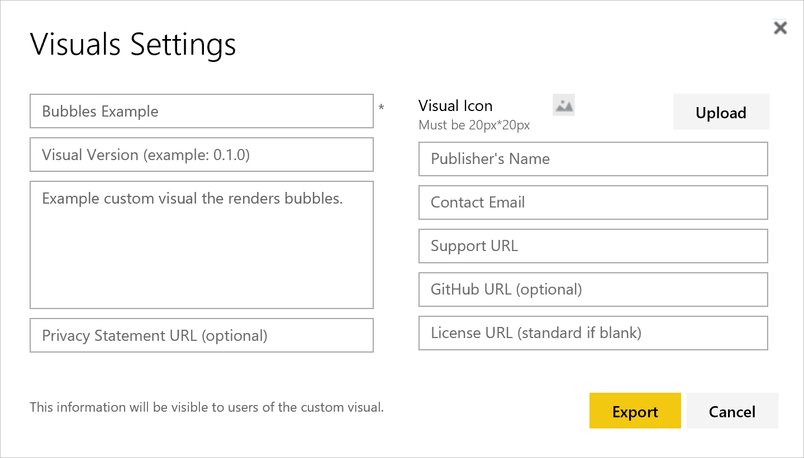

<properties
   pageTitle="Create a custom visual with the Developer Tools (Preview)"
   description="Getting Started with Developer Tools (Preview)"
   services="powerbi"
   documentationCenter=""
   authors="dvana"
   manager="mblythe"
   editor=""
   tags=""/>

<tags
   ms.service="powerbi"
   ms.devlang="NA"
   ms.topic="article"
   ms.tgt_pltfrm="NA"
   ms.workload="powerbi"
   ms.date="10/27/2015"
   ms.author="derrickv"/>

# Create a custom visual with the Developer Tools (Preview)

We’re excited to share the first preview of **Developer Tools** available in Power BI which allow you to build and test custom visuals for use in Power BI. This article provides steps to enable the preview **Developer Tools**, provides usage instructions, and identifies supported scenarios.

## Building your first custom visual for Power BI

As a first step, familiarized yourself with how to build a custom visual using our IVisual interface. You can find resources and examples on how to do this in our open source project [Microsoft/PowerBI-visuals](http://www.github.com/Microsoft/PowerBI-visuals) on GitHub. The easiest way to get started is to fork the GitHub repo, follow the instructions in [Readme.md](https://github.com/Microsoft/PowerBI-visuals/blob/master/README.md) to build it, and follow the documentation in the [Wiki](https://github.com/Microsoft/PowerBI-visuals/wiki). Once you have the visual working in your copy of the GitHub repo, you’re ready to try it in the Developer Tools.

### Using the Developer Tools

Before using the **Developer Tools**, please note that the **Developer Tools** feature is in preview, so there are many features that we are still working on to enable in the future.

Here's how to use the **Power BI Custom Visuals Developer Tools**.

**Step 1: Open the developer tools**
1. Under the settings icon, choose **Developer Tools**.

  

  A new tab will open that represents the **Developer Tools**. Here’s an example of the Developer Tools page:  

  

**Step 2: Create your custom visual**

The diagram below shows the major parts of using the developer tools. You write your [TypeScript](http://www.typescriptlang.org/) code in the **TypeScript code pane** and any CSS styles in the **CSS pane**.

**To run your custom visual**
1.  Choose **Compile + Run** to see a preview of your visual. If your visual is not shown, you may see errors highlighted in red in the code window. You may also check your browser debugging tools for JavaScript errors.

  	

The developer tools allow you to also specify an Icon, work with multiple visuals and delete visuals. The **Data Preview** option allows you to select from sample data views to test your visual’s behavior. To test with additional data, see [Testing your custom visual in Reports and Dashboards](#testing).

**Step 3: Debug your custom visual**

You can debug your custom visual using your web browser’s debugger. For most browsers, you can press **F12** to launch the browser’s debugger.

>**Note:**
>The code you write is [TypeScript](http://www.typescriptlang.org/) which is ‘typed’ JavaScript. Before debugging, your TypeScript code is compiled into JavaScript. You debug the resulting JavaScript code in your browser. To make fixes to your code, you’ll need to make them in your TypeScript and then choose **Compile + Run** again.

**Locating your code in the Browser Debugger**

**Internet Explorer**

The code you write will be located under **File** &gt; **Dynamic Scripts** in IE’s debugger.

  

**Chrome**

It will be located under (no domain) within Sources in Chrome’s debugger.

  

**To set a break point**

To set a break point, open your browser’s debugger (typically press **F12**), find the JavaScript line of code, and set a break point there. You cannot set a breakpoint directly within Power BI’s developer tools.

**Step 4: Iterating on your custom visual code**

You can work in two browser windows or two tabs one with the **Developer Tools** open to edit your visual code and a second open with the report or dashboard you are testing with. As you make changes in the **Developer Tools** and choose **Compile + Run**, you need to remember to refresh the tab in which you have your report or dashboard for testing. To refresh the tab, press **CTRL + F5** in most browsers.

>**Note:**
>When testing your custom visual in a Report or Dashboard, press **CTRL+F5** to ensure the latest version of your custom visual code is used. Repeat this each time you choose **Compile + Run** in the Developer Tools. Otherwise, you may be using an older version of your code.

**Step 5: Testing your custom visual in Reports and Dashboards**

After you test your visual and get it working in the Developer Tools, you should test that it is working in Reports and Dashboards in Power BI. Here’s how to do this:

1.  If you’re using a browser tab you already have open press **Ctrl+F5** to refresh the page.
2.  Open the report you wish to edit.
3.  Choose **Edit Report**.
4.  If you specified a custom icon for your custom visual, you will see the icon for your custom visual in the visualizations pane.

**Notes and Caveats**

The Developer Tools are in an early preview, as such there are some caveats to be aware. As we bring Developer Tools into broader previews, we will remove these limitations.

1.  You can test your custom visual in IE, Edge, Chrome, or Firefox. You will need to re-load your custom visual code for each browser you wish to test on. To re-load your custom visual, follow steps 1 through 5 above in each browser.
2.  There may be times when due to a service change, your code will no longer work. We will try to minimize this as much as possible.
3.  Ensure you keep a copy of your code in your own source control to ensure you do not lose it in such cases.
4.  The custom visual you test using the Developer tools is only visible to you in the browser you loaded it into.

## Export a custom visual
After you design your custom visual, you export it to share it with others or upload it to the community gallery.

### To export a custom visual
1.  In **Developer Tools**, choose **Export**.
2.  In **Visuals Settings**, enter your custom visual settings.
     
3.  Choose **Export**.

## See also

[Visualizations in Power BI](powerbi-service-visualizations-for-reports.md)

[Custom Visualizations in Power BI](powerbi-custom-visuals.md)

[The Power BI custom visuals gallery](https://app.powerbi.com/visuals)
