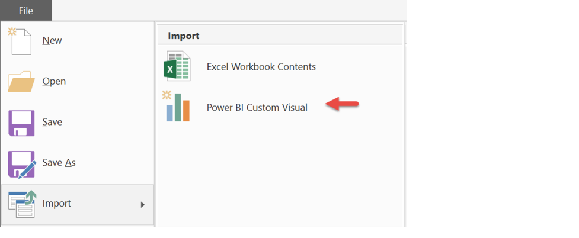

<properties
   pageTitle="Add a custom visual to a report (Desktop)"
   description="Add a custom visual to a report in Desktop"
   services="powerbi"
   documentationCenter=""
   authors="mihart"
   manager="mblythe"
   editor=""
   tags=""/>

<tags
   ms.service="powerbi"
   ms.devlang="NA"
   ms.topic="article"
   ms.tgt_pltfrm="NA"
   ms.workload="powerbi"
   ms.date="11/7/2015"
   ms.author="mihart"/>

# Add a custom visual to a report (Desktop)  

Once downloaded, custom visualizations must be imported into a report. Once imported, the new visual will appear in the Visualizations pane of your report canvas. To learn how to download custom visualizations, see [Download a custom visualization from the gallery](powerbi-custom-visuals-download-from-the-gallery.md).

>**Important** A custom visual is added to a specific report when imported. If you'd like to use the visual in another report, you need to import it into that report as well. When a report with a custom visual is saved using the **Save As** option, a copy of the custom visual is saved with the new report.

1. Open Power BI Desktop and select the report where you want to add the custom visualization.  Open the report in [Editing View](powerbi-service-interact-with-a-report-in-editing-view.md).

2.  There are two options to import a custom visual: from the **File** menu or from the **Visualizations** pane.

  **From the Desktop File menu**  
  - On the report **File** menu, choose **Import** &gt; **Power BI Custom Visual**. You must be in the editing view.  

      

  **From the Visualization pane**  
  - In the **Visualizations** pane, choose **Insert (…)**.  

        

4. **Review the warning**.

  A custom visual has access to the data in the report you use in the custom visual, and can perform actions on your behalf. If you share the report with others, when they view the report the custom visual can do the same, but for your co-workers. Take care to review the custom visual to ensure it comes from a trustworthy source. Microsoft recommends you work with your IT department if you're not sure whether to use a specific Custom Visual you obtained from the Power BI visuals gallery, through email, or from some other source.  

  

3. Select a .pbiviz file in the **File Open** dialog.

4. You will see the custom visual added to the visualizations available for your use.

  

## See also

[Add a custom visual to a report in the Power BI Service](powerbi-custom-visuals-add-to-report.md)

[Create and submit a custom visual](powerbi-custom-visuals-create-for-the-gallery.md)

[Visualizations in Power BI](powerbi-service-visualizations-for-reports.md)

Back to [Custom Visualizations in Power BI](powerbi-custom-visuals.md)

[The Power BI custom visuals gallery](https://app.powerbi.com/visuals.md)
