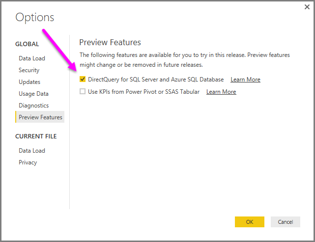
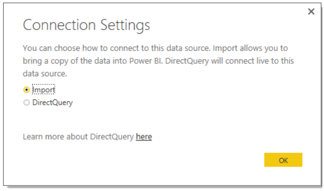

<properties 
   pageTitle="Use DirectQuery in Power BI Desktop (Preview Feature)"
   description="Use DirectQuery in Power BI Desktop (Preview Feature)"
   services="powerbi" 
   documentationCenter="" 
   authors="jastru" 
   manager="mblythe" 
   editor=""
   tags=""/>
 
<tags
   ms.service="powerbi"
   ms.devlang="NA"
   ms.topic="article"
   ms.tgt_pltfrm="NA"
   ms.workload="powerbi"
   ms.date="10/27/2015"
   ms.author="v-jastru"/>

# Use DirectQuery in Power BI Desktop (Preview Feature)  
[← Power BI Desktop](https://support.powerbi.com/knowledgebase/topics/68530-power-bi-desktop)

With Power BI Desktop, when you connect to your data source, it is always possible to import a copy of the data into the Power BI Desktop. For some data sources, an alternative approach is available: connect directly to the data source using **DirectQuery**.

To enable **DirectQuery** select **File &gt; Options and settings &gt; Options**, then select **Preview Features** from the left pane. Enable **DirectQuery** by selecting the box next to *DirectQuery for SQLServer and Azure SQL Database*, as shown in the following image.  

In this preview release, **DirectQuery** is only supported in Power BI Desktop, and you cannot publish or upload reports that use **DirectQuery** to the Power BI service.

### Supported Data Sources  
In the preview release of **DirectQuery**, the following data sources are supported:  
-   SQL Server
-   Azure SQL Database

### How to Connect using DirectQuery  
When you choose the option to use the **DirectQuery** preview feature, and then use **Get Data** to connect to a data source supported by **DirectQuery**, a dialog window appears that asks how you want to connect.  

The differences between selecting Import and DirectQuery are the following:

**Import** – the selected tables and columns are imported into Power BI Desktop. As you create or interact with a visualization, Power BI Desktop uses the imported data. You must refresh the data, which imports the full data set again, to see any changes that occurred to the underlying data since the initial import or the most recent refresh.

**DirectQuery** – no data is imported or copied into Power BI Desktop. The selected tables and columns appear in your Power BI Desktop **Fields** list. As you create or interact with a visualization, Power BI Desktop queries the underlying data source, which means you’re always viewing current data.

Many data modeling and data transformations are available when using **DirectQuery**, though with some limitations. When creating or interacting with a visualization, the underlying source must be queried and the time necessary to refresh the visualization is dependent on the performance of the underlying data source. When the data necessary to service the request has recently been requested, Power BI Desktop uses recent data to reduce the time required to display the visualization. Selecting **Refresh** from the **Home** ribbon will ensure all visualizations are refreshed with current data.

### Benefits of using DirectQuery  
There are two primary benefits to using **DirectQuery**:  
-   **DirectQuery** lets you build visualizations over very large datasets, where it otherwise would be unfeasible to first import all of the data
-   Underlying data changes can require a refresh of data, and for some reports, the need to display current data can require large data transfers, making re-importing data unfeasible. By contrast, **DirectQuery** reports always use current data

### Limitations of DirectQuery  
There are certain limitations to using the preview version of **DirectQuery**:  
-   All tables must come from a single database
-   If the Query Editor query is overly complex an error will occur. To remedy the error you must: delete the problematic step in Query Editor, or Import the data instead of using **DirectQuery**
-   You cannot enter a SQL query when connecting to data
-   You cannot add calculated measures, columns, or tables
-   Relationship filtering is limited to a single direction, rather than both directions
-   You cannot change the data type of a column

In addition, as mentioned earlier you cannot publish a report created with the preview version of **DirectQuery** to the Power BI Service.