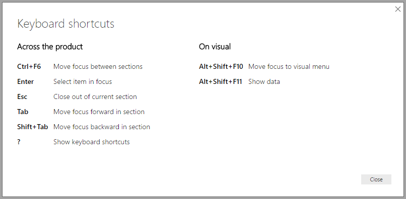
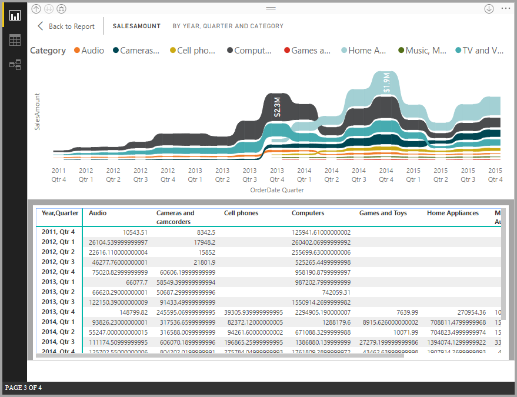
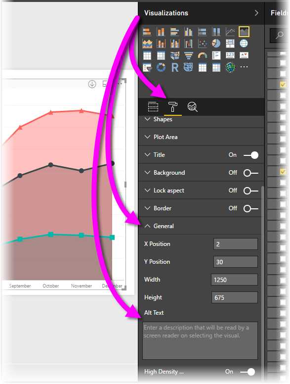

<properties
   pageTitle="Accessibility in Power BI Desktop reports"
   description="Features and suggestions for creating accessible Power BI Desktop reports"
   services="powerbi"
   documentationCenter=""
   authors="davidiseminger"
   manager="erikre"
   backup=""
   editor=""
   tags=""
   qualityFocus="no"
   qualityDate=""/>

<tags
   ms.service="powerbi"
   ms.devlang="NA"
   ms.topic="article"
   ms.tgt_pltfrm="NA"
   ms.workload="powerbi"
   ms.date="10/02/2017"
   ms.author="davidi"/>

# Accessibility in Power BI Desktop reports

**Power BI Desktop** has features that enable people with disabilities to more easily consume and interact with **Power BI Desktop** reports. These features include the ability to consume a report using the keyboard or a screen reader, tabbing to focus on various objects on a page, and thoughtful use of markers in visualizations.

> **Note:** These accessibility features are available with the June 2017 **Power BI Desktop** and later releases. Additional accessibility functionality is planned for future releases as well.

## Consuming a Power BI Desktop report with a keyboard or screen reader

Beginning with the September 2017 release of **Power BI Desktop**, you can press the **?** key to show a window that describes the accessibility keyboard shortcuts available in **Power BI Desktop**.

With the accessibility enhancements, you can consume a **Power BI Desktop** report with a keyboard or a screen reader with the following techniques:

You can **switch focus** between the report page tabs, or objects on a given report page, using **Ctrl+F6**.

-   When focus is on *report page tabs*, use the *Tab* or *Arrow* keys to move focus from one report page to the next. The title of the report page, and whether it is currently selected, is read out by the screen reader. To load the report page currently under focus, use the *Enter* or *Space* key.

-   When focus is on a loaded *report page*, use the *Tab* key to shift focus to each object on the page, which includes all textboxes, images, shapes, and charts. The screen reader reads the type of object, and a description of that object that's provided by its author. 

You can press **Alt+Shift+F10** to move focus to a visual menu.

You can press **Alt+Shift+F11** to present an accessible version of the *See data* window.

These accessibility additions were created to let users fully consume **Power BI Desktop** reports using a screen reader and keyboard navigation.

## Tips for creating accessible reports

The following tips can help you create **Power BI Desktop** reports that are more accessible.

-   For **Line**, **Area**, and **Combo** visuals, as well as for **Scatter** and **Bubble** visuals, turn markers on, and use a different *Marker shape* for each line.
    -   To turn *Markers* on, select the **Format** section in the **Visualizations** pane, expand the **Shapes** section, then scroll down to find the **Markers** toggle and turn it to *On*.

    -   Then, select the name of each line (or area, if using an **Area** chart) from the drop-down box in that **Shapes** section. Below the drop-down, you can then adjust many aspects of the marker used for the selected line, including its shape, color, and size.

    

    -   Using a different *Marker shape* for each line makes it easier for report consumers to differentiate lines (or areas) from each other.

-   As a follow on to the previous bullet, don't rely on color to convey information. Using shapes on lines (markers, as described in the previous bullets) is helpful.

-   Select a *theme* that is high contrast and color blind friendly from the theme gallery, and import it using the [**Theming** preview feature](powerbi-desktop-report-themes.md).

-   For every object on a report, provide *Alt Text*. Doing so ensures that consumers of your report understand what you are trying to communicate with a visual, even if they cannot see the visual, image, shape, or textbox. You can provide *Alt Text* for any object on a **Power BI Desktop** report by selecting the object (such as a visual, shape, etc.) and in the **Visualizations** pane, select the **Format** section, expand **General**, then scroll to the bottom and fill in the **Alt Text** textbox.

    

-   Make sure your reports have sufficient contrast between text and any background colors.

-   Use text sizes and fonts that are easily readable. Small text size, or fonts that might be difficult to read, are unhelpful for accessibility.

-   Include a title, axis labels, and data labels in all visuals.

## Considerations and limitations

There are a few known issues and limitations to the accessibility features, described in the following list:

-   JAWS is only supported in reports that are viewed in the **Power BI service**, including any embedded reports. The **Power BI Desktop** team is actively working on also making it available in reports viewed in **Power BI Desktop**.

## More Information

-   [Use Report Themes in Power BI Desktop (Preview)](powerbi-desktop-report-themes.md)
