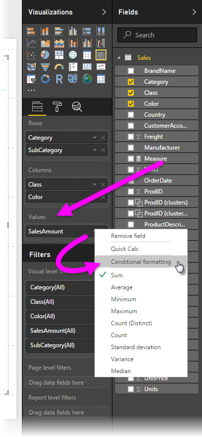
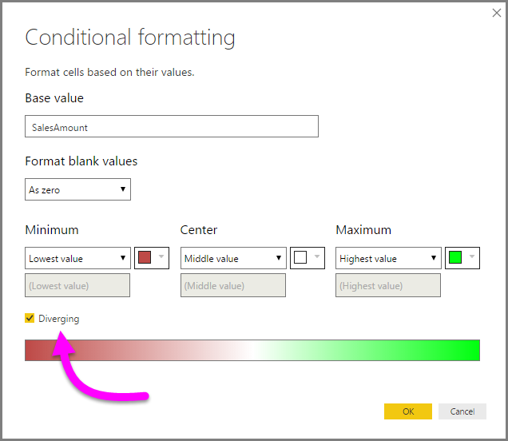
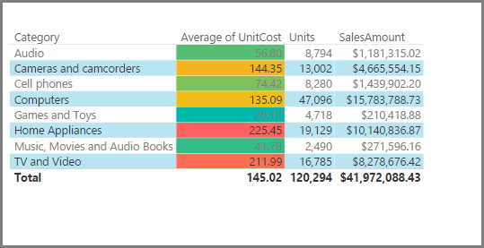
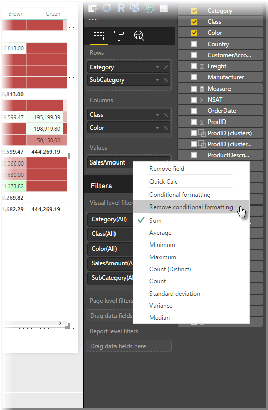

<properties
   pageTitle="Conditional table formatting in Power BI Desktop"
   description="Apply customized formatting to tables"
   services="powerbi"
   documentationCenter=""
   authors="davidiseminger"
   manager="mblythe"
   backup=""
   editor=""
   tags=""
   qualityFocus="no"
   qualityDate=""/>

<tags
   ms.service="powerbi"
   ms.devlang="NA"
   ms.topic="article"
   ms.tgt_pltfrm="NA"
   ms.workload="powerbi"
   ms.date="03/01/2017"
   ms.author="davidi"/>

# Conditional formatting in tables

With conditional formatting for tables, you can specify customized cell background colors based on cell values, including using gradient colors. To access conditional formatting, in the **Fields** well of the **Visualizations** pane in Power BI Desktop, select the down-arrow beside the measure you want to format (or right-click the field).

In the dialog that appears, you can configure the color, as well as the *Minimum*, *Maximum*, and an optional *Center* value associated with the customized formatting.

When applied to a table, the customized formatting applied using the steps outlined above overrides any custom table styles applied to the conditionally formatted cells.

To remove conditional formatting from a visualization, just right-click the field again, and select **Remove Conditional Formatting**.

