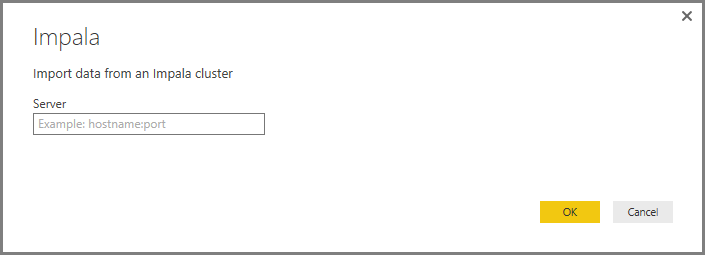

<properties
   pageTitle="Connect to an Impala database in Power BI Desktop (Preview)"
   description="Easily connect to and use an Impala database in Power BI Desktop"
   services="powerbi"
   documentationCenter=""
   authors="davidiseminger"
   manager="mblythe"
   backup=""
   editor=""
   tags=""
   qualityFocus="no"
   qualityDate=""/>

<tags
   ms.service="powerbi"
   ms.devlang="NA"
   ms.topic="article"
   ms.tgt_pltfrm="NA"
   ms.workload="powerbi"
   ms.date="07/27/2016"
   ms.author="davidi"/>

# Connect to an Impala database in Power BI Desktop (Preview)

In Power BI Desktop, you can connect to an **Impala** database and use the underlying data just like any other data source in Power BI Desktop. This release of the **Impala** connector is in Preview, and is subject to change.

## Enable the Impala (Preview) feature

To get access to the **Impala** connector, you first need to enable this preview feature. In **Power BI Desktop**, select **File > Options and settings > Option** then in the **Options** window, select the **Preview Features** section and enable **Impala**, as shown below.

When you check that box, you turn on the **Impala** preview feature. You'll need to restart Power BI Desktop for the change to take effect. Once you do, the preview features is available.

## Connect to an Impala database

Once you've enabled to preview feature, to connect to an **Impala** database select **Get Data** from the **Home** ribbon in Power BI Desktop. Select **Database** from the categories on the left, and you see **Impala (Beta)**.

In the **Impala** window that appears, type or paste the name of your Impala server into the box, and select **OK**.

When prompted, put in your username and password, or connect anonymously - either is supported.

>**Note:** Once you put in your username and password for a particular **Impala** server, Power BI Desktop uses those same credentials in subsequent connection attempts. You can modify those credentials by going to **File > Options and settings > Data source settings**.

Once you successfully connect, a **Navigator** window appears and displays the data available on the server, from which you can select one or multiple elements to import and use in **Power BI Desktop**.

## Considerations and Limitations

There are a few limits and considerations to keep in mind in this preview version of the **Impala** connector:

-   The connector currently only supports *Import* mode, which requires downloading the query output data to the local data model. Future plans include enabling *DirectQuery* as well as refresh support using the **Power BI Gateway**.

## More Information

There are all sorts of data you can connect to using Power BI Desktop. For more information on data sources, check out the following resources:

-   [Getting Started with Power BI Desktop](powerbi-desktop-getting-started.md)

-   [Data Sources in Power BI Desktop](powerbi-desktop-data-sources.md)

-   [Shape and Combine Data with Power BI Desktop](powerbi-desktop-shape-and-combine-data.md)

-   [Connect to Excel workbooks in Power BI Desktop](powerbi-desktop-connect-excel.md)   

-   [Enter data directly into Power BI Desktop](powerbi-desktop-enter-data-directly-into-desktop.md)   
