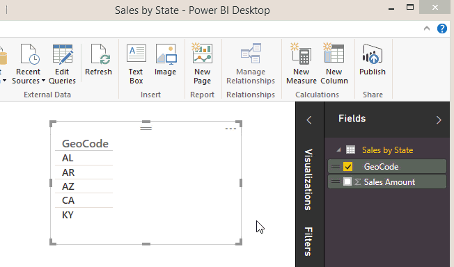

<properties
   pageTitle="Data categorization in Power BI Desktop"
   description="Data categorization in Power BI Desktop"
   services="powerbi"
   documentationCenter=""
   authors="davidiseminger"
   manager="mblythe"
   editor=""
   tags=""
   qualityFocus="no"
   qualityDate=""/>

<tags
   ms.service="powerbi"
   ms.devlang="NA"
   ms.topic="article"
   ms.tgt_pltfrm="NA"
   ms.workload="powerbi"
   ms.date="04/26/2016"
   ms.author="davidi"/>

# Data categorization in Power BI Desktop  

In **Power BI Desktop**, you can specify the Data Category for a column so Power BI Desktop knows how it should treat its values when in a visualization.

When Power BI Desktop imports data, not only does it get the data itself, it also gets information such as the table and column names, whether it’s a primary key, etc.  With that information, Power BI Desktop makes some assumptions about how to give you a good default experience when creating a visualization. 

Here’s an example: When Power BI Desktop detects a column has numeric values, you’ll probably want to aggregate it in some way, so it’s placed in the Values area. Or, for a column with date time values, it assumes you’ll probably use it as a time hierarchy axis on a line chart.

But, there are some cases that are a bit more challenging, like geography. Consider the following table from an Excel worksheet:

Should Power BI Desktop treat the codes in the GeoCode column as an abbreviation for a Country or a US State?  It’s not clear because a code like this can mean either one.  For instance, AL can mean Alabama or Albania, AR can mean Arkansas or Argentina, or CA can mean California or Canada. It makes a difference when we go to chart our GeoCode field on a map.  Should Power BI Desktop show a picture of the world with countries highlighted or a picture of the United States with states highlighted?  You can specify a Data Category for data just like this. Data categorization further refines the information Power BI Desktop can use to provide the best visualizations.  

**To specify a Data Category**

1.  In Report View or Data View, in the **Fields** list, select the field you want to be sorted by a different categorization.

2.  On the ribbon, in the **Data Tools Modeling** tab, click on the **Data Category:** drop down list.  This shows the list of possible data categories you can choose for your column.  Some selections might be disabled if they won’t work with the current data type of your column.  For example, if a column is a binary data type, Power BI Desktop won’t let you choose geographic data categories. 

And, that’s it!  Any behavior that normally accrues to a visual will now work automatically.  
