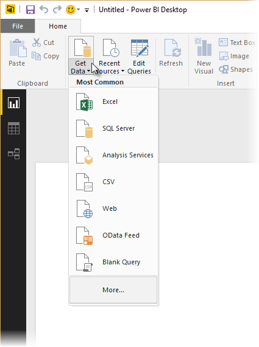
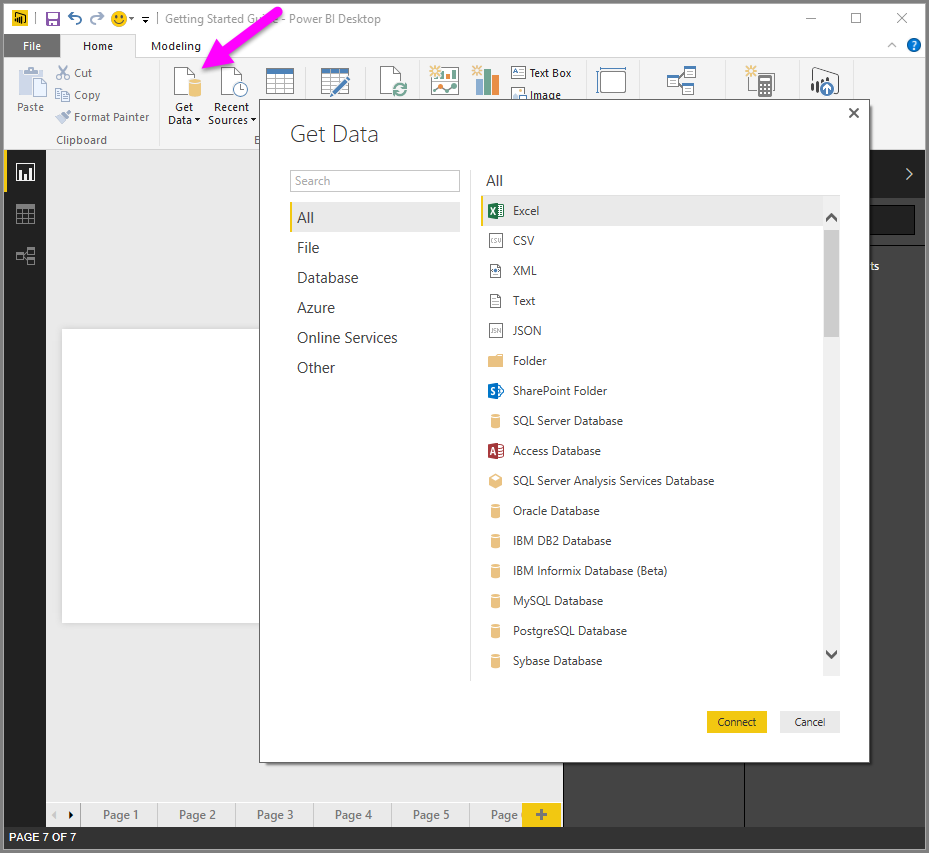
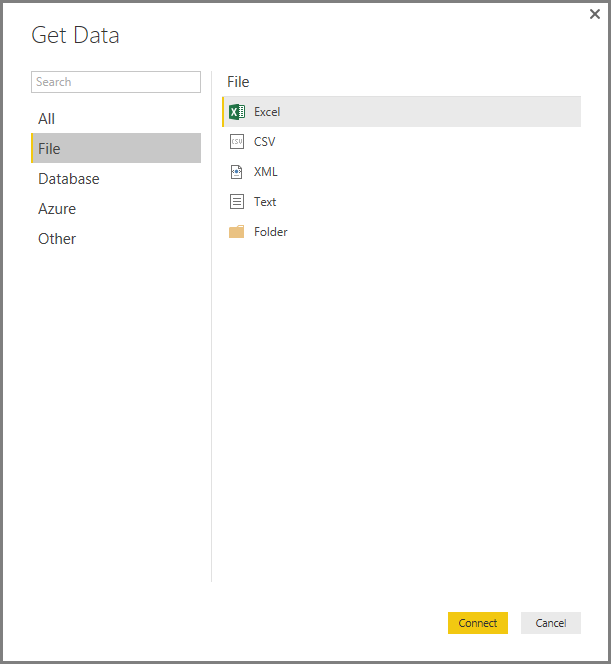
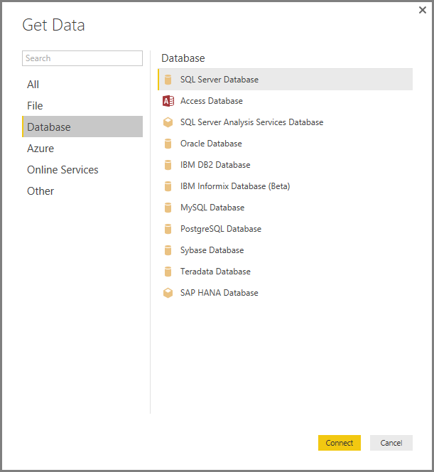
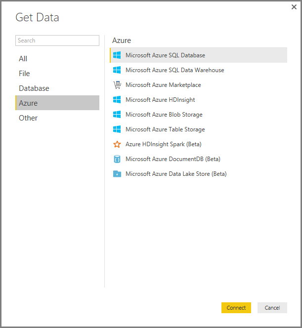
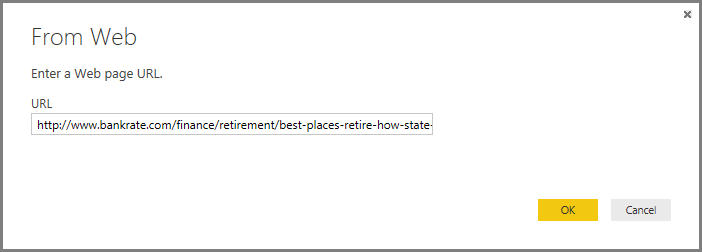
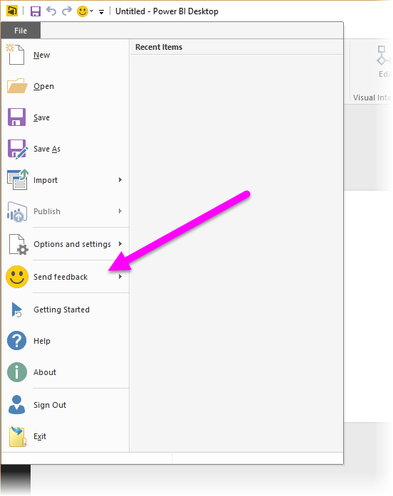

<properties 
   pageTitle="Data sources in Power BI Desktop"
   description="Data sources in Power BI Desktop"
   services="powerbi" 
   documentationCenter="" 
   authors="v-anpasi" 
   manager="mblythe" 
   editor=""
   tags=""/>
 
<tags
   ms.service="powerbi"
   ms.devlang="NA"
   ms.topic="article"
   ms.tgt_pltfrm="NA"
   ms.workload="powerbi"
   ms.date="09/28/2015"
   ms.author="v-anpasi"/>
# Data sources in Power BI Desktop

[← Power BI Desktop](https://support.powerbi.com/knowledgebase/topics/68530-power-bi-desktop)

With Power BI Desktop, you can connect to data from many different sources. A full list of available data sources is at the bottom of this page.

To connect to data, select **Get Data** from the **Home** ribbon. Selecting the down arrow, or the **Get Data** text on the button, shows the **Most Common** data types menu shown in the following image.

Selecting **More…** from the **Most Common** menu displays the **Get Data** window. You can also bring up the **Get Data** window (and bypass the **Most Common** menu) by selecting the **Get Data** **icon button** directly.

## Data Sources

Data types are organized in the following categories:

-   All
-   File
-   Database
-   Azure
-   Other

The **All** category includes all data connection types from all categories.

The **File** category provides the following data connections:

-   Excel
-   CSV
-   XML
-   Text
-   Folder

The following image shows the **Get Data** window for **File**.

 

The **Database** category provides the following data connections:

-   SQL Server Database
-   Access Database
-   SQL Server Analysis Services Database
-   Oracle Database
-   IBM DB2 Database
-   MySQL Database
-   PostgreSQL Database
-   Sybase Database
-   Teradata Database

The following image shows the **Get Data** window for **Database**.

The **Azure** category provides the following data connections:

-   Microsoft Azure SQL Database
-   Microsoft Azure Marketplace
-   Microsoft Azure HDInsight
-   Microsoft Azure Blob Storage
-   Microsoft Azure Table Storage

The following image shows the **Get Data** window for **Azure**.

The **Other** category provides the following data connections:

-   Web
-   SharePoint List
-   OData Feed
-   Hadoop File (HDFS)
-   Active Directory
-   Microsoft Exchange
-   Dynamics CRM Online
-   Facebook
-   Google Analytics
-   Salesforce Objects
-   Salesforce Reports
-   ODBC
-   appFigures (Beta)
-   QuickBooks Online (beta)
-   ZenDesk (Beta)
-   GitHub (Beta)
-   Twilio (Beta)
-   SweetIQ (Beta)
-   Blank Query

The following image shows the **Get Data** window for **Other**.

## Connecting to a Data Source

 

To connect to a data source, select the data source from the **Get Data** window and select **Connect**. In the following image, **Web** is selected from the **Other** data connection category.

A connection window is displayed, specific to the type of data connection. If credentials are required, you’ll be prompted to provide them. The following image shows a URL being entered to connect to a Web data source.

When the URL or resource connection information is entered, select **OK**. Power BI Desktop makes the connection to the data source, and presents the available data sources in the **Navigator**.

You can either load the data by selecting the **Load** button at the bottom of the **Navigator** pane, or edit the query before loading data by selecting the **Edit** button.

That’s all there is to connecting to data sources in Power BI Desktop.# More Information

There are all sorts of things you can do with Power BI Desktop. For more information on its capabilities, check out the following resources:

-   [Getting Started with Power BI Desktop](https://powerbi.uservoice.com/knowledgebase/articles/471664)
-   [Query Overview with Power BI Desktop](https://powerbi.uservoice.com/knowledgebase/articles/471646)
-   [Data Sources in Power BI Desktop](https://powerbi.uservoice.com/knowledgebase/articles/471643)
-   [Shape and Combine Data with Power BI Desktop](https://powerbi.uservoice.com/knowledgebase/articles/471644)
-   [Common Query Tasks in Power BI Desktop](https://powerbi.uservoice.com/knowledgebase/articles/471648)    

Want to give us feedback? Great – use the **Send Feedback** menu item in Power BI Desktop. We look forward to hearing from you!

 

