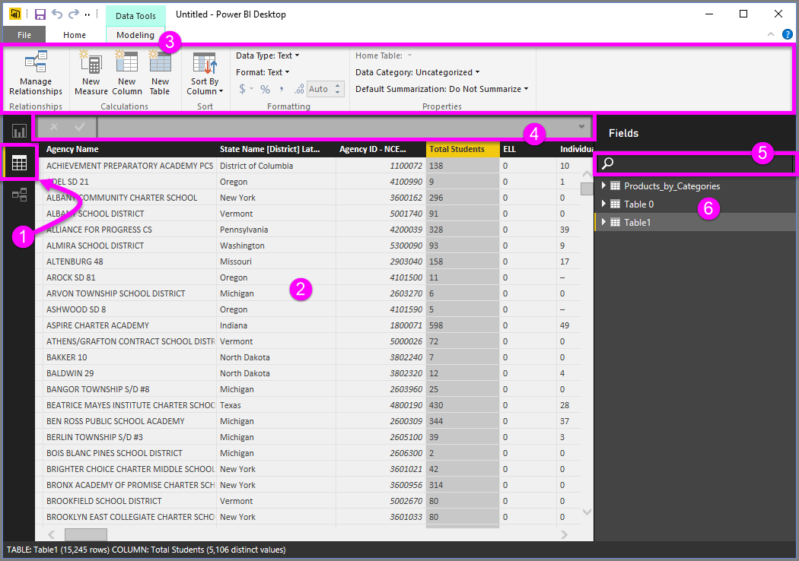

<properties
   pageTitle="Data View in Power BI Desktop"
   description="Data View in Power BI Desktop"
   services="powerbi"
   documentationCenter=""
   authors="davidiseminger"
   manager="mblythe"
   backup=""
   editor=""
   tags=""
   qualityFocus="no"
   qualityDate=""/>

<tags
   ms.service="powerbi"
   ms.devlang="NA"
   ms.topic="article"
   ms.tgt_pltfrm="NA"
   ms.workload="powerbi"
   ms.date="08/03/2016"
   ms.author="davidi"/>

# Data View in Power BI Desktop  

**Data View** helps you inspect, explore, and understand data in your Power BI Desktop model. It's different from how you view tables, columns, and data in **Query Editor**. With Data View, you’re looking at your data *after* it has been loaded into the model.

When you’re modeling your data, sometimes you want to see what’s actually in a table or column without creating a visual on the report canvas, often right down to the row level. This is especially true when you’re creating measures and calculated columns, or you need to identify a data type or data category.

Let’s take a closer look.

**1.** Data View icon – Click to enter Data View.

**2.** Data Grid – Shows the selected table and all columns and rows in it. Columns hidden from Report View are greyed out. You can  right-click on a column for options.

**3.** Modeling ribbon – Manage relationships, create calculations, change data type, format, data category for a column.

**4.** Formula bar – Enter DAX formulas for Measures and Calculated columns.

**5.** Search – Search for a table or column in your model.

**6.** Fields list – Select a table or column to view in the data grid.
