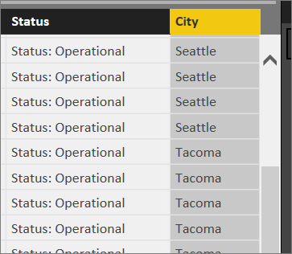
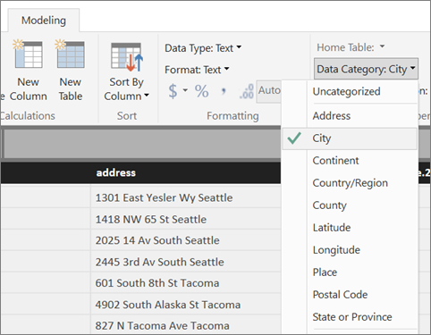

<properties 
   pageTitle="Set geofiltering in Power BI Desktop for the Power BI mobile apps"
   description="When you set geofiltering in your model in Power BI Desktop, you can filter data for your location automatically in the Power BI mobile apps for iOS."
   services="powerbi" 
   documentationCenter="" 
   authors="maggiesMSFT" 
   manager="mblythe" 
   editor=""
   tags=""
   qualityFocus="no"
   qualityDate=""/>
 
<tags
   ms.service="powerbi"
   ms.devlang="NA"
   ms.topic="article"
   ms.tgt_pltfrm="NA"
   ms.workload="powerbi"
   ms.date="06/07/2016"
   ms.author="maggies"/>

# Set geofiltering in Power BI Desktop for the Power BI mobile apps

In Power BI Desktop, you can [categorize geographical data](powerbi-desktop-data-categorization.md) for a column, so Power BI Desktop knows how to treat values in visuals in a report. As an added benefit, when you or your colleagues view that report in the Power BI mobile app for iOS, Power BI automatically provides geographical filters that match where you are. 

For example, say you're a sales manager traveling to meet customers, and you'd like to quickly filter the total sales and revenue for the specific customer you're planning to visit. You want to break out the data for your current location, whether by state, city, or an actual address. Later, if you have time left, you'd like to visit other customers located nearby. You can filter the report again by your location to find those customers.

1. In Power BI Desktop, switch to Data View .

2. Select a column with geographic data &#151; for example, a City column.

    

3. On the **Modeling** tab, select **Data Category**, then the correct category &#151; in this example, **City**.

    

4. Continue setting geographic data categories for any other fields in the model. 

    >**Note:** You can set multiple columns for each data category in a model, but if you do the model can't filter for geography in the Power BI mobile app. To use geofiltering in the mobile apps, set only one column for each data category &#151; for example, only one **City** column, one **State or Province** column, and one **Country** column. 

5. Save the report and publish it to the Power BI service.

Now when you open the report in the [Power BI app for iOS](powerbi-mobile-ipad-iphone-apps.md), you can filter it automatically to your location.

### See also  
- [Data categorization in Power BI Desktop](powerbi-desktop-data-categorization.md)  
- [Get started with the iPhone app for Power BI](powerbi-mobile-iphone-app-get-started.md)  
- [Get started with Power BI](powerbi-service-get-started.md)  
