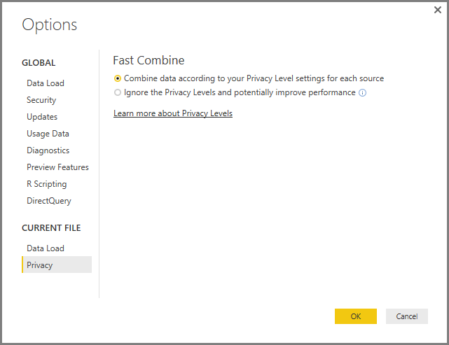

<properties
   pageTitle="Understand Power BI Desktop privacy levels"
   description="Power BI Desktop privacy levels"
   services="powerbi"
   documentationCenter=""
   authors="davidiseminger"
   manager="erikre"
   backup=""
   editor=""
   tags=""
   qualityFocus="no"
   qualityDate=""/>

<tags
   ms.service="powerbi"
   ms.devlang="NA"
   ms.topic="article"
   ms.tgt_pltfrm="NA"
   ms.workload="powerbi"
   ms.date="10/12/2017"
   ms.author="davidi"/>
# Power BI Desktop privacy levels

In **Power BI Desktop**, privacy levels specify an isolation level that defines the degree that one data source will be isolated from other data sources. Although a restrictive isolation level blocks information from being exchanged between data sources, it may reduce functionality and impact performance.

The **Privacy Levels** setting, found in **File > Options and settings > Options** and then **Current File > Privacy** determines whether Power BI Desktop uses your Privacy Level settings while combining data. This dialog includes a link to Power BI Desktop documentation about Privacy Levels and Privacy Levels (this article).

 The **Privacy** settings dialog for each data source is found **File > Options and settings > Data source settings**. Select the data source, then select **Edit**. The **Data Source Settings** dialog appears, from which you can select the appropriate privacy level from the drop-down menu at the bottom of the dialog, as shown in the following image.

 

 > **Caution:** You should configure a data source containing highly sensitive or confidential data as **Private**.

## Configure a privacy level

With privacy level settings, you can specify an isolation level that defines the degree that one data source must be isolated from other data sources.

|Setting|Description|Example Data Sources |
|---|---|---|
|**Private data source**|A **Private** data source contains sensitive or confidential information, and the visibility of the data source may be restricted to authorized users. A private data source is completely isolated from other data sources.|Facebook data, a text file containing stock awards, or a workbook containing employee review information.|
|**Organizational  data source**| An **Organizational** data source limits the visibility of a data source to a trusted group of people. An **Organizational** data source is isolated from all **Public** data sources, but is visible to other **Organizational** data sources.| A **Microsoft Word** document on an intranet SharePoint site with permissions enabled for a trusted group.|
|**Public data source**| A **Public** data source gives everyone visibility to the data contained in the data source. Only files, internet data sources or workbook data can be marked **Public**. |Free data from the Microsoft Azure Marketplace, data from a Wikipedia page, or a local file containing data copied from a public web page

## Configure privacy level settings

The **Privacy** settings dialog for each data source is found **File > Options and settings > Data source settings**.

To configure a data source privacy level, select the data source, then select **Edit**. The **Data Source Settings** dialog appears, from which you can select the appropriate privacy level from the drop-down menu at the bottom of the dialog, as shown in the following image.

> **Caution:** You should configure a data source containing highly sensitive or confidential data as **Private**.

## Configure Privacy Levels

**Privacy Levels** is a setting that is set to **Combine data according to your Privacy Level settings for each source** by default, which means that **Privacy Levels** is not enabled.

|Setting|Description|
|---|---|
|**Combine data according to your Privacy Level settings for each source** (on, and the default setting)|Privacy level settings are used to determine the level of isolation between data sources when combining data.|
|**Ignore the Privacy levels and potentially improve performance** (off)| Privacy levels are not considered when combining data, however; performance and functionality of the data may increase.

 > **Security Note:** Enabling **Privacy Levels** by selecting **Ignore the Privacy levels and potentially improve performance** in the **Privacy Levels** dialog could expose sensitive or confidential data to an unauthorized person. Do not enable **Privacy Levels** unless you are confident that the data source does not contain sensitive or confidential data.

**Configure Privacy Levels**

In Power BI Desktop or in Query Editor, select **File > Options and settings > Options** and then **Current File > Privacy**.

a. When **Combine data according to your Privacy Level settings for each source** is selected, data will be combined according to your Privacy Levels setting. Merging data across Privacy isolation zones will result in some data buffering.

b. When **Ignore the Privacy levels and potentially improve performance** is selected, the data will be combined ignoring your Privacy Levels which could reveal sensitive or confidential data to an unauthorized user. The setting may improve performance and functionality.

> **Security Note:** Selecting **Ignore the Privacy levels and potentially improve performance** may improve performance; however, Power BI Desktop cannot ensure the privacy of data merged into the Power BI Desktop file.
