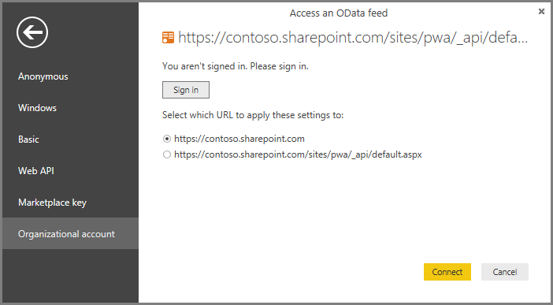

<properties
   pageTitle="Project Online: connect to data through Power BI Desktop"
   description="Project Online: connect to data through Power BI Desktop"
   services="powerbi"
   documentationCenter=""
   authors="davidiseminger"
   manager="mblythe"
   editor=""
   tags=""/>

<tags
   ms.service="powerbi"
   ms.devlang="NA"
   ms.topic="article"
   ms.tgt_pltfrm="NA"
   ms.workload="powerbi"
   ms.date="03/04/2016"
   ms.author="davidi"/>

# Project Online: connect to data through Power BI Desktop

You can connect to data in Project Online through Power BI Desktop.

### Step 1: Download Power BI Desktop

1.  [Download Power BI Desktop](http://go.microsoft.com/fwlink/?LinkID=521662)from the following link.

    <http://go.microsoft.com/fwlink/?LinkID=521662>*[521662](http://go.microsoft.com/fwlink/?LinkID=521662)*

2.  Run the installer and follow the instructions.

### Step 2: Connect to Project Online with OData

1.  Open Power BI Desktop on your computer.

2.  On the Welcome screen, click **Get Data.**

3.  Choose **OData feed** and click **Connect**.

4.  Enter the address for your OData feed in the URL box, and then click OK.

    If the address for your Project Web App site resembles https://\<tenantname\>.sharepoint.com/sites/pwa, the address you’ll enter for your OData Feed is https://\<tenantname\>.sharepoint.com/sites/pwa/\_api/Projectdata.

    For our example, we’re using https://contoso.sharepoint.com/sites/pwa/default.aspx

5.  Power BI Desktop will prompt you to authenticate with your Office 365 account. Select Organizational account and then enter your credentials.

    

From here, you can choose which tables you would like to connect to and build a query.  Want an idea of how to get started?  The following blog post shows how to build a burndown chart from your Project Online data.  The blog post refers to using Power Query to connect to Project Online, but this applies to Power BI Desktop as well.

[Creating burndown charts for Project using Power Pivot and Power Query](http://blogs.office.com/2014/03/24/creating-burndown-charts-for-project-using-power-pivot-and-power-query/)
