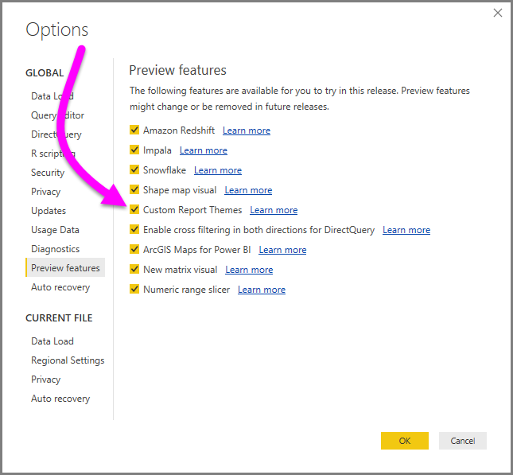
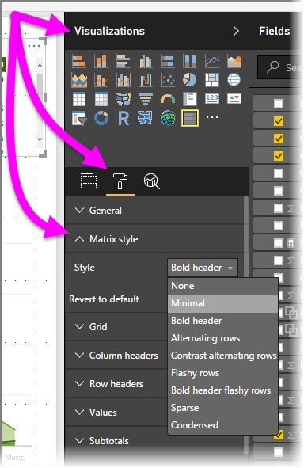
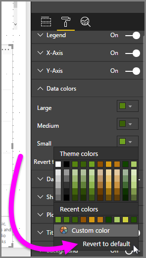

<properties
   pageTitle="Use Report Themes in Power BI Desktop (Preview)"
   description="Learn how to use a custom color palette, and apply it to an entire report in Power BI Desktop"
   services="powerbi"
   documentationCenter=""
   authors="davidiseminger"
   manager="erikre"
   backup=""
   editor=""
   tags=""
   qualityFocus="no"
   qualityDate=""/>

<tags
   ms.service="powerbi"
   ms.devlang="NA"
   ms.topic="article"
   ms.tgt_pltfrm="NA"
   ms.workload="powerbi"
   ms.date="06/06/2017"
   ms.author="davidi"/>

# Use Report Themes in Power BI Desktop (Preview)

With **Report Themes** you can apply a color theme to your entire report, such as corporate colors, seasonal coloring, or any other color theme you might want to apply a report. When you apply a **Report Theme**, all visuals in your report use the colors from your selected theme (a few exceptions apply, described later in this article).

Applying a **Report Theme** requires a JSON file, using a basic structure, which you can then import into Power BI Desktop and apply to your report. The JSON file structure, and the process of importing (it's just a few button clicks) are quick and easy.

### Enable Report Themes in Preview

You can try the new **Report Themes** feature beginning with the **March 2017** release of **Power BI Desktop**. To enable this preview feature, select **File > Options and Settings > Options > Preview Features**, then select the checkbox beside **Custom Report Themes**. You'll need to restart Power BI Desktop after you make the selection.

## How Report Themes work

To apply a Report Theme to a Power BI Desktop report, select **Switch Theme** button from the **Home** ribbon, then select **Import Theme** from the drop-down.

A window appears that lets you navigate to the location of the JSON theme file. Power BI Desktop looks for .JSON files, which is the Power BI Report Theme File type. In the following image, a handful of holiday theme files are available. We'll choose a holiday theme that happens in March.

When the theme file is successfully loaded, Power BI Desktop lets you know.

Now that we've imported a theme file, let's take a look at the simple and straightforward JSON file structure.

## Structure of a Report Theme JSON file

The JSON file selected in the previous section (the *St Patricks Day.json* file), when opened in an editor, looks like the following.

That JSON file has the following required lines:

-   **name** - this is the theme name, which is the only required field
-   **dataColors** - A list of hexcode color codes to use for data in Power BI Desktop visuals. The list can contain as many or as few colors as desired
-   **background**, **foreground** and **tableAccent** - These values are colors that should be used in **table** and **matrix** visuals. How these colors are used depends on the specific table or matrix style applied. The **table** and **matrix** visuals have no style applied by default, so you won't see any theme colors until you apply a style.

To apply a style to a **table** or **matrix** visual, select the visual and in the **Visualizations** pane select the **Format** section, then expand **Matrix style** and select a style from the **Style** drop-down.

For easy cut-and-paste to create your own JSON file, here's the text of the *St Patricks Day.json* file:

    {
        "name": "St Patricks Day",
        "dataColors": ["#568410", "#3A6108", "#70A322", "#915203", "#D79A12", "#bb7711", "#114400", "#aacc66"],
        "background":"#FFFFFF",
        "foreground": "#3A6108",
        "tableAccent": "#568410"
    }

From there you can enter your own color hexcode for your selected colors.

## How Report Theme colors stick to your reports

When you publish your report to the **Power BI service**, your Report Theme colors stay with it.

In addition, the **Data colors** section of the **Format** panel reflect your Report Theme. For example, after applying the multitude of green and brown colors from the **St. Patrick's Day** theme, when we select a visual and go to **Format > Data colors** we see the following.

See all that green? That's because those colors were part of the **Report Theme** we imported and applied.

### Situations when Report Theme colors won't stick to your reports

If you apply a custom color set (or individual color) to a particular data point in a visual, applying a Report Theme will *not* override that customized data point color.

In addition, if you've manually set a data point's color using the Theme colors section of the color palette, that (or those) colors will *not* be updated when you apply a new Report Theme. To get your default colors back (so they'll update when you apply a new Report Theme), you can select **Revert to default** in the **Theme colors** palette.

Also, many **Custom Visuals** will not apply Report Themes.

## Report Theme files you can use right now

Want to get started with **Report Themes**? Great! Here are a handful of ready-made Report Theme JSON files that you can download and import into your **Power BI Desktop** report, along with an image of that Report Theme applied to the report used in this article.

-   The [theme](https://go.microsoft.com/fwlink/?linkid=843924) used in the [blog post](https://powerbi.microsoft.com/blog/power-bi-desktop-march-feature-summary/) that announced the first release of **Report Themes**, called [*waveform.json*](https://go.microsoft.com/fwlink/?linkid=843924).

-   The [theme that's more visually impaired friendly](https://go.microsoft.com/fwlink/?linkid=843923) than the default color theme, called [*ColorblindSafe-Longer.json*](https://go.microsoft.com/fwlink/?linkid=843923).

-   A whole bunch of [Power View themes](https://go.microsoft.com/fwlink/?linkid=843925) wrapped in a zip file, including one called [*Apothecary.json*](https://go.microsoft.com/fwlink/?linkid=843925) shown below.

-   Lastly, here's one that is love-ly (the *Valentine's Day* theme) and sure to get your attention.

Rather than a download, here's the code for the Valentine's day JSON file:

    {
        "name": "Valentine's Day",
        "dataColors": ["#990011", "#cc1144", "#ee7799", "#eebbcc", "#cc4477", "#cc5555", "#882222", "#A30E33"],
        "background":"#FFFFFF",
        "foreground": "#ee7799",
        "tableAccent": "#990011"
    }

**Report Themes** can make your Power BI Desktop reports a colorful reflection of you, your organization, or even the current season or holiday. Enjoy them, they're easy!
