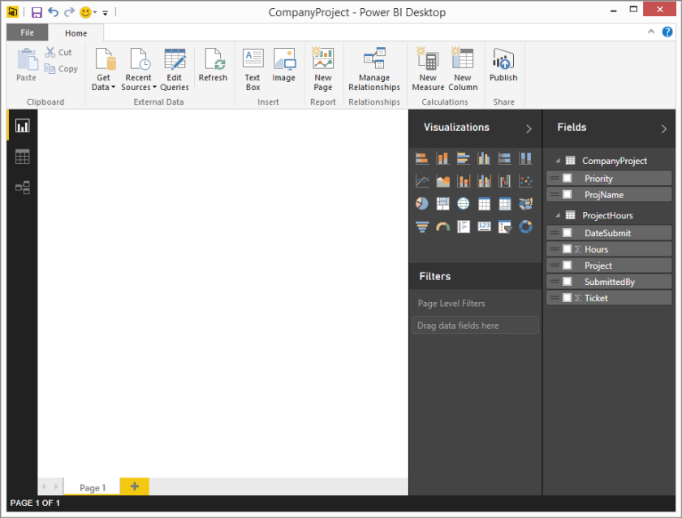
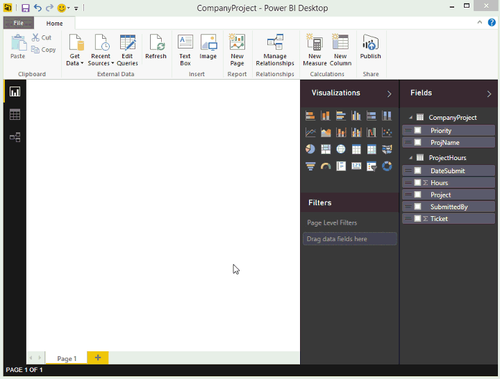
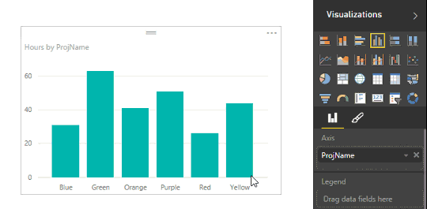
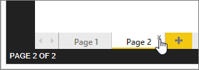

<properties
   pageTitle="Report View in Power BI Desktop"
   description="Report View in Power BI Desktop"
   services="powerbi"
   documentationCenter=""
   authors="davidiseminger"
   manager="mblythe"
   backup=""
   editor=""
   tags=""
   qualityFocus="no"
   qualityDate=""/>

<tags
   ms.service="powerbi"
   ms.devlang="NA"
   ms.topic="article"
   ms.tgt_pltfrm="NA"
   ms.workload="powerbi"
   ms.date="11/10/2016"
   ms.author="davidi"/>

# Report View in Power BI Desktop

If you’ve been working with Power BI, you know how easy it is to create reports providing dynamic perspectives and insights into your data. Power BI also has more advanced features in Power BI Desktop. With Power BI Desktop, you can create advanced queries, mashup data from multiple sources, create relationships between tables, and more.

Power BI Desktop includes **Report View**, where you can create any number of report pages with visualizations. Report View in provides pretty much the same design experience as a report’s Editing View in the Power BI service. You can move visualizations around, copy and paste, merge, etc.

The difference between them is when using Power BI Desktop, you can work with your queries and model your data to make sure your data supports the best insights in your reports. You can then save your Power BI Desktop file wherever you like, whether it's your local drive or to the cloud.

## Let's take a look!

When you first load data in Power BI Desktop, you’ll see **Report View** with a blank canvas.

You can switch between **Report View**, **Data View**, and **Relationship View** by selecting the icons in the left hand navigation bar:

Once you’ve added some data, you can add fields to a new visualization in the canvas.

To change the type of visualization, you can select it from the **Visualization** group in the ribbon or you can right click and select a different it from the **Change visualization type** icon.

> **Tip:** Be sure to experiment with different visualization types. It’s important your visualization convey information in your data clearly.

A report will have at least one blank page to start. Pages appear in the navigator pane just to the left of the canvas. You can add all sorts of visualizations to a page, but it's important not to overdo it. Too many visualizations on a page will make it look busy and difficult to find the right information. You can add new pages to your report, just click **New Page** on the ribbon.

To delete a page, click the **X** on the page's tab at the bottom of the Report View.

> **Note:** Reports and visualizations can’t be pinned to a dashboard from Power BI Desktop. To do that, you’ll need to [Publish from Power BI Desktop](powerbi-desktop-upload-desktop-files.md) to your  Power BI site.
