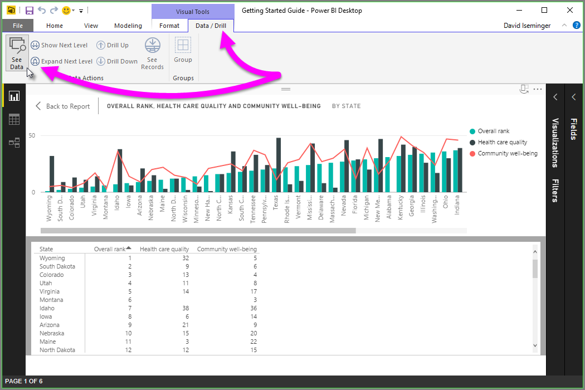
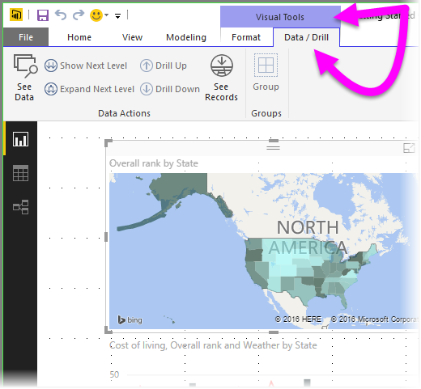
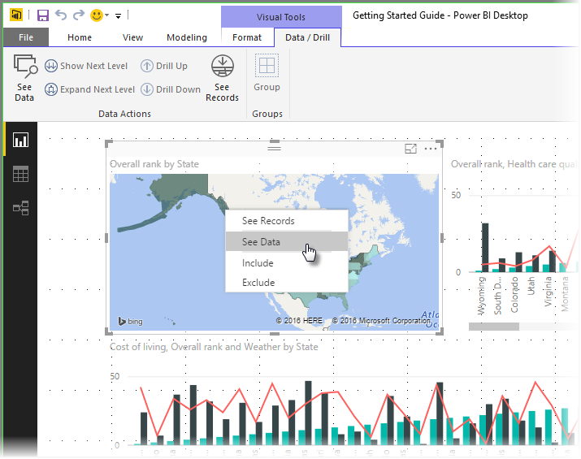
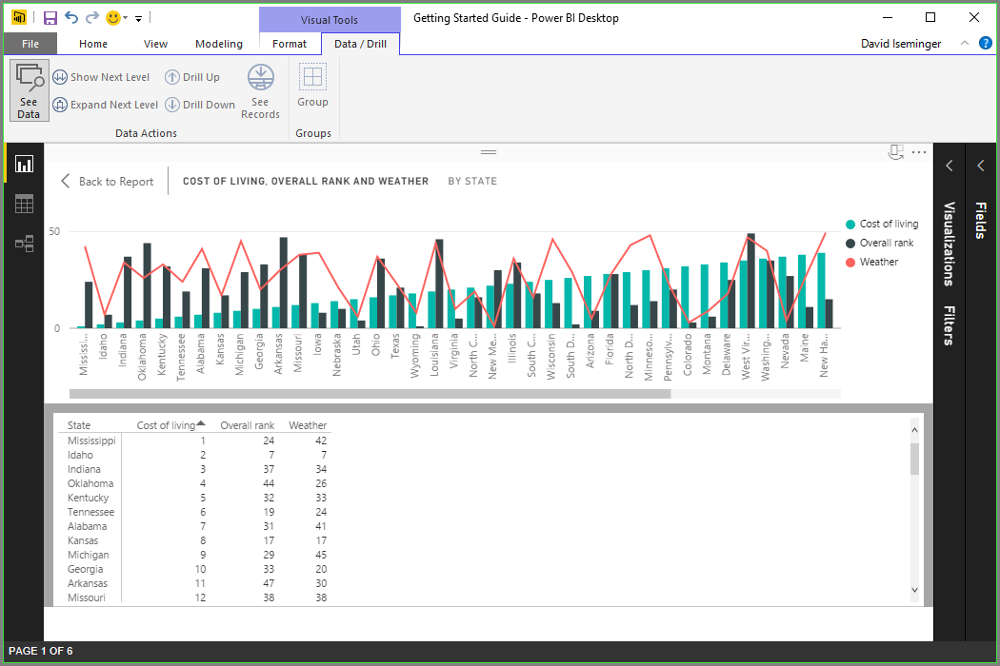
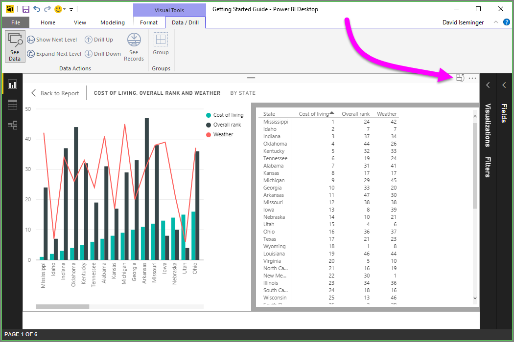
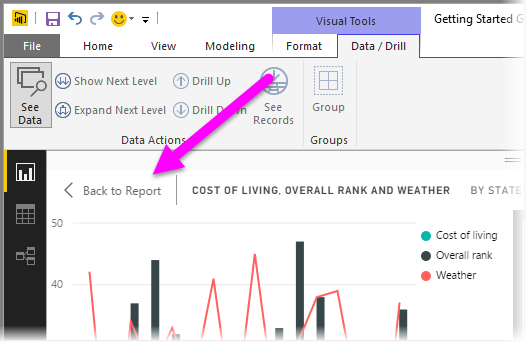
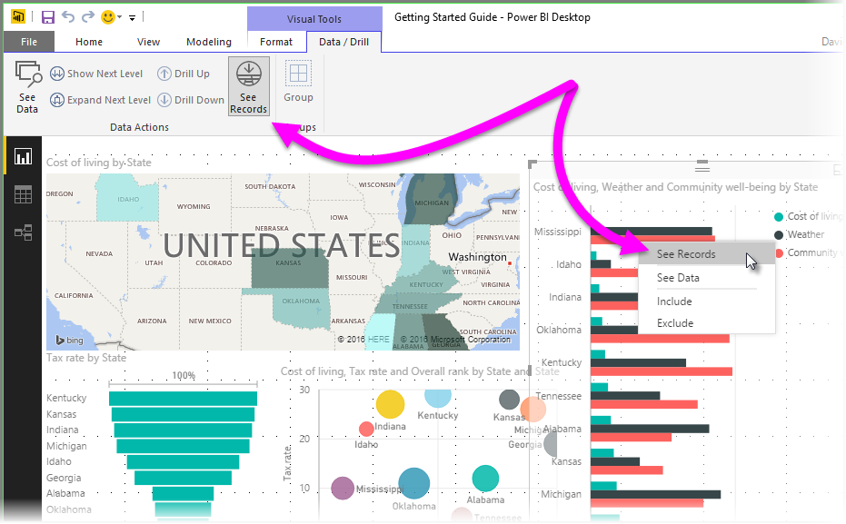
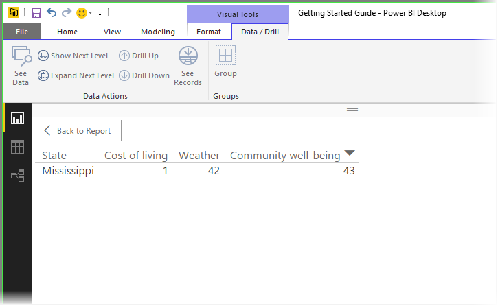

<properties
   pageTitle="See data and records in Power BI Desktop visuals"
   description="Use the See Data and See Records features of Power BI Desktop to drill into details"
   services="powerbi"
   documentationCenter=""
   authors="davidiseminger"
   manager="mblythe"
   backup=""
   editor=""
   tags=""
   qualityFocus="no"
   qualityDate=""/>

<tags
   ms.service="powerbi"
   ms.devlang="NA"
   ms.topic="article"
   ms.tgt_pltfrm="NA"
   ms.workload="powerbi"
   ms.date="12/05/2016"
   ms.author="davidi"/>

# Use See Data and See Records in Power BI Desktop

In **Power BI Desktop** you can drill into the details of any visual, and see the underlying data or individual records for a selected visual. These features are sometimes referred to as *click-through*, or *drill-through* or *drill-through to details*.

You can use **See Records** to view data for one selected record from a visual, or use **See Data** to view the underlying data for all records that are part of the selected visual. There are some limitations to using **See Data** and **See Records**, which are discussed at the end of this article.

### Using See Data in Power BI Desktop

The **See Data** button is located in the ** Data / Drill** tab in the **Visual Tools** section of the ribbon.

You can also **See Data** by right-clicking on a visual, then selecting **See Data** from the menu that appears.

> **Note:** You must be hovering over a data point in the visual in order for the right-click menu to be available.

When you select **See Data**, **Power BI Desktop** focuses on the visual and data you selected and dedicates the canvas space to displaying the visual and the underlying data. The visual is displayed on the top half of the canvas, and the underlying data is shown on the bottom half, as shown in the following image. This is the *horizontal* view.

You can also switch to a *vertical view* (or back to *horizontal view*), by selecting the icon in the upper right corner.

To get back to the report, select **< Back to Report** in the upper left corner of the canvas.

### Using See Records in Power BI Desktop

You can also focus on one record in a visual, and drill into the data behind it. Once a visual is selected there are two ways to use **See Records**; you can enable the **See Records** toggle button in the **Data / Drill** ribbon and then click on a data element, or you can right-click on a data element and select **See Records** from the menu that appears.

> **Note:** If the selected visual does not support **See Records** then the button on the ribbon is grayed out.

Once **See Records** is selected, **Power BI Desktop** focuses on that individual record and dedicates the canvas area to displaying the data for that record, as shown in the following image.

To get back to the report, select the **Back to Report** button in the upper left corner of the canvas.

### Limitations

There are a few limitations to consider when using **See Data** or **See Records**:

-   Only the following visual types are supported:
    -   **Bar**
    -   **Column**
    -   **Map**
    -   **Tree Map**
    -   **Filled Map**
    -   **Pie**
    -   **Donut**
    -   **Funnel**

## More Information

There are all sorts of report formatting and data management features in **Power BI Desktop**. Check out the following resources for a few examples:

-   [Use grouping and binning in Power BI Desktop](powerbi-desktop-grouping-and-binning.md)

-   [Use gridlines, snap-to-grid, z-order, alignment and distribution in Power BI Desktop reports](powerbi-desktop-gtidlines-snap-to-grid.md)
