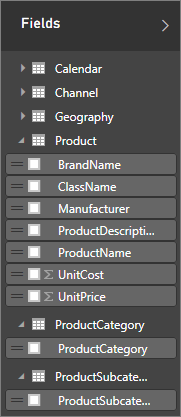
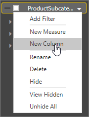
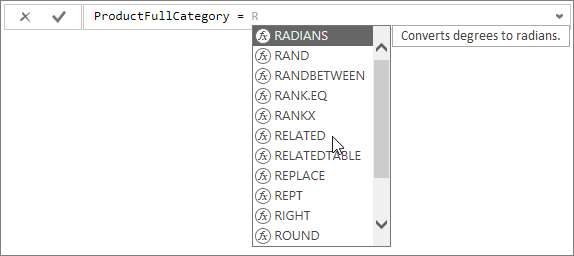
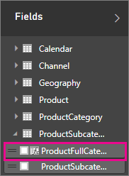
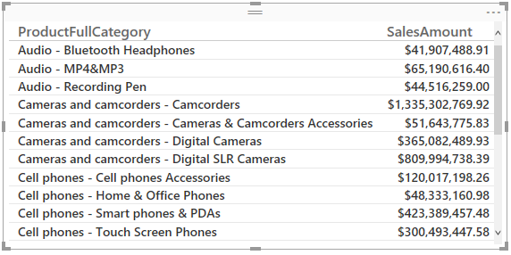
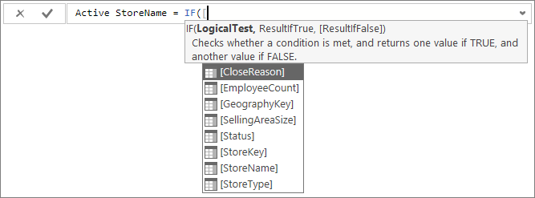
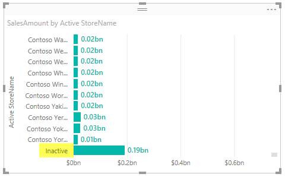

<properties
   pageTitle="Tutorial: Create calculated columns in Power BI Desktop"
   description="Tutorial: Create calculated columns in Power BI Desktop"
   services="powerbi"
   documentationCenter=""
   authors="davidiseminger"
   manager="mblythe"
   backup=""
   editor=""
   tags=""
   qualityFocus="no"
   qualityDate=""/>

<tags
   ms.service="powerbi"
   ms.devlang="NA"
   ms.topic="article"
   ms.tgt_pltfrm="NA"
   ms.workload="powerbi"
   ms.date="03/01/2017"
   ms.author="davidi"/>

# Tutorial: Create calculated columns in Power BI Desktop

Sometimes the data you’re analyzing just doesn’t contain a particular field you need to get the results you’re after. This is where calculated columns come in. Calculated columns use Data Analysis Expressions (DAX) formulas to define a column’s values. Those values can be just about anything, whether it be putting together text values from a couple of different columns elsewhere in the model, or calculating a numeric value from other values. For example, let’s say your data has a City and State columns (as fields in the Fields list), but you want a single Location field that has both as a single value, like Miami, FL. This is precisely what calculated columns are for.

Calculated columns are similar to measures in that both are based on a DAX formula, but they differ in how they are used. Measures are most often used in the Values area of a visualization, to calculate results based on other fields you have on a row in a table, or in an Axis, Legend, or Group area of a visualization. Calculated columns on the other hand are used when you want the column’s results on that row in the table, or in the Axis, Legend, or Group area.

This tutorial will guide you through understanding and creating some of your own calculated columns in Power BI Desktop. It’s intended for Power BI users already familiar with using Power BI Desktop to create more advanced models. You should already be familiar with using Query to import data, working with multiple related tables, and adding fields to the Report Canvas. If you’re new to Power BI Desktop, be sure to check out [Getting Started with Power BI Desktop](powerbi-desktop-getting-started.md).

To complete the steps in this tutorial, you’ll need to download the [Contoso Sales Sample for Power BI Desktop](http://download.microsoft.com/download/4/6/A/46AB5E74-50F6-4761-8EDB-5AE077FD603C/Contoso%20Sales%20Sample%20for%20Power%20BI%20Desktop.zip) file. This is the same sample file used for the [Create your own measures in Power BI Desktop](powerbi-desktop-tutorial-create-measures.md) tutorial. It already includes sales data from the fictitious company, Contoso, Inc. Because data in the file was imported from a database, you won’t be able to connect to the datasource or view it in Query Editor. When you have the file on your own computer, go ahead and open it in Power BI Desktop.

## Let’s create a calculated column

Let’s say we want to display product categories together with product subcategories in a single value on rows, like Cell phones – Accessories, Cell phones – Smart phones & PDAs, and so on. In Report View or Data View (we're using Report View here), If we look at our product tables in the Fields list, we see there’s no field that gives is what we want. We do, however, have a ProductCategory field and a ProductSubcategory field, each in their own tables.

 

We’ll create a new calculated column to combine values from these two column into new values for our new column. Interestingly enough, we need to combine data from two different tables into a single column. Because we’re going to use DAX to create our new column, we can leverage the full power of the model we already have, including the relationships between different tables that already exist.

### To create a ProductFullCategory column

**1.**  Right click, or click the down arrow on the **ProductSubcategory** table in the Fields list, and then click **New Column**. This will make sure our new column is added to the ProductSubcategory table.

The formula bar appears along the top of the Report canvas or Data grid. This is where we can rename our column and enter a DAX formula.

By default a new calculated column is simply named Column. If we don’t rename it, when we create another, it will be named Column 2, Column 3, and so on. We want our columns to be more identifiable, so we’ll give our new column a new name.

**2. ** Since the **Column** name is already highlighted in the formula bar, just type **ProductFullCategory**.

Now we can begin entering our formula. We want the values in our new column to start with the ProductCategory name from the ProductCategory table. Because this column is in a different, but related table, we’re going to use the [RELATED](https://msdn.microsoft.com/library/ee634202.aspx) function to help us get it.

**3.**  After the equals sign, type **R**. You’ll see a dropdown suggestion list appear with all of the DAX functions beginning with the letter R. The more we type, the more the suggestion list is scaled closer to the function we need. Next to the function you’ll see a description of the function. Select **RELATED** by scrolling down, and then pressing Enter.

 

An opening parenthesis appears along with another suggestion list of all of the available columns we can pass to the RELATED function. A description and details on what parameters are expected is also shown.

 

An expression always appears between an opening and closing parenthesis. In this case, our expression is going to contain a single argument passed to the RELATED function; a related column to return values from. The list of columns is automatically narrowed down to show only the columns that are related. In this case, we want the ProductCategory column in the ProductCategory table.

Select **ProductCategory[ProductCategory]**, and then type a closing parenthesis.

> **Tip:** Syntax errors are most often caused by a missing or misplaced closing parenthesis. But often Power BI Desktop will add it if you forget.

**4. ** We want to add a dash symbol to separate each value, so after the closing parenthesis of the first expression, type a space, ampersand (&), quote, space, dash (-), another space, a closing quote, and then another ampersand. Your formula should now look like this:

 **ProductFullCategory = RELATED(ProductCategory[ProductCategory]) & " - " &**

> **Tip:** Click the down chevron on the right side of the formula bar to expand the formula editor. Click Alt & Enter to move down a line, and Tab to move things over.

**5. ** Finally, enter another opening bracket and then select the **[ProductSubcategory]** column to finish the formula. Your formula should look like this:

You’ll notice we didn’t use another RELATED function in the second expression calling the ProductSubcategory column. This is because this column is already in the same table we’re creating our new column in. We can enter [ProductCategory] with the table name (fully qualified) or without (non-qualified).

 

**6.**  Complete the formula by pressing Enter or clicking on the checkmark in the formula bar. The formula is validated and added to the field list in the **ProductSubcategory** table.

You’ll notice calculated columns get a special icon in the field list. This shows they contain a formula. They’ll only appear like this in Power BI Desktop. In the PowerBI service (your Power BI site), there’s no way to change a formula, so a calculated column field doesn’t have an icon.

## Let’s add our new column to a report

Now we can add our new ProductFullCategory column to the report canvas. Let’s look at SalesAmount by ProductFullCategory.

Drag the **ProductFullCategory** column from the **ProductSubcategory** table onto the Report canvas, and then drag the **SalesAmount** field from the **Sales** table into the chart.

 

## Let’s create another

Now that you know how to create a calculated column, let’s create another.

The Contoso Sales Sample for Power BI Desktop model contains sales data for both active and inactive stores. We want to make it really clear that data shown for inactive stores is identified as such. In-effect, we want a field named Active StoreName. To do this, we’ll create another column. In this case, when a store is inactive, we want our new Active StoreName column (as a field) to show the store’s name as “Inactive”, but show the store’s real name when it’s an active store.

Fortunately, our Stores table has a column named Status, with a value of On for active stores, and Off for inactive stores. We can test values for each row in the Status column to create new values in our new column.

### To create an Active StoreName column

**1.**  Create a new calculated column named **Active StoreName** in the **Stores** table.

For this column, our DAX formula is going to check each stores status. If a stores status is On, our formula will return the stores name. If it’s Off, it will have the name, “Inactive”. To do this, we’ll use the logical [IF](https://msdn.microsoft.com/library/ee634824.aspx) function to test the stores status and return a particular value if the result is true or false.

**2.**  Begin typing **IF**. The suggestion list will show what we can add. Select **IF**.

The first argument for IF is a logical test. We want to test whether or not a store has a status of “On”.

 

**3.**  Type an opening bracket **[** , which allows us to select columns from the Stores table. Select **[Status]**.

 

**4.**  Right after **[Status]**, type **="On"**,  then enter a comma (**,**) to enter the second argument. The tooltip suggests we need to add the value for when the result is true.

**5.**  If the store is On, we want to show the store’s name. Type an opening bracket **[** and select the **[StoreName]** column, and then type another comma so we can enter our third argument.

**6.**  We need to add a value for when the result is false, in this case we want the value to be **“Inactive”**.

**7.**  Complete the formula by pressing Enter or clicking on the checkmark in the formula bar. The formula is validated and added to the field list in the Stores table.

Just like any other field, we can use our new Active StoreName column in visualizations. In this chart, stores with a status of On are shown individually by name, but stores with a status of Off are grouped together and shown as Inactive. 

 

## What we’ve learned

Calculated columns can enrich our data, providing easier insights. We've learned how to create calculated columns by using the formula bar, how to use the suggestions list, and how to best name our new columns.

## Additional resources

If you want to take a deeper dive into DAX formulas, and create calculated columns with more advanced DAX formulas, see [DAX Basics in Power BI Desktop](powerbi-desktop-quickstart-learn-dax-basics.md). This article focuses on fundamental concepts in DAX, such as syntax, functions, and a more thorough understanding of context.

Be sure to add the [Data Analysis Expressions (DAX) Reference](https://msdn.microsoft.com/library/gg413422.aspx) to your favorites. This is where you'll find detailed info on DAX syntax, operators, and the over 200 DAX functions.
