<properties 
   pageTitle="Tutorial: Create your own measures in Power BI Desktop"
   description="Tutorial: Create your own measures in Power BI Desktop"
   services="powerbi" 
   documentationCenter="" 
   authors="v-anpasi" 
   manager="mblythe" 
   editor=""
   tags=""/>
 
<tags
   ms.service="powerbi"
   ms.devlang="NA"
   ms.topic="article"
   ms.tgt_pltfrm="NA"
   ms.workload="powerbi"
   ms.date="06/18/2015"
   ms.author="v-anpasi"/>
# Tutorial: Create your own measures in Power BI Desktop

[← Power BI Desktop](https://support.powerbi.com/knowledgebase/topics/68530-power-bi-desktop)

Some of the most powerful data analysis solutions in Power BI Desktop can be created by using measures. Measures help us by performing calculations on our data as we interact with our reports. This tutorial will guide you through understanding and creating some of your own basic measures in Power BI Desktop.

This article is intended for Power BI users already familiar with using Power BI Desktop to create more advanced models. You should already be familiar with using Get Data and Query Editor to import data, working with multiple related tables, and adding fields to the Report Canvas. If you’re new to Power BI Desktop, be sure to check out [Getting Started with Power BI Desktop](http://support.powerbi.com/knowledgebase/articles/471664-getting-started-with-power-bi-designer).

To complete the steps in this tutorial, you’ll need to download the [Contoso Sales Sample for Power BI Desktop](http://download.microsoft.com/download/4/6/A/46AB5E74-50F6-4761-8EDB-5AE077FD603C/Contoso%20Sales%20Sample%20for%20Power%20BI%20Desktop.zip) file. It already includes online sales data from the fictitious company, Contoso, Inc. Because data in the file was imported from a database, you won’t be able to connect to the datasource or view it in Query Editor. When you have the file on your own computer, go ahead and open it in Power BI Desktop.

## What are these measures all about?

Measures are most often created for us automatically, like when we select the checkbox next to the **SalesAmount** field from the **Sales** table in the field list, or drag **SalesAmount** onto the Report canvas.

A new chart visualization appears, like this:

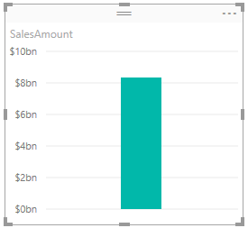

What we get is a Column chart showing a sum total amount of sales values from the SalesAmount field.  Our SalesAmount field is really just a column named SalesAmount in the Sales table we already imported.

The SalesAmount column contains over two million of rows of sales values. You might be wondering why you don’t see a table with rows of all those values. Well, Power BI Desktop knows that all of the values in SalesAmount are of a numeric datatype, and you’ll probably want to aggregate them in some way, whether it be adding them up, averaging, counting, etc..

Whenever you see a field in the Fields list with a sigma icon , it means the field is numeric, and its values can be aggregated. In this case, when we select SalesAmount, Power BI Desktop creates its own measure and the sum of all sales amounts is calculated and displayed in our chart.

Sum is the default aggregation when we select a field with a numeric datatype, but we can change to a different type of aggregation quite easily.

In the **Value** area, if we click the down arrow next to **SalesAmount**, we can then select **Average**.

Our visualization changes to an average of all sales values in the SalesAmount field.

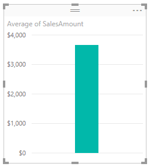

We can change the type of aggregation depending on the result we want, but not all types of aggregation apply to just any numeric datatype. For example, for our SalesAmount field, Sum and Average make sense. Minimum and Maximum have their place as well. But, Count won’t really make much sense for our SalesAmount field because while its values are numeric, they’re really currency.

Understanding aggregations is fundamental to understanding measures, because every measure will perform some type of aggregation. We’ll see more examples of using a Sum aggregation a little later, when you create some of your own measures.

Values calculated from measures are always changing in response to our interactions with our report. For example, if we drag the **RegionCountryName** field from the **Geography** table to our chart, sales amounts for each country are averaged and displayed.

When the result of a measure changes because of an interaction with our report, we are affecting our measure’s *context*. In fact, every time you interact with your report, you are changing the context in which a measure calculates and displays its results.

In most cases, Power BI does its thing and calculates and returns values according to the fields we’ve added and the types of aggregation we choose. But in other cases, you might have to create your own measures to perform more complex, unique calculations.

With Power BI Desktop, you create your own measures with the Data Analysis Expressions (DAX) formula language. DAX formulas are very similar to Excel formulas. In fact, DAX uses many of the same functions, operators, and syntax as Excel formulas. However, DAX’s functions are designed to work with relational data and perform more dynamic calculations as we interact with our reports.

There are over 200 DAX functions that do everything from simple aggregations like Sum and Average to more complex statistical and filtering functions. We’re not going to go into too much detail on the DAX language here, but there are many resources to help you learn more. After you've gone through this tutorial, be sure to see [DAX basics in Power BI Desktop](https://support.powerbi.com/knowledgebase/articles/554619-quickstart-learn-dax-basics-in-power-bi-designer).

When we create our own measures, they’re added to the Fields list for the table we want. This is known as an *explicit* measure, and it will remain in our table as a field. Some of the great advantages to explicit measures are that we can name them what we want, making them more identifiable. We can also use them as an argument in other DAX expressions, and we can create measures that perform complex calculations very quickly.

## Let’s create our own measure

Let’s say we want to analyze our net sales. If we look at our Sales table in the field list, we see that there's no field named NetSales. But, we have the building blocks to create our own measure to calculate net sales.

We need a measure to subtract discounts and returns from sales amounts. Because we want our measure to calculate a result for whatever context we have in our visualization, in-effect, we need to subtract the sum of DiscountAmount and ReturnAmount from sum of SalesAmount. This might seem a little confusing at the moment; don’t worry, it will be more clear in a little bit.

### Net Sales

**1.**  Right click, or click the down arrow on the **Sales** table in the field list, and then click **New Measure**. This will make sure our new measure is saved in the Sales table, where it will be easier to find.

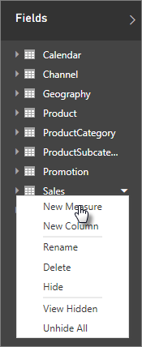

> **Tip:** You can also create a new measure by clicking on the New Measure button in the ribbon on Power BI Desktop’s Home tab.
>
> 
> 
> When you create a measure from the ribbon, the measure could be created in any of the tables. While a measure doesn’t have to belong in a particular table, it will be easier to find if you create them in a table most logical to you. If you want it to be in a particular table, click the table first, to make it active. Then click New Measure. In our case, we’re going to create our first measure in the Sales table.

The formula bar appears along the top of the Report Canvas. This is where we can rename our measure and enter a DAX formula.

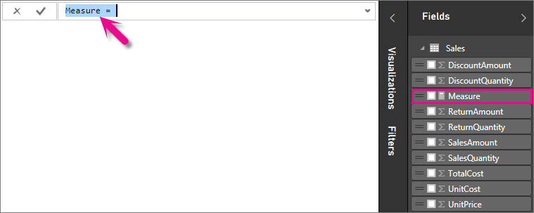

Let’s give our new measure a name. By default a new measure is simply named Measure. If we don’t rename it, when we create another, it will be named Measure 2, Measure 3, and so on. We want our measures to be more identifiable, so let’s name our new measure Net Sales.

**2. ** Highlight **Measure** in the formula bar, and then type **Net Sales**.

Now we can begin entering our formula.

**3.**  After the equals sign type an **S**. You’ll see a dropdown suggestion list appear with all of the DAX functions beginning with the letter S. The more we type, the more the suggestion list is scaled closer to the function we need. Select **SUM** by scrolling down, and then press Enter.

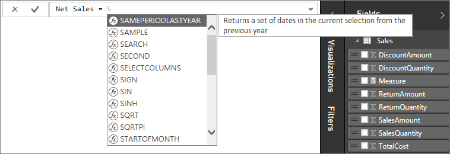

After we press Enter, an opening parenthesis appears along with another suggestion list of all of the available columns we can pass to the SUM function.

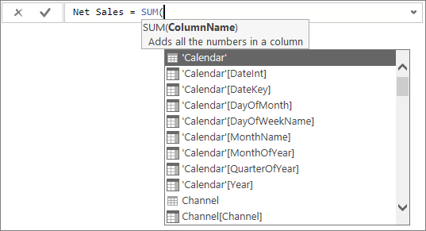

An expression always appears between an opening and closing parenthesis. In this case, our expression is going to contain a single argument to pass to the SUM function; a column to sum up. We can narrow down our list of columns by typing the first letters of what we want. In this case, we want the SalesAmount column, so when we begin typing salesam, our list gets smaller, and we are shown two items we can select. They’re actually the same column. One just shows [SalesAmount], because we’re creating our measure in the same table the SalesAmount column is in. The other, we see the table name preceding the column name.

In general, it’s good practice to enter the fully qualified name of a column. It will make your formulas easier to read.

**4. ** Select **Sales[SalesAmount]**, and then type a closing parenthesis.
> **Tip:** Syntax errors are most often caused by a missing or misplaced closing parenthesis.

Now we want to subtract our other two columns.

**5.**  After the closing parenthesis for our first expression, type a space, and then a minus operator (**-**), followed by another space. Then enter another SUM function with the **Sales[DiscountAmount]** column as its argument.

We’re starting to run out of space for our formula. No problem.

**6.**  Click the down chevron on the right side of the formula bar.

Now we have more space. We can enter new parts to our formula on a new line by pressing Alt-Enter. We can also move things over by using Tab.

Now we can add the final part of our formula.

**7.**  Add another minus operator followed by another SUM function and the **Sales[ReturnAmount]** column as its argument.

Our formula now looks ready.

**8.**  Press Enter or click the checkmark in the formula bar to complete. The formula is validated and added to the field list in the Sales table.

### Let’s add our new measure to a report

Now we can add our Net Sales measure to the report canvas, and net sales will be calculated for whatever other fields we add to the report. Let’s look at net sales by country.

**1.**  Drag the **Net Sales** measure from the **Sales** table onto the Report canvas.

**2. ** Now drag the **RegionCountryName** field from the **Geography** table into the chart.

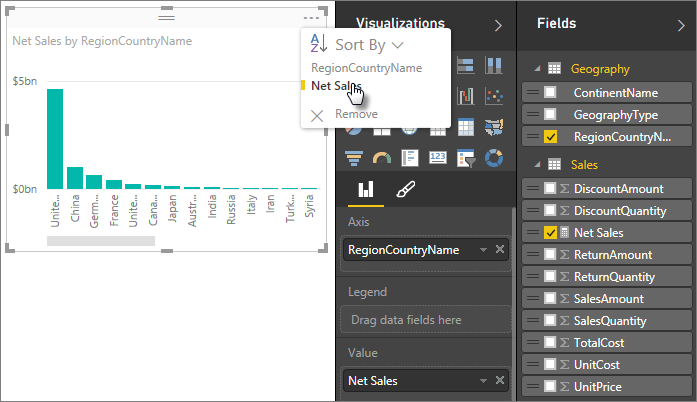

Let’s add some more data.

**3.**  Drag the **SalesAmount** field into the chart, to see the difference between net sales and sales amount.

We now really have two measures in our chart. SalesAmount, which was summed up automatically, and the Net Sales measure we created. In each case, the results were calculated in context of another field we have in the chart, the countries in RegionCountryName.

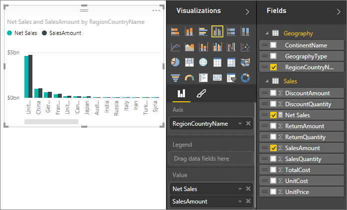

Let’s add a Slicer, so we can further break down our net sales and sales amounts by calendar year.

**4.**  Click a blank area next to the chart, then in **Visualizations**, click on the Table visualization.

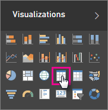

This creates a blank table visualization in the Report canvas.

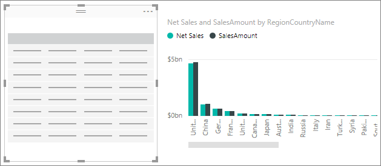

**5.**  Drag the **Year** field from the **Calendar** table into the new blank table.

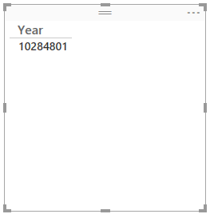

Because Year is a numeric field, Power BI Desktop summed up its values and gave us a chart. But, that doesn’t do us much good as a Slicer.

**6. ** In **Values**, click the down arrow next to **Year**, and then click **Do Not Summarize**.

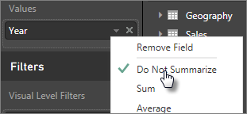

Now we can change the Year field in the table visualization into a Slicer.

**7.**  In **Visualizations**, click the **Slicer** visualization.

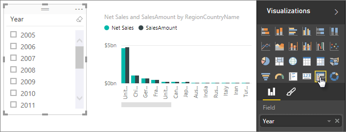

Now we have Year as a Slicer. We can select any individual or group of years and our report’s visualizations will all be sliced accordingly.

**8. ** Go ahead and click on **2013**. You’ll see the chart change. Our Net Sales and SalesAmount measures are re-calculated, showing new results just for 2013. Here again, we’ve changed the context in which our measures calculate and display results.

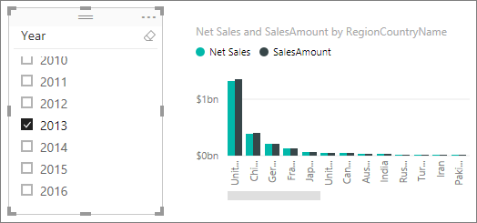

## Let’s create another measure

Now that you know how to create your own measures, let’s create a another.

### Net Sales per Unit

What if we want to find out which products with the most sales per unit sold is?

Well, we can create another measure. In this case, we want to divide net sales by the quantity of units sold. In-effect, we want to divide the result of our Net Sales measure by the sum of Sales[SalesQuantity].

**1.**  Create a new measure named **Net Sales per Unit** in either the Sales or Products table.

In this measure, we’re going to use the Net Sales measure we created earlier. With DAX, we can reference other measures in our formula.

**2.**  Begin typing **Net Sales**. The suggestion list will show what we can add. Select **[Net Sales]**.

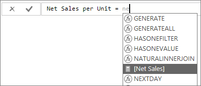

You can also reference another measure by just typing an opening bracket (**[**). The suggestion list will show us only the measures we can add to our formula.

**3.**  Right after **[Net Sales]**, enter a space, then a divide operator (**/**), then enter a SUM function, then type **Quantity**. The suggestion list shows all of the columns with Quantity in the name. Select **Sales[SalesQuantity]**. The formula should now look like this:
> **Net Sales per Unit = [Net Sales] / SUM(Sales[SalesQuantity])**

Pretty cool, huh? Entering DAX formulas is really quite easy when we use the DAX Editor’s search and suggestion functionality. Now, let’s see what we get with our new Net Sales per Unit measure.

**4. ** Drag the **Net Sales per Unit** measure onto a blank area in the report canvas.

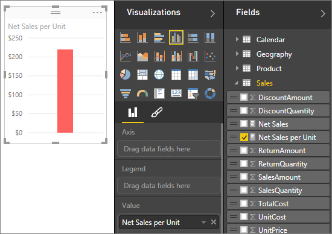

Not very interesting is it? Don’t worry.

**5.**  Change the chart visualization type to **Tree Map**.

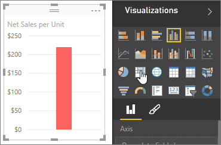

**6. ** Now drag the **ProductCategory** field from the **ProductCategory** table down into the **Group** area.

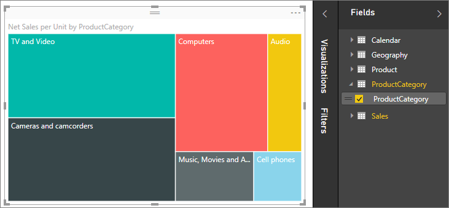

That’s some good info, but what if we want to look at net sales by product?

**7. ** Remove the **ProductCategory** field, and then drag the **ProductName** field from the **Product** table down into the **Group** area instead. 

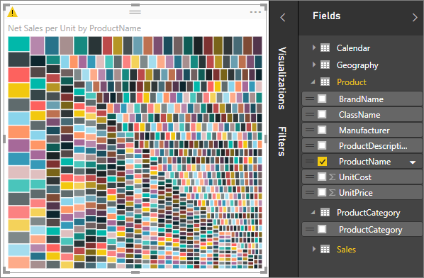

Ok, now we're just playing, but you have to admit, that's just cool! Of course, we can filter this tree map down any number of ways, but that's out of scope for this tutorial.

## What we’ve learned

Measures give us a lot of power in getting the insights we want from our data. We’ve learned how to create measures by using the formula bar. We can name measures whatever makes most sense, and the suggestion lists make it easy to find and select the right element to add to our formulas. We’ve also been introduced to context, where the result of calculations in measures change according to other fields, or by other expressions in your measure formula.

## Additional resources

If you want to take a deeper dive into DAX formulas, and create some more advanced measures, see [DAX basics in Power BI Desktop](http://support.powerbi.com/knowledgebase/articles/554619-quickstart-learn-dax-basics-in-power-bi-designer). This article focuses on fundamental concepts in DAX, such as syntax, functions, and a more thorough understanding of context.

Be sure to add the [Data Analysis Expressions (DAX) Reference](https://msdn.microsoft.com/en-us/library/gg413422.aspx) to your favorites. This is where you'll find detailed info on DAX syntax, operators, and the over 200 DAX functions.

